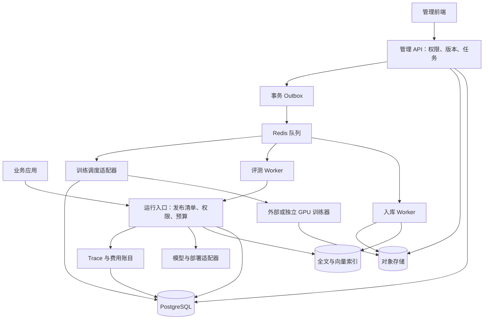

# AI 管理后台：产品与工程实施规格（交给 Claude 开发）

- 文档版本：1.0；编写与资料核查日期：2026-09-25。
- 文档性质：待实施规格。页面、接口、架构、默认值、测试用例均为本项目设计；没有已经开发、部署、训练或测得效果的含义。
- 目标读者：负责实施的 Claude、AI 产品经理、前后端工程师、算法工程师、测试与运维人员。
- 核心范围：Prompt 管理、RAG 知识管理、微调管理，以及支撑它们的模型接入、数据集、评测、运行记录、发布、权限与成本控制。
- 假设：企业内部使用，支持多个项目与开发/测试/生产环境；中文界面，面向通用知识问答、文本生成、分类与信息抽取，不绑定客服行业。
- 数字约定：页面尺寸、分页、默认参数和种子数据数量属于**本方案设计初值**，不是行业统一标准；性能、效果、真实费用在实施后测量。未知费用显示“未知”，不用 0 代替。

## 阅读路径与开发约定

产品人员重点看“页面设计、人工操作、验收”；工程人员重点看“工程搭建、数据模型、接口、状态与任务执行”。各节共同组成验收范围，不能只实现静态页面。

快速定位：第 5 节是统一布局；第 8 节是 Prompt；第 9 节是 RAG；第 10—11 节是数据与微调；第 12—15 节是评测、发布、运行与权限；第 16 节是人工操作册；第 17—20 节是工程实施；附录 C 是验收用例。

Claude 接到本文件后，应先检查目标仓库与已有约定，复用可用基础设施；新建项目时使用本文默认架构。遇到非阻塞选择按文档默认值实施，并记录调整理由。涉及真实凭证、训练资源、外部费用或生产发布时，再按照实际授权配置执行；没有外部资源仍可完成本地演示和自动化测试。

**实施必须遵守：**

1. 保存草稿不会修改生产。生产使用不可变的发布清单，记录 Prompt、模型、知识索引、检索配置等确切版本。
2. 每个按钮必须对应真实接口、状态和失败反馈；未接入能力明确显示“未配置/不支持”，不能用 Toast 和假进度冒充执行。
3. 演示模式使用隔离的模拟适配器、测试数据库和醒目标记，不允许将模拟结果计入真实评测或发布。
4. 训练完成仅代表得到产物；须经过登记、兼容检查、评测、部署与发布才能服务用户。
5. 外部资料是数据，不具有更改系统规则、权限或执行工具的授权。
6. 功能逐阶段交付，但整份规格都保留。不能因为没有 GPU，就从需求中删除微调模块。
7. 界面优先展示业务含义；请求 ID、模型 revision、Token 等放在可展开的技术信息中。

## 1. 为什么建设、谁来使用

以下是立项假设，不是已经访谈验证的客户结论。

| 要素 | 本方案定义 |
|---|---|
| 场景 | 团队维护多个大模型应用，需要持续调整回答规则、更新知识、尝试微调并安全发布 |
| 岗位 | AI 产品经理、Prompt 编辑人员、知识运营人员、数据标注人员、算法工程师、测试人员、发布负责人、管理员 |
| 当前痛点 | 提示词散落在代码与聊天中；知识更新后不知道何时生效；微调依赖脚本且缺少版本追踪；发现错误无法确认模型实际收到什么；上线与实验混在一起 |
| 解决方式 | 把配置、资料、实验、人工审核和发布放入同一条可追溯流程，让工作人员能修改、比较、核查和撤回 |
| 输入 | 任务规范、Prompt、示例、文档、样本与标准答案、模型连接、训练配置、评测规则、运行反馈 |
| 输出 | 可调用的应用版本、知识索引、Prompt 版本、训练产物、评测报告、问题清单、运行与费用记录 |

成功判断：工作人员能完成“发现错误→定位证据→修改配置或数据→复测→发布→观察→必要时回滚”。页面数量和聊天流畅程度不是最终成功标准。

## 2. 模块关系与职责边界

| 模块 | 管什么 | 主要产物 | 不承担的职责 |
|---|---|---|---|
| Prompt | 指令、变量、示例、输出格式、生成参数 | 不可变 Prompt 版本 | 不更新模型参数，也不自动获得外部事实 |
| RAG | 文档处理、索引、检索、重排序、上下文组装 | 知识索引版本、检索配置、证据片段 | 不保证检索内容一定正确，不把上传文档变成模型记忆 |
| 微调 | 训练数据、训练目标、参数更新方式、训练任务、模型产物 | 适配器或完整模型版本 | 不自动更新工具、权限、工作流；不替代动态知识查询 |
| 评测 | 同条件比较、分场景评分、人工复核 | 可追溯报告与发布依据 | 不因单次回答正确就认定稳定 |
| 应用与发布 | 将上述组件组合成实际对外服务 | 发布清单、环境绑定、回滚记录 | 不把任意模块的“最新版本”静默用于生产 |
| 运行记录 | 展示每次请求实际经过的阶段与输入输出 | Trace、错误定位、反馈样本 | 不承诺展示模型完整的内部思考过程 |

**重要区分：**SFT/DPO 是训练目标或方法；LoRA/全量更新是参数更新方式。表单必须分别选择，不能做成“SFT、DPO、LoRA 三选一”。Skill 可以提供可复用操作指南；程序校验、权限和任务状态由后端负责。

## 3. 交付阶段

| 阶段 | 必须交付 | 本阶段完成证据 |
|---|---|---|
| 基础可运行版 | 登录与项目、统一布局、模型连接、Prompt 编辑调试、文本知识上传与检索、数据集、评测、Trace、发布清单；微调表单/状态/模拟任务明确标识 | 本地启动说明、真实数据库读写、自动化检查、端到端操作录像或截图、模拟/真实能力清单 |
| 真实能力闭环版 | 实际推理与 Embedding 接入、真实索引构建、真实批量评测、至少一种实际训练适配器、产物登记与测试部署 | 外部任务 ID、产物校验、测试端点、真实报告；缺凭据的项目写“未验” |
| 生产化版 | 企业登录、细粒度权限、预算并发限制、发布审批、灰度与回滚、监控告警、备份恢复、实际容量测试 | 生产检查表、权限负向测试、故障演练、回滚演练、容量报告 |
| 扩展版 | 更多连接器、DPO、多训练提供商、多模态知识处理、模型路由、复杂 Workflow/Agent 编排 | 逐项能力测试，不能用扩展版承诺充当基础版已完成 |

基础架构为扩展预留接口，首版不建设完整拖拽式 Agent 编排器；应用先使用“Prompt 生成”和“RAG 问答”两种明确流水线。后续 Agent 模板沿用权限、Trace 和发布机制。

## 4. 信息架构与导航

```text
顶部：组织 / 项目 / 环境选择     全局搜索     任务中心     帮助     当前账号
左侧：
  工作台
  应用与发布
  模型与连接
  Prompt 管理
  知识与 RAG
    知识库
    检索实验室
  数据集
  微调训练
    训练任务
    模型产物
  评测中心
  运行记录
  用量与成本
  设置
    成员与权限
    密钥与连接安全
    审计记录
    项目配置
```

- 项目切换后，清除旧项目对象选择，重新校验权限；不能沿用原项目的知识库或密钥 ID。
- 环境在页头持续可见。生产环境增加文字标签与明显边框，不能只用颜色区分。
- 全局搜索只返回有权访问的对象，支持名称/标识/标签，不默认全文索引敏感运行内容。
- 任务中心汇总入库、评测、训练、部署、导出等后台任务；关闭页面不会终止任务。
- 路由支持深链接，保留筛选、页码、详情 Tab；浏览器返回时恢复列表位置。

## 5. 通用页面与按钮布局

### 5.1 桌面布局设计初值

以 1440px 宽桌面为主设计，兼容 1280px；侧栏默认 224px，可收起；顶部栏 56px；内容间距 24px。它们是本方案布局值，开发可在不改变信息层级的前提下微调。

```text
┌────────────────────────── 顶栏：项目 / 环境 / 账号 ──────────────────────────┐
│ 侧栏 │ 面包屑                                                              │
│      │ 页面标题、状态、说明                   [次要操作] [主要操作] [更多⋯] │
│      │ Tab（详情页才有）                                                   │
│      │ [搜索] [状态▼] [标签▼] [负责人▼]          [重置] [筛选设置]           │
│      │ 选中后出现：已选 N 项  [可执行的批量操作] [取消选择]                  │
│      │ 列表 / 表单 / 对比区域                                               │
│      │ 统计说明                              每页条数 / 翻页                │
└────────────────────────────────────────────────────────────────────────────┘
```

### 5.2 按钮通则

| 位置 | 内容 | 行为约定 |
|---|---|---|
| 列表页右上 | “新建 Prompt”“新建知识库”等唯一主要动作；导入/导出次要按钮 | 新建打开页面或抽屉，不能误触即启动收费任务 |
| 行尾 | “查看/编辑”常驻；低频动作放“更多” | 删除/停用与查看分开；危险操作使用明确文本 |
| 详情页右上 | 与当前状态相符的主操作，如保存版本、开始评测 | 不同时把保存、训练、发布都做成同等强调 |
| 编辑页底部固定区 | 左侧校验/保存状态；右侧“取消”“保存草稿”“保存为新版本” | 未保存离开时提示；保存成功保持编辑位置 |
| 弹窗右下 | “取消”在左，“确认动作”在右 | 文案使用“取消训练”“发布到生产”，不用笼统“确定” |
| 长任务页右上 | 运行中为“申请取消”，终态为“基于此配置重试” | 取消需回查执行器状态；前端点击不等于已取消 |
| 对比页右上 | “导出报告”“基于此版本创建发布候选” | 不能凭单条好回答直接生产发布 |

每个按钮必须定义：可见权限、启用状态、前置校验、影响范围、请求、加载反馈、成功去向、失败恢复。无权限可隐藏；因未配置而不可用则保留并说明原因。不可把“禁用前端按钮”当后端授权。

### 5.3 列表与表单统一规则

- 列表默认每页 20 条，选项 20/50/100；默认按更新时间倒序并以唯一 ID 稳定排序。后端分页，支持列宽、列显隐与筛选重置。
- 复选框默认只选当前页。跨页选择必须明确“选择当前筛选的全部 N 条”，执行前展示数量和范围快照。
- 必填项标记；错误在字段附近显示，并在提交时定位首个错误。格式正确但不支持的模型参数也要拦截。
- 大文本自动保存草稿可以选配，但自动保存不创建生产发布、不反复生成正式版本。
- 模态框用于短确认；抽屉用于元数据；多步骤创建与长文本编辑使用完整页面。
- 数字显示单位，时区显示明确；时间后端存 UTC，前端按用户时区显示。复制时间时保留时区。
- 支持键盘操作、可见焦点、文字错误说明；色彩不是状态的唯一提示。代码和长文本支持复制与换行。

### 5.4 必备状态

所有页面覆盖：首次加载、无数据、筛选无结果、无权限、接口失败、部分失败、处理中、已取消、数据过期、并发冲突、未保存。

空数据给本页对应入口；筛选无结果给重置；接口失败保留已有数据并标记最后更新时间；大批任务显示成功/失败/待处理数量；未知进度显示处理阶段，不编百分比。网络断线后恢复查询任务，不重新创建任务。

## 6. 工作台

**使用者与目的：**产品、测试和运维进入后台后，先知道哪里需要处理。

- 卡片：当前生产版本、请求量、请求成功返回率、业务质量分数（有评测覆盖才显示）、P95 总耗时、已知费用、费用未覆盖数量、失败任务、待审核发布。
- 每项显示时间范围、分母、环境、数据来源与更新时间；质量评分不能用 HTTP 成功率代替。
- 中部：延迟趋势、费用趋势、错误分布；底部：待办事项、最近发布与训练任务。
- 右上：时间范围、环境筛选、“查看运行记录”；不放全局“一键优化”按钮。
- 点击异常卡片进入带筛选的列表。无质量数据显示“尚未评测”，不显示 0 分。

## 7. 模型与连接

### 7.1 列表

| 区域 | 内容 |
|---|---|
| 列 | 连接名称、提供商、用途（生成/Embedding/重排序/训练）、模型标识、环境、连接状态、最近探测时间、负责人、更新时间 |
| 筛选 | 提供商、用途、环境、启用状态、关键词 |
| 右上 | 主按钮“新建连接”；次按钮“检查连接” |
| 行尾 | 查看、测试；更多：复制配置、停用、轮换密钥 |
| 批量 | 批量探测；生产引用中的连接不能批量删除 |

“连接正常”只代表接口可用；效果、结构化输出、工具调用等能力必须分别记录验证结果。

### 7.2 详情与创建字段

Tab：基本配置｜能力与参数｜用量价格｜健康记录｜引用关系｜变更历史。

| 字段 | 控件/校验 | 工作人员可做什么 |
|---|---|---|
| 提供商/协议适配器 | 下拉选择已实现适配器 | 切换时重新验证参数，不认为兼容协议就是能力相同 |
| Base URL | 管理员输入，服务端域名白名单 | 自建端点可配置；禁止任意访问内网与云元数据地址 |
| 密钥 | 密钥引用选择/一次性录入 | 创建后只显示尾号与轮换时间，不能回显明文 |
| 模型 ID/revision | 拉取候选或手动录入后探测 | 无不可变 revision 时标“提供商未披露”，保留调用日期 |
| 能力 | 流式、结构化输出、工具、图像等 | 来源标明：官方声明/探测通过/人工配置/未知 |
| 参数约束 | 支持的采样参数、输出长度、上下文上限 | 由适配器校验；不支持 temperature 的模型不强行发送 |
| 速率与并发 | 项目级限流、单连接并发、超时 | 管理员调整，后台限流独立于浏览器 |
| 费用规则 | 币种、计费单位、输入/缓存/输出/请求价格、来源、生效日期 | 创建有版本的价格表；未知留 null |
| 训练能力 | 支持的训练目标、参数方式、取消/恢复/部署能力 | 按提供商暴露真实能力；没有则隐藏训练入口并说明 |

页头“测试连接”为主按钮；底部“保存”。改变生产所用模型配置创建新连接版本，经发布清单采用后才生效；密钥轮换独立审计，日志不得记录密钥内容。

## 8. Prompt 管理

**使用者与目的：**产品和 Prompt 编辑人员把任务规范、输入和输出要求配置成可复用版本，并用相同数据比较效果。版本和环境标签的分离参考 [Langfuse Prompt Version Control](https://langfuse.com/docs/prompt-management/features/prompt-version-control)；本文进一步用完整发布清单管理跨模块依赖。

### 8.1 Prompt 列表

| 项 | 明确内容 |
|---|---|
| 默认列 | 名称、用途摘要、标签、最新保存版本、生产引用版本、负责人、最近评测状态、更新时间、操作 |
| 可选列 | 引用应用数、变量数、默认测试模型、最近运行次数 |
| 筛选 | 搜索名称/描述、标签、负责人、是否被生产引用、评测状态 |
| 右上按钮 | 主“新建 Prompt”；次“导入”；导出放更多 |
| 行内动作 | 查看、进入调试；更多：复制、归档、导出 |
| 批量动作 | 修改标签、归档未引用对象、导出有权限的配置 |

“最新版本”和“生产使用版本”并排出现，避免以为保存就上线。归档保留历史调用引用；被当前生产引用的对象不能直接归档。

### 8.2 详情结构

Tab：编辑与调试｜版本历史｜评测结果｜引用应用｜运行记录。

```text
标题：文章摘要 Prompt     草稿/版本标识      [版本对比] [保存为新版本] [更多]
左侧约 60%：任务与指令 / 消息模板 / 变量 / 示例 / 输出要求
右侧约 40%：模型与参数 / 测试输入 / [运行测试] / 实际输出
下方可展开：实际发送输入 / 校验结果 / 用量耗时 / 证据 / Trace
```

窄屏上下排布；编辑内容和测试输入独立保存，运行结果不会覆盖模板。

### 8.3 编辑表单：哪些内容需要填写

| 分组 | 字段 | 控件与约束 |
|---|---|---|
| 基础信息 | 名称、用途、负责人、标签 | 名称在项目内可辨识，稳定标识创建后不可随意改 |
| 任务目标 | 要完成什么、面向谁、完成标准 | 多行文本；可填写“把文章整理成结论、依据、待核实事项” |
| 指令与消息 | 系统指令、用户模板、可选历史消息占位 | 分角色编辑；高级模式查看标准消息结构；适配器映射提供商角色 |
| 输入变量 | 名称、中文说明、类型、来源、必填、默认值、长度上限、样例 | 名称与模板双向检查，支持 string/number/boolean/object/array |
| 变量来源 | 用户输入/上一步结果/检索上下文/受控系统字段 | 选择来源路径并做绑定测试；定义变量不等于已经取得数据 |
| 行为约束 | 缺失信息、证据冲突、拒答/澄清规则、不可执行动作 | 普通约束写指令；可确定性判定的约束配置后端校验 |
| 示例 | 示例输入、期望输出、用途标签、适用条件 | 可排序、启停；参考答案只在明确配置为 few-shot 时进入 Prompt |
| 输出要求 | 文本/Markdown/JSON Schema、必含项、引用要求、未知值规则 | JSON Schema 可视化与源码模式；可选字段不伪造必填数据 |
| 生成配置 | 默认调试模型、输出长度、支持的采样参数 | 参数范围依据连接能力；仅影响调试，应用发布配置另行冻结 |
| 变更说明 | 修改原因、关联问题/实验 | 保存正式版本必填；草稿可暂缺 |

示例变量：`article`（必填字符串，来自用户输入）、`audience`（可选字符串，默认“普通读者”）、`evidence`（来自检索结果，不允许用户覆盖权限信息）。

未知成本的结构化表达示例：`{"cost":null,"cost_status":"unknown","currency":"CNY"}`；0 只能用于确实为零的数值。

### 8.4 调试输入与输出

**工作人员填写：**测试变量值、测试模型、临时生成参数；可从数据集载入一条输入。期望答案放在独立评分区域，不自动传给被测模型。

**后台展示：**

- 实际输出与结束原因，包括截断、拒绝、工具请求、接口错误。
- 格式解析、Schema、必要字段、引用存在性等确定性检查；语义质量评分单列，不能冒充程序证明。
- 应用实际发送的消息顺序、变量展开结果、拼入的检索片段、工具定义与参数；默认脱敏，原文受权限保护。
- 输入/缓存/输出 Token、费用及计价版本、排队/模型/总耗时、模型与 Prompt 版本、Trace 链接。
- 测试结束可“加入问题集”“保存为评测样本”“与另一版本比较”。新样本先进入待审核，避免将错误答案当真值。

缺变量时在调用前拦截；超过模型输入预算时展示缺口与具体内容来源，不能静默裁掉关键限制。允许配置有审计的裁剪策略，并预览最终输入。

### 8.5 版本与按钮行为

| 动作/位置 | 前置条件 | 后台动作 | 结果 |
|---|---|---|---|
| 保存草稿/底部 | 编辑权限 | 保存可变工作副本与 revision | 更新保存时间，不影响已保存版本 |
| 保存为新版本/页头或底部 | 模板、变量、Schema 静态校验通过，变更说明完整 | 从草稿建立不可变快照 | 新版本详情；内容不再原地修改 |
| 运行测试/右侧输入下方 | 必需变量齐全、连接可用、有预算 | 创建独立 Run；固定此次输入快照 | 流式输出、失败可定位 |
| 版本对比/页头 | 至少选择两个版本 | 按字段、指令和示例比较 | 高亮新增删除，保持原始文本 |
| 基于此版编辑/历史行尾 | 有编辑权限 | 复制为新草稿 | 旧版保留 |
| 创建发布候选/已保存版本更多 | 具备应用编辑权限 | 跳转应用发布页并预填版本 | 不直接生产生效 |

AI 辅助改写为可选次要按钮“生成修改建议”；左原文右建议 Diff，由工作人员选取应用到草稿。不能自动覆盖生产，也不能把更长的 Prompt 当效果改善。

## 9. 知识与 RAG

**使用者与目的：**知识运营更新资料，测试人员能看清答案证据在哪一步丢失。检索实验参数与正式配置分开，可参考 [Dify 检索测试](https://docs.dify.ai/en/cloud/use-dify/knowledge/test-retrieval)。以下页面、字段和版本机制为本方案设计。

### 9.1 知识库列表

- 列：名称、描述、负责人、文档数（有效/处理中/失败）、当前发布索引、候选索引状态、检索方式、更新时间、引用应用数。
- 筛选：名称、负责人、标签、索引状态、是否生产引用。
- 右上：“新建知识库”；行尾：“进入”“检索测试”，更多含复制配置/归档。
- 知识库创建字段：名称、用途、语言、权限策略、默认解析方式、切片策略、Embedding 连接、检索配置。纯关键词知识库不强制 Embedding。
- 详情 Tab：文档｜检索测试｜索引版本｜检索与组装配置｜权限与设置｜引用关系。

### 9.2 文档列表

| 类型 | 内容 |
|---|---|
| 列 | 标题、来源/文件类型、文档版本、生效/失效时间、业务标签、权限范围、解析状态、切片数、索引状态、更新时间 |
| 筛选 | 名称/来源、类型、有效期、权限范围、处理状态、更新范围 |
| 右上 | 主“添加资料”；次“同步来源”（有连接器才显示） |
| 行尾 | 查看；更多：上传新版本、重新处理、暂停使用、导出元数据 |
| 批量 | 设置标签/权限、发起重新处理、暂停使用；展示逐项失败原因 |

暂停使用属于即时安全控制：在检索和引用读取时校验禁用状态，不能等重建完成才挡住已撤回资料。历史 Trace 的访问仍受当前权限和保留策略约束。

### 9.3 添加资料向导

步骤：选择来源→解析预览→切片设置→元数据与权限→确认入库。

| 步骤 | 填写/展示 | 主要按钮 |
|---|---|---|
| 来源 | 文件上传、粘贴文本；远程 URL/连接器仅在实际实现后启用 | 右下“下一步”，上传后做类型、大小、内容检查 |
| 解析预览 | 原文件与解析文本对照、标题层级、表格、页码、缺失告警 | “重新解析”“下一步”；纯扫描 PDF 无 OCR 能力则明确失败原因 |
| 切片设置 | 按标题/段落切片、最大 Token、重叠、父子片段可选、表格与例外条款保留方式 | “生成切片预览”，修改参数后提示预览已过期 |
| 元数据权限 | 文档名、来源、版本、生效时间、标签、部门/用户组、公开范围 | “检查权限”；默认继承知识库且允许收紧 |
| 确认 | 文件数、预计片段数、Embedding 连接、估计费用依据、将生成候选索引 | “提交入库”；返回任务详情，不显示“立即生效” |

首版正式支持 UTF-8 TXT/Markdown、文本型 PDF、DOCX；表格需提供专门表格解析并保存表头语义，未实现时不能宣称 XLSX 已支持。图片、扫描 PDF、音视频默认显示待接入相应解析能力。

切片初值可设最大 600 Token、重叠 80 Token，仅作为实验起点；必须按实际 tokenizer 计数并保留语义结构，长表格可分段附表头。小文档可不切片，向量检索不是 RAG 的唯一方案。

### 9.4 文档详情与片段详情

文档详情 Tab：原文预览｜解析文本｜片段｜版本历史｜处理日志｜引用记录。

- 页头：标题、权限、版本、处理状态；主“上传新版本”，次“重新处理”，危险“暂停使用”放更多。
- 原文与文本联动定位；显示页码、章节路径和解析器版本；解析失败不能只展示空白。
- 片段列表：序号、章节、文本摘要、Token 数、来源页、启用状态、元数据、Embedding 状态。
- 点击片段打开侧边抽屉：完整内容、父片段、前后相邻片段、来源坐标、标签、内容哈希、索引版本；操作“编辑候选片段”“拆分”“合并相邻片段”“停用”。
- 人工编辑片段创建新的处理版本；原始上传文件保持不变，标明人工覆盖与来源，保留 Diff。重新解析时提示已有人工修订，不能悄悄丢掉。
- Embedding 由片段内容及模型版本决定；文本变化、切片变化或 Embedding 变化，均使相关向量失效，需重算并验证。
- 同一文件在不同权限范围出现时，内容去重不能合并其访问权限。

### 9.5 检索实验室：必须看到整条链路

```text
左侧：问题 / 目标知识库与候选索引 / 检索参数 / 合法的测试身份
       [只测试检索] [检索并生成]
右侧步骤：原始问题→查询处理→召回→重排序→上下文→最终回答
下方：候选表格 / 原始证据 / 得分说明 / 耗时 / Trace
```

| 调整项 | 含义与校验 |
|---|---|
| 原始问题、查询改写 | 原问与改写同时保留；改写可关闭，避免错误改写被隐藏 |
| 检索范围 | 知识库、索引版本、生效日期、标签；无权范围不可选 |
| 召回方式 | 关键词/向量/混合；由实际索引能力决定 |
| 候选数 | 分别设置关键词与向量候选上限；重排序池与最终片段数单独设置 |
| 融合方式 | 默认可用 RRF，展示公式与配置，不直接相加不可比的原始分数 |
| 重排序 | 开关、模型、候选池；模型不可用时按已配置降级规则处理并记录 |
| 过滤条件 | 服务端权限过滤不可关闭；工作人员只能调整合法业务筛选 |
| 上下文预算 | 为系统指令、用户问题、工具、历史、输出预留后计算可用证据预算 |
| 无证据策略 | 请求澄清、说明未找到、进入允许的其它查询路径；不能默认瞎答 |

候选结果列：片段 ID、文档/章节、版本、召回通道、通道内名次与分数、融合名次、重排名次、是否被选入、排除原因、Token 数。原始分数标明方向和来源，不把相似度当作正确概率。

排除原因必须区分：业务过滤、重复、超预算、重排落选、停用/过期。关于无权文档，普通人员只看“权限过滤已应用”，不可泄露其标题/内容/存在性；有专门审计权限才看必要统计。

人工“标记相关/不相关”“标记正确证据缺失”形成待审核评测标注，默认只作用于实验。若增加固定命中、同义词等干预规则，必须另建有作用范围、有效期与回归结果的配置版本。

### 9.6 上下文组装规格

1. 固定本次发布配置和请求身份，取得合法索引；保存原问及查询变换。
2. 在有权限范围内检索；检索后再校验当前权限、有效期和停用状态。
3. 按配置融合/重排；消除重复证据，保留条件、例外、否定与表格表头。必要时回取父片段或相邻片段并再次鉴权。
4. 建立引用标识到文档版本、片段、页码的映射。
5. 分配输入预算，明确最终入选内容。片段不足或全部超预算时返回明确状态，不静默丢掉所有证据。
6. 组装“指令→任务→标记为资料的证据→问题”等确定顺序；最终顺序允许配置但必须记录。
7. 生成回答，验证引用 ID 是否真实存在于本次证据；来源存在不等于结论受支持，语义支持性需另评。

调试页能看到每一步输入输出。对外回答只暴露用户有权查看的引用，不暴露内部密钥或提示词。

### 9.7 索引版本与发布

状态：待处理→解析→切片→向量化（适用时）→建索引→校验→候选就绪；各阶段可能失败或取消。

- 索引详情列出文档版本清单、解析/切片/Embedding 配置、完成数、失败数、日志与构建时间。
- 修改 Embedding 模型或维度必须新建独立索引；查询使用与索引兼容的向量空间。
- 部分失败默认为不能发布；确需仅用成功文档，明确确认遗漏范围，建立独立完整候选并重新评测。
- “设为候选”不影响生产；“创建发布候选”进入应用发布流程；生产回滚按完整清单切换。
- 删除资料后：先停止访问与新检索，再按保留规则清理索引/文件/缓存。删除源文件不会自动清除所有历史副本，页面展示清理状态。

## 10. 数据集管理

**使用者与目的：**标注人员准备可复用数据，测试人员保管独立测试集，算法工程师取得冻结的训练版本。训练、调试、验收用的数据可以共享管理能力，但用途与访问权限必须分开。

### 10.1 数据集列表与详情

| 页面 | 列/内容 | 筛选 | 按钮 |
|---|---|---|---|
| 数据集列表 | 名称、用途、样本格式、最新版本、有效/待审/异常样本数、负责人、更新时间 | 名称、训练/开发评测/最终验收用途、格式、状态 | 右上“新建数据集”“导入”；行尾查看，更多复制/归档 |
| 数据集详情 | Tab：样本、质量报告、版本、引用记录、设置 | 样本标签、长度、审核状态、错误类型、来源 | 右上“添加样本”“导入”；“冻结为新版本”作为完成清理后的主操作 |
| 样本列表 | 输入摘要、目标输出摘要、标签、来源、审核人、状态、Token 数、重复组 | 待审/通过/退回/疑似重复、主题、类别 | 行尾编辑/审核；批量加标签/指派审核/停用 |
| 样本详情 | 输入、标准答案或偏好对、证据、适用条件、来源、变更历史 | 不适用 | 右下“保存草稿”“通过审核”“退回”；审核需理由 |

默认不开放批量“全部通过”，避免绕过逐项质量检查。经过程序校验的格式状态与人工内容审核状态分开。

### 10.2 样本格式

SFT 用于学习示范输出，DPO 用于偏好学习；相关格式参考 [TRL SFT](https://huggingface.co/docs/trl/sft_trainer) 与 [TRL DPO](https://huggingface.co/docs/trl/dpo_trainer)。以下是本后台简化的交换格式，训练适配器负责转换为其实际接受的格式。

```json
{
  "sample_id": "sample_summary_001",
  "messages": [
    {"role": "user", "content": "请总结：项目已经完成设计，开发尚未开始。"},
    {"role": "assistant", "content": "设计已完成；开发尚未开始。"}
  ],
  "metadata": {"category": "事实总结", "source": "人工合成", "review_status": "approved"}
}
```

DPO 格式示例：

```json
{
  "prompt": [{"role": "user", "content": "请总结：设计完成，开发尚未开始。"}],
  "chosen": [{"role": "assistant", "content": "设计已完成，开发未开始。"}],
  "rejected": [{"role": "assistant", "content": "设计和开发都已完成。"}],
  "metadata": {"preference_reason": "避免把未发生的工作写成已完成"}
}
```

偏好对不等于必须“一真一假”，也可比较格式、完整性等；必须给偏好原因且两者针对相同输入。生产推理不需要为了 DPO 先生成错误答案。

评测格式应包含 `input`、`expected_output` 或评分规则、允许证据、禁止行为、场景标签；`expected_output` 默认只供评测器访问。被测模型不应读取验收答案。

### 10.3 导入、清洗与分集

1. 上传 JSONL/CSV，选择用途与字段映射；预览解析样本，显示总条数与错误行，不静默忽略损坏行。
2. 检查编码、必填字段、角色顺序、空内容、长度、敏感信息、来源授权。审核状态不因导入而自动通过。
3. 检查重复和近似重复；原始文本、归一化文本与重复证据均可查看，自动删除只限明确授权的精确重复规则。
4. 标注人员修正标签、添加必要条件和证据；模型建议必须保留“机器建议”来源并接受人工复核。
5. 按来源实体/文档/会话分组，再划分训练、验证、独立测试；同源改写不能横跨集合造成泄漏。
6. 分集比例由任务决定，页面展示实际数量、类别覆盖和分组规则。样本太少的类别明确告警，不机械保证比例。
7. 冻结版本：保存样本 ID/内容哈希/Schema/划分/来源/审核记录，训练和实验只引用冻结版本。
8. 独立测试答案限制访问；开发调参多次使用的数据应归开发评测，不能继续宣称完全独立验收。

人工调整入口：样本详情“修改标签/答案”、重复组“保留/合并/均保留”、分集页“调整规则并重新预览”。改变冻结数据须新版本；旧实验不覆盖，新旧分数标明数据不可直接比较。

## 11. 微调训练

**使用者与目的：**算法工程师提交真实训练任务；产品与测试查看模型学了什么、效果是否改善以及能否使用。LoRA 适配器与基座的依赖依据 [PEFT Quicktour](https://huggingface.co/docs/peft/quicktour)；本文不预设所有提供商都允许训练、恢复或部署。

### 11.1 训练任务列表

| 项 | 内容 |
|---|---|
| 列 | 任务名称、训练目标、参数方式、基座/版本、数据集版本、执行环境、状态、进度阶段、实际费用/估算、创建人、创建/开始时间 |
| 筛选 | 状态、基座、SFT/DPO、LoRA/全量、创建人、时间、模拟/真实 |
| 右上 | 主“创建训练任务”；次“查看资源与配额” |
| 行尾 | 查看；更多：复制配置、申请取消、从检查点新建任务（能力允许时） |
| 批量 | 导出元数据；批量取消需展示影响和逐项结果，不提供批量删除运行中任务 |

训练进度只有执行器明确提供总 step 时显示百分比；否则显示阶段、已执行 step 与最后心跳时间。

### 11.2 创建任务向导与字段

步骤：目标与基座→数据→训练方式与参数→资源预算→确认。

| 分组 | 字段 | 校验及展示 |
|---|---|---|
| 任务目标 | 名称、要改善的行为、基线实验、目标评测集、验收标准 | 不允许只写“提升效果”；先定义成功标准 |
| 训练服务 | 提供商适配器/受控训练集群 | 能力探测，权限、配额和区域检查 |
| 基座 | 模型仓库或提供商 ID、不可变 revision、Tokenizer revision、许可证记录 | 检查访问权、可训练性及使用范围；不能输入任意壳命令 |
| 训练目标 | SFT；DPO 在提供商与数据格式支持时开启 | DPO 要求偏好数据，目标不匹配时阻止提交 |
| 参数更新方式 | LoRA 默认可选；全量更新需实际资源支持；量化训练为高级开关 | 明确支持矩阵；LoRA 不代表无需加载基座或无需显存 |
| 数据 | 训练版本、验证版本、数据转换器、聊天模板 | 独立测试集不能被选择为训练数据；校验分集泄漏 |
| 序列与损失范围 | 最大序列长度、截断策略、packing、仅目标回答计损失等 | 按训练器和模板能力展示，预览哪些 Token 参与损失；不能静默删除目标答案 |
| 基本训练参数 | epoch、学习率、每设备 batch、梯度累积、随机种子 | 由基座/资源配置档给建议值，记录建议来源；没有普适最优值 |
| LoRA 参数 | rank、alpha、dropout、target modules | 使用与模型结构匹配的配置档；普通人员折叠高级设置 |
| DPO 参数 | beta、参考模型/参考策略等适配器支持项 | 检查与实现一致；不支持的字段不可提交 |
| 资源 | GPU 类型/数量、精度、镜像 digest、存储配额、最长运行时长 | 提交前环境检查；显示显存估计方法和不确定性 |
| 检查点 | 保存间隔、保留策略、验证间隔、早停规则 | 保留被产物引用的检查点；提前停止训练不自动判质量合格 |
| 预算 | 预算币种、费用上限、GPU 时长限制、预计费用依据 | 未知单价不能显示 0；缺费用估计时至少要求资源时长硬上限并明确缺项 |

这里的“建议值”来自针对具体基座验证过的配置档；不允许 Claude 在界面中把学习率、rank、epoch 硬编码成“最佳实践”。所有最终生效参数必须保存完整快照。

### 11.3 确认与启动

确认页展示基座、数据指纹、样本数、训练配置差异、运行环境、费用估计/未知项、资源限制和产物路径。页脚“上一步”“保存配置”“提交训练”，提交训练为主按钮。

后端流程：权限→Schema→数据冻结与泄漏检查→能力兼容→预算/配额预留→创建任务和幂等键→提交执行器→记录外部任务 ID→状态同步。实际任务不得在 Web API 进程中长时间执行。

训练器读取批准的数据快照和固定镜像，凭短期权限读取对象存储、写入指定产物路径；不获得生产密钥。自定义训练脚本首版不开放网页任意上传执行，扩展时通过受控仓库审核和镜像构建。

### 11.4 训练详情

Tab：概览｜参数与数据｜训练曲线｜运行日志｜检查点与产物｜评测结果｜审计。

- 概览：状态、阶段、心跳、执行器任务 ID、资源、用量、费用、起止时间、失败原因、下一步建议。
- 曲线：训练/验证 loss、step、学习率、吞吐、资源利用率（执行器实际提供才显示）。Loss 下降不能写成任务成功率提高。
- 参数与数据：完整参数、基座/Tokenizer/镜像版本、样本划分、数据检查报告；历史任务不可编辑。
- 日志：按阶段/级别搜索、脱敏下载；无心跳展示“状态待核实”，不要直接判定失败并重建任务。
- 检查点：step、时间、大小、校验和、验证指标、保留原因。删除被部署或注册产物引用的检查点需先解除依赖。
- 人工可做：查看日志、提出取消、修改后另建任务、选择合法检查点创建续训任务、为产物发起评测。

页头按钮随状态变化：待提交“提交训练”；排队/运行中“申请取消”；失败“基于此配置重试”；成功“登记产物并评测”。“暂停/恢复”仅在执行器真正支持时出现；从检查点续训创建新任务并保留父任务引用。

### 11.5 状态规则

```text
草稿 → 校验中 → 排队中 → 启动中 → 训练中 → 产物校验中 → 已完成
                    ↘                ↘             ↘ 失败
                       取消请求中 → 已取消
```

“状态待核实”是同步不确定标记，不代表任务已结束。供应商超时后先通过外部 ID/幂等键查询，避免重复训练。取消请求与自然完成并发时，保留真实最终状态及取消未生效原因；UI 不强行覆盖为“已取消”。

预算控制分两层：提交前预估和预留；执行中按用量/时长监测并申请停止。外部账单有延迟、停止也可能滞后，费用上限不得宣称绝对零超支；展示计费滞后与额外消耗，并在可用时使用供应商硬配额。

### 11.6 模型产物列表与详情

模型登记参考 [MLflow Model Registry](https://mlflow.org/docs/latest/ml/model-registry/) 的版本、来源和别名思想；本后台可独立保存登记信息，MLflow 作为可选集成，不必重复建设两个主数据源。

| 页面 | 必备内容与操作 |
|---|---|
| 产物列表 | 名称、基座、产物类型（适配器/完整权重）、来源任务、版本、校验状态、评测状态、部署状态、创建人；筛选基座/状态；右上“登记外部产物” |
| 产物详情 | Tab：概览、文件与依赖、评测、部署、引用；展示内容哈希、存储位置、训练配置、许可证、兼容基座/Tokenizer、运行框架要求 |
| 测试部署表单 | 目标端点、资源规格、配额、模型/适配器组合、健康检查；兼容检查通过才允许提交 |
| 操作位置 | 页头主“创建评测”或“部署到测试”；更多含导出元数据、归档；“创建生产发布候选”跳转发布中心 |

适配器文件不能默认作为独立完整模型加载。部署成功要求权重可读取、兼容检查通过、端点健康且完成推理冒烟；质量是否合格由评测判断。训练提供商不提供推理部署时，需要另一个部署适配器，并明确数据传输与资源要求。

## 12. 评测中心

**使用者与目的：**测试和产品人员用固定数据比较 Prompt、RAG、模型或微调方案，查明改动是否有效。UI 发起实验和并排查看结果可参考 [Langfuse Experiments](https://langfuse.com/docs/evaluation/experiments/experiments-via-ui)；本文规定更完整的发布验收字段。

### 12.1 列表与创建

- 列表列：实验名称、对象类型、候选/基线、数据集版本、执行状态、已完成/失败/计划数、主要指标、费用、创建人、时间。
- 筛选：应用、对象类型、数据集、状态、创建人、模拟/真实。
- 右上主“新建实验”；行尾查看、比较；更多复制配置/导出。比较时校验数据版本和评分器版本一致。
- 创建字段：实验目标、候选与基线版本、冻结数据集、评分器与版本、重复次数、随机性参数、并发、超时、费用预算、主要指标、分场景上线阈值。
- 改 Prompt 的实验保持模型、知识库和其它参数一致；研究新知识库泛化时可另建实验，但不能与旧数据直接声称因果改善。
- 至少支持逐条查看、手工打分和确定性校验。LLM 裁判作为可选评分器，需要权限、费用与人工校准。

### 12.2 详情布局

Tab：总览｜样本对比｜分组分析｜失败案例｜运行配置｜人工复核。

顶部卡片显示样本分母、完成覆盖率、格式通过率、任务达标率、延迟、总费用/未知费用。结果不完整时用“部分结果”，不覆盖旧的完整实验。

样本对比区左输入与参考依据，中间方案 A，右方案 B；底部是逐项评分和 Trace。人工可以标记判分有误、给复核意见、归类根因、送入问题集；不能直接改模型原始回答。

根因枚举：输入缺失、知识过期、解析/切片、检索范围、召回、重排序、上下文截断、指令不清、生成错误、工具错误、判分器问题、待确认。允许多选，不能强迫所有问题归“模型幻觉”。

### 12.3 指标口径

| 指标 | 计算与限制 |
|---|---|
| 返回成功率 | 正常返回请求数/发起请求数；不等于答案正确 |
| 任务达标率 | 满足全部必要条件的任务数/计划评测任务数；同时报告未完成数 |
| 分类别正确率 | 每一类独立统计，展示分母；稀有关键类不被总体平均掩盖 |
| 格式合规率 | 通过解析和 Schema 的输出数/应输出该格式的任务数 |
| Recall@K | 每题已找回的相关证据数/该题标注相关证据总数，再按定义聚合；无完整标注时不虚报 Recall |
| Hit@K | 前 K 中命中至少一条正确证据的问题比例；与 Recall 区分 |
| 引用有效性/支持性 | 引用确实存在用程序检查；引用能否支撑结论用明确规则和人工校准评分 |
| 无证据处理正确率 | 无答案题中按约定澄清/说明缺证据的比例，不能奖励所有题都拒答 |
| P50/P95 耗时 | 分别记录排队、检索、首个可见 Token、完整输出与端到端时长 |
| 每个成功任务成本 | 所有相关执行费用（含失败重试）/成功任务数；成功数为零显示不可计算 |

同条件重复运行用于观察波动；更换题目、文档、条件用于检查泛化，分开命名和报告。两轮是基本检查而不是统计充分性的保证；差异小于波动时增加样本/重复或采用配对统计，不急着判胜负。

### 12.4 人工审核与发布资格

页头“提交复核”→人工逐项确认→“生成验收报告”。报告记录配置指纹、数据版本、评分器、样本覆盖、失败案例与审核结论。

确定性权限/隔离/数据破坏问题要求测试用例全部通过；任务质量、延迟、成本阈值由应用负责人预先填写。未填写关键阈值或缺失关键类别评测，发布按钮不可用，并显示补充入口。

## 13. 应用与发布

### 13.1 应用列表与详情

- 列表：名称、用途、负责人、开发/测试/生产版本、主要模型、知识库、近期质量状态、最近发布；支持名称、环境、负责人筛选。
- 右上主“新建应用”；行内“查看”“调试”；更多归档/复制。
- 创建：名称、用途、模板（Prompt 生成/RAG 问答）、输入 Schema、输出 Schema、负责人、默认权限范围。
- 详情 Tab：配置｜调试｜发布记录｜评测｜运行记录｜调用说明。
- 配置区选择明确 Prompt 版本、模型连接版本、知识索引和检索配置；RAG 可关闭。页面展示依赖完整性与版本差异。
- 首版输入/检索/生成/校验是预设流程；不因每个节点使用模型就称为自主 Agent。

### 13.2 发布清单

每次发布冻结：应用版本、输入输出 Schema、Prompt 版本、模型连接/模型标识、适配器产物（如有）、知识索引、检索与组装配置、流程模板版本、工具契约版本（如有）、评测报告、风险限制、构建版本。

价格、实时余额、访问权限等不能被冻结后绕过当前约束：发布清单记录策略版本用于追溯，执行时仍检查当前权限、停用状态和资源限制。

### 13.3 发布页与按钮

```text
标题：发布候选                  [查看完整 Diff] [提交审核]
左：当前生产清单     右：候选清单
中：改动原因 / 影响应用 / 评测报告 / 兼容检查 / 回滚目标
下：目标环境 / 灰度比例与人群（可用时）/ 观察窗口 / 停止条件
```

| 动作 | 允许者 | 校验/结果 |
|---|---|---|
| 创建候选 | 编辑者 | 固定全部依赖，生成不可变候选 |
| 提交审核 | 编辑者 | 评测、依赖、许可证/数据范围、费用配置、回滚能力完整 |
| 审核通过/驳回 | 审核者 | 保存理由；默认生产采用作者与审核者分离，可由组织策略配置 |
| 部署到测试 | 发布者 | 实际部署完成并通过冒烟后才标“测试可用” |
| 灰度发布 | 发布者 | 稳定按用户/会话分组，分组规则版本化；不是刷新随机换方案 |
| 全量发布 | 发布者 | 审核和观察条件符合；原子切换环境指针，所有调用记录具体清单 |
| 回滚 | 有回滚权限者 | 展示旧版本可用性、依赖健康、权限有效性；固定旧清单重新发布并留下记录 |

状态：草稿候选→待审核→已批准→部署中→测试/灰度运行→生产生效；驳回、失败、停止均有明确终态。审批不等于已部署，指针切换不等于外部模型端点已经健康。

一个请求开始后固定同一发布清单，不在途中混用新 Prompt 和旧知识索引。回滚改变新请求；在途请求按旧快照结束或按中止策略处理。数据写入等副作用不因模型版本回滚而自动撤销。

## 14. 运行记录与问题排查

应用级 Trace 记录输入、模型调用、检索和工具阶段，可参考 [Langfuse Observability](https://langfuse.com/docs/observability/overview)。本文要求**记录应用实际发送和收到的数据**，不是猜测模型内心怎么想。

### 14.1 列表

列：Trace ID、应用、环境/发布版本、开始时间、请求状态、质量标注、总耗时、Token、已知费用、反馈、用户匿名标识。筛选：时间、环境、状态、模型、Prompt、索引、错误类型、延迟范围、反馈、模拟/真实。

页头次要“导出脱敏记录”；行内“查看”。导出是异步任务，受字段级权限约束且记录审计。默认不在列表展示完整敏感输入。

### 14.2 详情

```text
摘要：状态 / 应用发布版本 / 成本 / 用时
左侧：阶段时间线（排队、查询处理、检索、重排、组装、模型、校验、工具）
右侧：所选阶段的输入、输出、配置、错误与重试
底部：人工反馈、根因标记、关联问题集
```

- 可展开查看最终输入：系统/开发者指令映射、用户消息、历史、工具定义、已回传工具结果、RAG 证据；受提供商接口能力限制的部分标注无法观测。
- 记录 provider_request_id、实际模型标识、采样参数、输入哈希、版本指纹、结束原因、各段耗时。
- 工具调用显示名称、已脱敏参数、服务端授权结果、执行状态、返回结果、幂等键、重试原因。
- 允许记录提供商显式返回且允许展示的推理摘要；不要求、不伪造完整隐藏思维链。
- “复现到调试台”复制有权查看的输入与配置快照到测试环境；含写操作的工具默认禁用。复现是新运行，不保证逐字一致，也不能修改历史记录。
- “加入问题集”打开标注表单，工作人员核查期望结果后再送入训练/评测。

日志默认脱敏。确需保存可复现的敏感原文时使用受限加密存储、单独权限和保留期限；没有原文则明确“仅保留脱敏输入，无法完整复现”，不声称拥有精确原始证据。

## 15. 用量、成本、任务中心与设置

### 15.1 用量成本

列表按日期/项目/应用/模型/任务分组：请求数、输入/缓存/输出 Token、训练资源时长、存储量、已知费用、未计价用量、币种、计价版本。详情提供每条账目及来源，区分供应商实际账单、调用用量计算、估算。

右上“导出账目”；预算页“新增预算策略”；管理员可调整项目额度、训练额度、并发、告警阈值。不同币种不直接求和，换算需记录汇率来源和日期。

费用聚合不重复计入父 Trace 与子调用；重试调用计入实际费用。缓存读写是否单独计价按供应商规则映射。价格缺项时显示“已知部分合计＋未知用量”，总额不能写成已核实总成本。

### 15.2 任务中心

列：任务类型、对象、状态、阶段、已完成/计划数量、创建人、时间、失败原因。筛选类型/状态/创建人；行内查看，更多申请取消/查看日志/从配置新建。

所有异步操作都有唯一任务 ID 与幂等关系。进度刷新使用 SSE（服务端事件推送），断线使用带游标的轮询补齐。禁止浏览器定时器自己把进度从 0 增加到 100。

### 15.3 权限矩阵

以下是本方案默认角色，可由管理员在不突破最小权限原则的前提下组合。

| 能力 | 查看者 | 编辑/知识运营 | 标注/测试 | 训练操作员 | 审核发布者 | 管理员 |
|---|---|---|---|---|---|---|
| 查看有权配置 | 是 | 是 | 是 | 是 | 是 | 是 |
| 改 Prompt/知识候选 | 否 | 是 | 可授权 | 否 | 可授权 | 是 |
| 改训练样本 | 否 | 可授权 | 是 | 可授权 | 否 | 是 |
| 运行评测 | 否 | 有额度时 | 是 | 是 | 是 | 是 |
| 提交真实训练 | 否 | 否 | 否 | 有配额时 | 否 | 可授权 |
| 生产审核/发布/回滚 | 否 | 否 | 否 | 否 | 分别授权 | 是 |
| 查看敏感输入/独立测试答案 | 否 | 默认否 | 分别授权 | 默认否 | 默认否 | 仍需专项权限 |
| 配置密钥与预算 | 否 | 否 | 否 | 否 | 否 | 是 |
| 查看审计 | 默认否 | 默认否 | 可授权 | 默认否 | 是 | 是 |

成员列表列：姓名/账号、项目、角色、专项权限、状态、最近登录；右上“添加成员”；行内“编辑权限”，更多停用。权限编辑抽屉底部“取消/保存”，展示改动范围；不能通过邀请获得自己没有的权限。

授权必须在服务端每次请求执行，并检查对象所属项目；知识片段、源文档、历史 Trace、文件下载同样适用。依据 [OWASP Authorization Cheat Sheet](https://cheatsheetseries.owasp.org/cheatsheets/Authorization_Cheat_Sheet.html)。

### 15.4 审计和项目配置

审计列表：操作者、动作、对象、环境、时间、结果、原因、关联请求；详情：脱敏前后 Diff、审批/发布/取消记录。审计追加写入，不允许普通编辑删除。

项目设置：名称、负责人、保留策略、默认时区、预算、允许的提供商/区域、数据外发策略、环境发布策略、告警接收配置。修改涉及实际外发范围时应展示影响对象。

## 16. 工作人员手动调控操作册

| 现象/需求 | 人先看什么 | 在哪里调 | 验证后怎样生效 |
|---|---|---|---|
| 回答格式不统一 | 实际输入是否包含要求、Schema 是否正确 | Prompt→输出要求/示例；可确定性要求加校验 | 冻结版本，同题评测，再创建发布候选 |
| 文档有答案但没找到 | 资料是否正确解析，实际查询、权限、召回与重排结果 | RAG→切片、元数据、查询改写、候选池、重排配置 | 新索引/检索版本，检查新旧关键题，再发布 |
| 用了旧制度 | 生效时间、索引清单、缓存和生产版本 | 文档新版本；必要时先暂停旧资料 | 更新索引并发布，检查旧引用是否仍能泄露 |
| 生成了无依据数字 | 本次证据与实际输入、引用是否支持 | Prompt 缺证据处理、程序计算/字段校验 | 无答案题与有答案题一起测，防止全拒答 |
| 分类边界不稳定 | 标签是否错、样本是否覆盖条件、Prompt 是否清晰 | 数据集修订；必要时训练新模型 | 独立评测与分组结果达标后部署候选 |
| 训练失败 | 执行器错误、显存、数据长度、损失掩码、资源状态 | 复制配置修改资源/参数，重建任务 | 保留原失败日志，验证产物后再评测 |
| 延迟增大 | Trace 的排队、检索、重排、生成分段 | 对实际瓶颈调整并发/索引/参数/模型 | 同负载复测正确率和延迟，不仅看单条速度 |
| 费用偏高 | 重试、输出长度、缓存、上下文和模型路由 | 预算、参数、索引选片、模型配置 | 同一质量要求比较每成功任务成本 |
| 新版本变差 | 发布清单、分场景指标、错误实例 | 发布中心停止灰度/回滚 | 回查实际环境绑定并运行冒烟 |
| 操作员无法查看某资料 | 权限归属与合法业务需求 | 权限管理员处理授权 | 不关闭检索权限过滤来“修复” |

每次调整记录：问题证据、假设原因、改动项、保持不变的条件、实验结果、是否发布。多项同时改动可以解决问题，但不得据此断言只有某一项带来改善。

## 17. 工程怎么搭建

### 17.1 默认技术架构与取舍

这是适合本需求的可替换默认方案，不是唯一行业标准。优先采用模块化单体 API，加独立后台 Worker；先避免拆成大量微服务。训练计算必须与管理界面和线上推理解耦。

| 层 | 默认选型 | 负责什么 | 取舍与替换条件 |
|---|---|---|---|
| 管理前端 | React + TypeScript + Vite；Ant Design；TanStack Query；Monaco 编辑器 | 表格表单、代码编辑、缓存与异步状态 | 面向密集管理操作；已有成熟前端栈可沿用，不重复引入另一套组件库 |
| 管理 API | Python + FastAPI + Pydantic | 权限、字段校验、版本、状态、任务提交、Provider 适配 | 方便衔接训练生态；模型长调用和批任务不能堵住普通管理请求 |
| 数据访问 | SQLAlchemy + Alembic | 数据模型、事务、迁移 | 数据库约束与服务校验共同防跨项目关联 |
| 事务数据库 | PostgreSQL | 对象、版本、任务状态、权限、评测记录、费用账目 | 数据库是管理状态真值来源；禁止 Redis 缓存成为唯一记录 |
| 向量与关键词 | pgvector；受控中文分词后建立 PostgreSQL 全文索引 | 首版向量检索、基础关键词检索和融合 | 不把 PostgreSQL 默认全文评分宣传为 BM25；中文分词质量单测。需要复杂检索/规模扩展时再接专用引擎 |
| 文件/产物 | S3 兼容对象存储 | 原文件、数据快照、索引清单、检查点、报告 | 本地开发可用容器化兼容服务；下载必须重新鉴权 |
| 后台任务 | Celery + Redis；持久化 Job + Outbox | 入库、评测、导出、任务状态同步 | 重复投递是正常故障场景，Worker 必须幂等 |
| GPU 训练 | 独立容器/集群或托管训练服务；TRL + PEFT 作为自托管路径 | 实际权重/适配器训练 | GPU 镜像与 API 镜像分离，不假设用户电脑有 GPU |
| 推理部署 | 提供商端点或经过验证的自托管推理适配器 | 生成、Embedding、重排序、微调产物推理 | 每种模型/适配器组合须兼容测试，不默认所有模型都能用同一运行时 |
| 可观测 | 统一 Trace 结构；可选接 Langfuse；基础指标可接现有监控 | 请求追踪、指标、错误与费用 | 本后台与外部追踪工具通过 ID 关联，明确哪个是原始数据源 |
| 模型实验登记 | 本地元数据为默认；MLflow 可选 | 训练参数、产物与实验关联 | 如果接入 MLflow，记录外部 ID，避免双向随意改导致状态冲突 |

pgvector 的近似索引会带来速度与召回之间的取舍，且过滤条件可能影响候选数量，实施需用带权限过滤的数据测试。参见 [pgvector 官方说明](https://github.com/pgvector/pgvector)。Celery 的任务投递和重试需要配合幂等处理，参见 [Celery Tasks](https://docs.celeryq.dev/en/stable/userguide/tasks.html)。

### 17.2 系统图



开发/测试/生产的凭证、文件前缀、端点与数据库范围隔离。生产可按规模拆运行服务，避免管理 API 的维护影响线上推理。

### 17.3 建议仓库结构

```text
ai-management-console/
  apps/web/                    # 页面、表单、统一布局与权限展示
  services/api/
    app/auth/                  # 身份、项目授权、字段权限
    app/prompts/               # 草稿、版本、编译校验
    app/knowledge/             # 文档、切片、索引与检索配置
    app/datasets/              # 样本、审核、冻结与分集
    app/training/              # 训练任务、产物登记
    app/evaluations/           # 实验与评分
    app/releases/              # 依赖清单、审批、环境指针
    app/runtime/               # 实际生成与 RAG 流程
    app/traces/                # 运行观察与反馈
    app/billing/               # 计价、配额与账目
    app/adapters/              # 模型、解析、训练、部署、检索接口
    app/jobs/                  # 幂等、Outbox、租约、取消、恢复
    migrations/
  workers/                     # 入库、评测、调度与状态同步入口
  training/                    # 固定训练入口、镜像、配置档
  packages/contracts/          # OpenAPI 生成的 TS 类型与共享 Schema
  infra/                       # Compose、镜像、环境配置模板
  fixtures/                    # 合成文档、样本、预期值、故障模拟
  tests/unit/
  tests/integration/
  tests/e2e/
  docs/                        # 安装、接口、权限、验收与运维
  .env.example                 # 只有变量名和无敏感性的说明
  Makefile
  README.md
```

不要将模型凭证打包进前端。前端通过管理后端完成授权调用。服务端密钥使用 Secret Manager/KMS 或已有安全设施；本地 .env 不提交版本库。

### 17.4 从零实施顺序

1. **冻结开发契约：**先建对象关系、状态机、OpenAPI 与权限矩阵；生成前端类型，统一错误结构。
2. **启动基础服务：**Compose 启 PostgreSQL/pgvector、Redis、对象存储；迁移建立表和索引；准备分离的开发测试环境。
3. **实现登录和项目隔离：**本地允许明确的开发身份模式；生产接已有 OIDC/SSO。服务启动时阻止生产开启开发绕过。
4. **实现版本与任务底座：**草稿 revision、不可变版本、Outbox、Worker、任务详情/SSE、审计、文件上传和下载授权。
5. **接模型适配器并跑通 Prompt：**先模拟错误与流式，再接真实 API；参数不支持时返回明确错误。
6. **接知识处理链：**真实解析文本→切片→索引→检索测试→组装→生成；建立完整证据链与权限测试。
7. **实现数据集和评测：**样本审核、分集冻结、确定性评分、人工复核、基线对比；再增加模型评分。
8. **实现训练链：**任务表单→调度适配器→训练器→实际产物→测试部署→评测。先模拟基础状态，真实能力另验。
9. **实现发布链：**候选依赖冻结→测试部署→审核→环境指针切换→回滚；禁止 API 参数任意指定生产外的未审版本。
10. **完成运行记录、费用与生产检查：**从真实执行接入指标，验证重试/取消/跨项目/恢复；完善运维文档。

开发时锁定可兼容的依赖版本并提交 lockfile；训练镜像固定 digest，不以“latest”标签保证可复现。升级 SDK、解析器、Tokenizer、Embedding 或模型均触发相关回归。

### 17.5 本地启动契约

下列命令是**Claude 要在项目中实现并验证的开发接口**，本规格本身不包含已经可运行的软件：

```bash
cp .env.example .env
make bootstrap
make dev
make seed-demo
make test
make test-e2e
```

- `bootstrap`：安装锁定依赖、启动基础容器、迁移；失败明确指出端口/依赖问题。
- `dev`：启动 API、Web 和 Worker；输出本地访问地址与健康检查。
- `seed-demo`：仅在开发环境导入合成数据；重复执行不增加重复对象；不连接收费提供商。
- `test`：确定性单测与集成测试，报告实际执行数量和失败。
- `test-e2e`：跑关键页面闭环及禁止行为，保存报告。
- 单独提供 `make test-live`，只有配置真实凭证后才执行外部调用，展示费用范围；缺资源报告跳过，不算通过。

环境配置至少包括：运行环境、数据库 URL、Redis URL、对象存储端点与桶、认证模式/OIDC 配置、密钥管理配置、允许的模型端点、Trace 保留策略、Worker 并发、训练适配器类型。价格和实际模型 ID 在受控后台配置，不塞进浏览器环境变量。

## 18. 数据模型与版本关联

以下是逻辑表设计，字段可根据实现规范命名，但关系和约束不得省略。

| 实体 | 关键字段 | 约束 |
|---|---|---|
| organizations/projects/memberships | 组织、项目、成员、角色、状态 | 项目归属明确，服务端从认证上下文校验 |
| model_connections/connection_versions | 用途、adapter、endpoint、secret_ref、capabilities、revision | 密钥只存引用；配置版本不可原地改 |
| prompt_drafts/prompt_versions | 标识、messages、变量 Schema、输出 Schema、参数、revision/hash | 草稿并发控制；正式版本不可变 |
| knowledge_bases/documents/document_versions | 源信息、对象存储键、内容哈希、生效时间、ACL、停用状态 | 内容版本与权限状态分开；文档父级权限可收紧 |
| chunks/index_builds/index_members | 文档版本、章节位置、文本/hash、配置版本、Embedding 标识、构建状态 | 索引清单只引用确切片段版本；向量维度兼容 |
| retrieval_config_versions | 召回方式、候选数、融合、重排、上下文预算 | 校验最终片段数不超过可用候选限制 |
| datasets/dataset_versions/samples | 格式、用途、内容、来源、审核、分集、group_id、hash | 冻结版本不能被样本后续编辑改变 |
| training_jobs/checkpoints/model_artifacts | 配置快照、外部 ID、镜像、状态、文件清单、基座/Tokenizer、hash | 任务唯一幂等键，产物校验后才能登记可用 |
| evaluations/evaluation_items/scores | 候选与基线、数据/评分版本、原始结果、人工复核 | 原始结果不被复核覆盖；评分有来源与版本 |
| applications/release_manifests/environment_bindings | 类型、完整依赖清单、报告、审批、当前指针、revision | 指针变更原子化；候选与生产分离 |
| traces/spans/feedback | 会话、请求、阶段、输入输出引用、版本、结束原因 | 敏感原文独立存储；授权查询 |
| usage_ledger/pricing_versions/budgets | 用量、币种、价格快照、来源、额度预留 | 唯一用量事件防重复计费；unknown 区分 zero |
| jobs/job_events/outbox | 类型、对象、状态、尝试次数、lease、cancel_requested、事件序号 | 数据库事务内写 Job+Outbox；事件有序、可重放 |
| audit_events | 操作者、动作、目标、时间、脱敏 Diff、结果 | 追加写入，受控保留 |

通用字段：ID、organization_id、project_id（按实体适用）、created_at/by、updated_at、revision、archived_at。跨对象引用使用包含项目/组织范围的外键或等效约束；仅靠前端传 project_id 不够。

索引建议：项目+更新时间、项目+状态、任务外部 ID 唯一、版本内容哈希、Trace 时间+应用、费用事件唯一键。高体积 Trace/日志需规划时间分区、压缩和归档。

删除策略：普通对象先归档；被生产清单、实验或训练产物引用的版本禁止直接删除。涉及数据撤回/清理的管理员流程需同时处理文件、索引、缓存和历史访问，展示已清理与待清理范围。

## 19. API、异步任务与真实执行

### 19.1 接口原则

所有业务接口位于 `/api/v1/projects/{project_id}` 下；后端重新检查项目权限与对象范围。浏览器不能通过更改 ID 绕过授权。

- GET 返回分页数据、筛选回显和排序；标准 `items/next_cursor/total`，未知 total 明确 null。
- POST 创建实体返回 201；异步动作返回 202 与 job_id，不能返回“已经训练完成”。
- PATCH 草稿或环境绑定要求 `If-Match`/expected_revision；版本冲突返回 409 并提供刷新/比较，不覆盖别人改动。
- 有外部副作用的创建动作要求 `Idempotency-Key`；相同键相同请求返回原任务，相同键不同请求返回冲突。
- 失败结构包括 code、message、field_errors、retryable、trace_id、可执行建议；不能把原始供应商密钥写入错误。
- 状态语义：401 未认证，403 无权，404 不存在或按策略隐藏存在性，409 冲突，422 输入无效，429 限额，5xx 服务问题。

### 19.2 必须实现的接口组

| 资源/操作 | 示例端点（相对项目根路径） | 结果 |
|---|---|---|
| 模型连接 | GET/POST `/model-connections`；POST `/{id}/probe` | 连接元数据/探测任务 |
| Prompt | GET/POST `/prompts`；PATCH `/prompts/{id}/draft`；POST `/prompts/{id}/versions` | 草稿与不可变版本 |
| Prompt 调试 | POST `/prompt-runs`；GET `/runs/{id}` | Run ID、输出和校验 |
| 文件上传 | POST `/uploads`；POST `/uploads/{id}/complete` | 受限上传地址、服务端校验后的文件引用 |
| 知识库与资料 | GET/POST `/knowledge-bases`；POST `/knowledge-bases/{id}/documents`；POST `/documents/{id}/versions` | 资料版本，不立即生产生效 |
| 片段修订 | POST `/document-versions/{id}/revisions` | 新候选文本/片段版本 |
| 索引构建 | POST `/knowledge-bases/{id}/index-builds` | 构建任务 |
| 检索测试 | POST `/retrieval-tests` | 原问、候选、选片、证据与 Trace |
| 数据集 | GET/POST `/datasets`；PATCH `/datasets/{id}/samples/{sample_id}`；POST `/datasets/{id}/versions` | 样本修订/冻结快照 |
| 训练任务 | GET/POST `/training-jobs`；GET `/training-jobs/{id}`；POST `/training-jobs/{id}/cancel` | 真实外部任务关联与取消请求 |
| 产物与部署 | GET/POST `/model-artifacts`；POST `/deployments` | 校验/部署任务 |
| 评测 | GET/POST `/evaluations`；POST `/evaluations/{id}/reviews` | 实验与复核记录 |
| 应用 | GET/POST `/applications`；PATCH `/applications/{id}/draft` | 应用候选配置 |
| 发布 | POST `/applications/{id}/releases`；POST `/releases/{id}/reviews`；POST `/releases/{id}/deploy` | 候选、审核、部署任务 |
| 回滚 | POST `/applications/{id}/rollbacks` | 指定历史清单的新部署操作 |
| 运行 | POST `/applications/{id}/runs` | 按环境绑定执行，不接受任意未审生产依赖覆盖 |
| 观察 | GET `/traces`、`/traces/{id}`、`/jobs/{id}`、`/jobs/{id}/events` | 脱敏详情/SSE，实时结果重新鉴权 |
| 费用与权限 | GET `/usage`；管理 `/budgets`、`/memberships`、`/audit-events` | 按权限读写，关键动作审计 |

实际 OpenAPI 必须补齐所有列表筛选、详情、更新、归档与错误响应；上表定义主干，不允许因此遗漏页面已规定的按钮能力。

异步响应示例：

```json
{
  "job_id": "job_demo_001",
  "status": "queued",
  "resource_id": "training_demo_001",
  "status_url": "/api/v1/projects/project_demo/jobs/job_demo_001",
  "trace_id": "trace_demo_001"
}
```

### 19.3 Worker 正确性

任务至少保存：`queued/running/cancel_requested/succeeded/failed/cancelled`、具体阶段、heartbeat、attempt、lease_owner/expiry、已处理数量、外部 ID、错误代码、创建人和快照哈希。

- Job 与 Outbox 在同一数据库事务提交；发布器可重复投递；Worker 获取租约并检查现有结果，完成时用状态条件更新。
- 分阶段保存检查点，已完成片段不重复 Embedding；输入版本发生变化则创建新构建而不是复用错误结果。
- 重试使用退避与抖动，最大次数按适配器配置；格式错误、权限不足、预算禁止不盲重试。
- 网络超时但外部可能已成功：先查询外部状态。对方无幂等/查询能力时标记“待人工核实”，禁止自动重复不可逆动作。
- 取消令牌向执行器传递；后台确认终态。强制杀进程不能保证外部任务/费用立即停止。
- 大批操作每个子项有结果，重试仅针对失败且可重试的子项。

幂等与重试依据 [AWS Builders’ Library](https://aws.amazon.com/builders-library/making-retries-safe-with-idempotent-APIs/)；这里的具体 Job/Outbox 结构是本项目设计。

### 19.4 适配器契约

| 适配器 | 最小方法/能力 | 必须保留的结果 |
|---|---|---|
| ModelProvider | capabilities、generate/stream、embed、rerank（按用途） | 请求 ID、结束原因、实际模型、用量、原始错误类别 |
| DocumentParser | validate、parse | 文本、结构、来源位置、警告、解析器版本 |
| Retriever | build、search、health | 索引版本、片段 ID、分数含义、过滤与召回元数据 |
| TrainingProvider | validate、estimate、submit、status、cancel、list_artifacts | 外部 ID、真实状态、成本来源、文件清单；resume 单独能力声明 |
| DeploymentProvider | validate_artifact、deploy、health、undeploy | 模型组合、端点、资源、就绪状态 |
| Evaluator | validate_rubric、score | 判据版本、得分、解释/证据、错误、费用 |

模拟适配器与真实适配器实现同一契约，但记录 `execution_mode=mock/live`。生产发布拒绝 mock 产物和 mock 验收报告。

## 20. 安全、容量、运维与发布要求

- **上传安全：**校验实际文件类型、大小、压缩展开量；解析进程低权限、隔离网络和资源；不运行宏或文档中的命令。来源连接器做域名白名单和 SSRF 防护。
- **提示注入：**资料内容与指令分隔；模型不能自己授予权限；工具参数、文件路径、网络访问在后端独立检查。仅写“忽略恶意指令”不算实现防护。
- **缓存：**缓存键纳入项目、身份/权限范围、资料和配置版本；命中后再检查撤回与权限。不得把高权限检索结果缓存给低权限用户。
- **敏感数据：**尽量不采集；上传、Trace、导出和训练使用同一数据外发政策。独立测试答案、API 密钥不进入普通 Prompt 示例。
- **配额：**区分 Web 请求并发、模型连接限流、评测并发、索引队列、训练 GPU；训练积压不拖垮正常问答。
- **超时：**连接、首响应、完整生成、工具、任务分别配置。流式首字快不等于任务完成快；界面分别展示。
- **健康检查：**API 存活/就绪、数据库、队列、对象存储、执行器连接分开；健康不等于效果合格。
- **告警：**失败率、P95 延迟、队列积压、无心跳任务、费用异常、索引更新失败、模型端点不可用。每条含负责人、对象、证据和操作入口。
- **备份恢复：**数据库与对象存储版本协同，定期演练恢复到新环境；不能只确认“备份任务成功”。清晰定义所需恢复时间和允许数据损失后再测量。
- **数据保留：**配置运行明细、原文、训练数据、产物、审计分别保留多久；删除报告说明备份过期策略与剩余副本。
- **前后兼容：**数据库采用先扩展后收缩迁移；新旧 Worker 共存时任务消息带 Schema 版本。不用破坏性迁移配合盲回滚。
- **容量验收：**负责人先填写目标并发、峰值、文档量、样本量、Token 分布和延迟预算。没有负载目标不宣称能承载企业规模。

## 21. 设计默认值与待接入项

| 项目 | 当前决定 | 何时必须重新确认 |
|---|---|---|
| 使用场景 | 通用内部 AI 应用管理 | 接入敏感行业、跨组织交付时 |
| UI | 中文桌面管理后台，统一表单表格 | 需要移动端复杂编辑时 |
| 模型 | 无生产默认模型；开发默认 mock | 首次真实评测前选择有凭证的连接 |
| 训练 | 自托管 TRL/PEFT 或托管服务，通过适配器 | 真实训练前确认 GPU、许可、数据外发与预算 |
| 检索 | 先实现关键词/向量与可关闭重排 | 中文语料、过滤条件和规模使质量不达标时 |
| 存储 | PostgreSQL + 对象存储，完整版本清单 | 数据量、吞吐或保留要求超出实测能力时 |
| 生效方式 | 候选→评测→发布清单→环境绑定 | 团队决定简化非生产审批时 |
| SSO/通知 | 预留现有企业系统对接；本地模拟 | 生产化前必须完成身份接入，通知按实际授权配置 |
| 软件版本 | 实施时核查并锁定兼容版本 | 每次依赖升级时 |

此表中的未提供凭证、生产模型和负载目标不阻塞页面、接口、模拟测试与工程底座开发；会阻塞对应真实能力验收。不得用假数据“补齐”未知项。

## 22. Claude 的交付清单

- 可运行代码、依赖锁文件、数据库迁移、配置模板、启动和升级说明。
- 完整导航；本文规定的主要列表、详情、编辑、对比、任务状态与异常页。
- OpenAPI 文档、适配器契约、权限矩阵、状态机和版本关系说明。
- 可重建的合成演示数据、明确的 mock 标识；真实接入能力清单及测试证据。
- 自动化测试报告、手工验收记录、外部调用成本记录；未测项目明确列出原因。
- 关键按钮操作截图或录像：Prompt 新版本→测试；文档入库→检索定位；数据冻结→训练→产物；实验对比→发布→回滚。
- 运维手册：任务卡住、取消未确认、索引失败、模型不可用、费用超限、权限撤回、备份恢复。
- 已知限制与下一步，不以“页面都能点击”宣称生产可用。

## 23. 官方实践依据与引用范围

检索日期统一为 2026-09-25。下列资料支持相应的工程模式，**本文页面布局、字段清单、阶段规划、默认值和验收用例是针对本需求设计，并非照抄某产品或声称所有企业都应采用同一实现。**

| 依据 | 在本方案中的用途 |
|---|---|
| [Langfuse Prompt Version Control](https://langfuse.com/docs/prompt-management/features/prompt-version-control) | Prompt 版本、标签、差异和回滚思路 |
| [Langfuse Experiments via UI](https://langfuse.com/docs/evaluation/experiments/experiments-via-ui) | 数据集实验和结果对比 |
| [Langfuse Observability](https://langfuse.com/docs/observability/overview) | 模型应用执行追踪与指标 |
| [Dify Test Knowledge Retrieval](https://docs.dify.ai/en/cloud/use-dify/knowledge/test-retrieval) | 独立检索测试、临时测试配置 |
| [Hugging Face TRL SFT Trainer](https://huggingface.co/docs/trl/sft_trainer) | SFT 的数据和训练器接口 |
| [Hugging Face TRL DPO Trainer](https://huggingface.co/docs/trl/dpo_trainer) | 偏好数据与 DPO 训练接口 |
| [Hugging Face PEFT Quicktour](https://huggingface.co/docs/peft/quicktour) | 参数高效微调、适配器与基座关系 |
| [MLflow Model Registry](https://mlflow.org/docs/latest/ml/model-registry/) | 模型产物、版本与引用管理 |
| [pgvector](https://github.com/pgvector/pgvector) | PostgreSQL 向量索引能力及取舍 |
| [Celery Tasks](https://docs.celeryq.dev/en/stable/userguide/tasks.html) | 异步任务、重试与幂等考虑 |
| [OWASP Authorization](https://cheatsheetseries.owasp.org/cheatsheets/Authorization_Cheat_Sheet.html) | 服务端授权、最小权限、逐请求检查 |
| [AWS Idempotent APIs](https://aws.amazon.com/builders-library/making-retries-safe-with-idempotent-APIs/) | 超时不确定性与安全重试 |

不引用未经核实的所谓“最新最强模型”；Codex/Claude Code 等应用、GPT/Claude/Gemini 等模型家族、训练方法与部署框架不混为一类。模型列表从实际可用连接登记，具体型号与价格核查后配置。

## 附录 A · 算法清单

以下均为待实施算法/规则，**未运行，未取得本项目效果结果**。配置改动须同步更新本清单和对应实验；明确公式不等于已经实现正确。

### A-1 按结构切片与预算计数

- **用在哪**：知识运营的解析与切片预览。
- **解决什么问题**：大文档难以精确检索，机械截断会丢条件。
- **输入 → 输出**：带标题/页码/表格的文本、Tokenizer、切片配置→有来源坐标的片段。
- **怎么算**：先按结构分段，再按实际 Token 上限合并/拆分；重叠不超过片段长度；表格带表头，例外条款保留关联，超长单元显式告警。
- **为什么选它**：比固定字符切分更能保留结构；比模型逐段改写易追溯，但需解析器提供结构。
- **怎么验证的**：未验；用边界否定、跨页表格、超长段和中文文本校验覆盖、来源位置与预算。
- **局限**：排版错误、OCR 错误会影响结构；有片段不代表内容完整。
- **记于**：2026-09-25 · 最后改于：2026-09-25。

### A-2 重复检测与数据分集

- **用在哪**：知识入库、数据集质量页与分集页。
- **解决什么问题**：重复内容污染召回、同源内容跨集合造成评测泄漏。
- **输入 → 输出**：原文、受控归一化规则、来源组→精确重复组、疑似重复组、分集清单。
- **怎么算**：精确去重使用规范化内容哈希；近似重复可用固定字符 n-gram 相似度产生候选，阈值需标注校准；同源组整体分配到一个集合，固定种子并兼顾类别分布。
- **为什么选它**：哈希可复现且便宜；近似规则只是复核入口，不自动决定语义等同。
- **怎么验证的**：未验；反例包含仅一个否定词不同、不同权限相同文本、同一会话改写；检查跨集 group_id 交集为空。
- **局限**：过度归一化会合并不同含义；来源缺失时不能证明无泄漏。
- **记于**：2026-09-25 · 最后改于：2026-09-25。

### A-3 关键词与向量召回

- **用在哪**：检索实验室候选列表。
- **解决什么问题**：精确术语和语义近似问题需要不同检索信号。
- **输入 → 输出**：查询、合法资料范围、索引版本→按通道排序的候选。
- **怎么算**：关键词用固定分词器与全文评分；向量用与索引兼容的 Embedding，按配置的距离函数排序。近似检索与精确检索分开记录。
- **为什么选它**：混合信号可覆盖不同问题；只用一个通道更简单，但易遗漏其不擅长的表达。
- **怎么验证的**：未验；固定正确证据，分别测术语、缩写、否定、同义词、权限过滤后的 Hit/Recall 和延迟。
- **局限**：语义接近不代表满足条件；通道分数不能直接跨模型比较。
- **记于**：2026-09-25 · 最后改于：2026-09-25。

### A-4 召回融合与重排序

- **用在哪**：检索实验室融合/重排步骤。
- **解决什么问题**：不同通道分数不可比，初步候选需要进一步筛选。
- **输入 → 输出**：候选列表及通道名次、查询、重排模型→最终候选排序。
- **怎么算**：RRF 示例为 `score(d)=Σ 1/(k+rank_i(d))`，未出现项不计分，名次从 1 开始，k 为版本化正数；随后可由重排模型对查询与片段打分排序，同分用稳定 ID 排序。
- **为什么选它**：RRF 无须假定原始分数量纲一致；重排增加耗时与费用，可按实验关闭。
- **怎么验证的**：未验；小型手算列表验证融合公式；同题两轮比较重排前后正确证据位置与端到端回答。
- **局限**：正确证据没召回时重排无法补回；重排模型也可能错。
- **记于**：2026-09-25 · 最后改于：2026-09-25。

### A-5 上下文选片

- **用在哪**：RAG 上下文预览与实际模型输入。
- **解决什么问题**：证据数量与输入容量冲突，重复片段浪费预算。
- **输入 → 输出**：候选、必要关联片段、当前权限、输入预算→有序证据及排除原因。
- **怎么算**：预算减去指令/历史/问题/工具/输出预留；依配置排序后按证据组装入，保留必要关联，去精确重复；装不下的证据明确记录。
- **为什么选它**：可解释、可复现；相比直接塞前 K 条能暴露预算冲突，复杂优化可在有证据后扩展。
- **怎么验证的**：未验；边界条件不可被静默切掉，来源 ID 必须与实际输入一致，超预算确定性拦截。
- **局限**：贪心装入不保证全局最优，预算充足也不保证模型正确使用证据。
- **记于**：2026-09-25 · 最后改于：2026-09-25。

### A-6 评分、聚合与比较

- **用在哪**：评测中心与发布依据。
- **解决什么问题**：平均分掩盖关键失败、格式分数冒充事实正确。
- **输入 → 输出**：原始回答、标准答案/证据、判据、场景标签→逐题分数、分组统计和不确定性说明。
- **怎么算**：确定性规则单独判；主观评分按版本化量表。比例按明确分母计算；分母为零显示不适用。P95 固定一种分位数实现并记录。模型评分经人工校准；对比采用相同样本的配对结果，重复运行报告波动。
- **为什么选它**：比分数混为单一“准确率”更可核查；人工复核有成本。
- **怎么验证的**：未验；先用人工构造对照检查评分器，再运行至少两轮真实模型实验；两轮不自动证明显著性。
- **局限**：测试分布和标注质量限制结论；不能从小样本推断稳定生产效果。
- **记于**：2026-09-25 · 最后改于：2026-09-25。

### A-7 费用计算与预算控制

- **用在哪**：调试、训练、实验和成本页。
- **解决什么问题**：未知单价、失败重试、缓存收费造成漏算或重复计算。
- **输入 → 输出**：提供商用量、价格版本、币种、资源账目→已知费用、未知项、预算预留与消耗。
- **怎么算**：各计费桶用量×对应单价求和；每百万 Token 计价时除以 1,000,000。缓存桶按提供商定义互斥映射，禁止重复扣减。训练按实际资源时长/供应商计费口径；缺单价的项保留 unknown。
- **为什么选它**：比相信任意框架汇总费更可审计；需要维护价格版本和账单对账。
- **怎么验证的**：未验；手算固定单价/用量夹具，覆盖缓存、重试、未知、零、币种变化和重复事件。
- **局限**：账单延迟、折扣、税费和资源闲置影响最终支出；预估不能保证绝对不超预算。
- **记于**：2026-09-25 · 最后改于：2026-09-25。

### A-8 灰度分组与请求快照

- **用在哪**：发布中心和线上运行入口。
- **解决什么问题**：同一会话频繁切模型或混用新旧依赖。
- **输入 → 输出**：项目、应用、实验版本、用户/会话稳定标识、比例→唯一发布清单。
- **怎么算**：稳定哈希映射到固定桶空间，按配置比例选清单；请求开始后固定清单，当前权限仍实时检查。
- **为什么选它**：比每次刷新随机选择更适合会话一致性；分组标识变化会改变归属。
- **怎么验证的**：未验；相同键多次结果一致、不同组织隔离、比例分布近似目标、在途请求不混版本。
- **局限**：流量少时真实比例偏离设定；灰度通过不能替代关键场景验收。
- **记于**：2026-09-25 · 最后改于：2026-09-25。

### A-9 幂等、重试与队列恢复

- **用在哪**：后台任务与外部训练/部署提交。
- **解决什么问题**：超时后重复训练、重复收费、任务状态不一致。
- **输入 → 输出**：作用域、幂等键、请求哈希、已有任务/外部状态→复用结果、执行或冲突。
- **怎么算**：唯一键保护创建；相同键不同参数拒绝；指数退避加抖动只对可重试错误使用；租约与终态条件更新防双 Worker 提交。
- **为什么选它**：比先提交再用内容去重更早防止副作用；需要外部查询/幂等支持配合。
- **怎么验证的**：未验；并发相同请求、提交成功响应丢失、Worker 重启、取消完成竞态逐项注入。
- **局限**：外部接口无幂等且无查询时无法保证自动安全重试，需要待核实处理。
- **记于**：2026-09-25 · 最后改于：2026-09-25。

### A-10 SFT/DPO、LoRA 与检查点选择

- **用在哪**：训练器和训练详情。
- **解决什么问题**：让模型学习稳定的示范行为或偏好，并管理训练产物。
- **输入 → 输出**：基座、冻结数据、训练目标、参数方式、超参数→训练记录及模型/适配器。
- **怎么算**：SFT 按选定目标 Token 计算监督损失；DPO 按 chosen/rejected 相对偏好目标训练；LoRA 冻结基座并训练适配器。具体目标函数与参数映射以固定版本训练器为准。检查点选择依据预先指定验证指标，不能拿独立测试集反复挑选。
- **为什么选它**：用成熟训练器减少自造训练循环；全量更新和其它目标作为有实际需求的替代路径。
- **怎么验证的**：未验；先验证样本转换、损失掩码、可训练参数清单和适配器加载，再用相同独立测试数据比较基座与产物至少两轮。
- **局限**：loss 下降不等于应用质量提升；可能遗忘、过拟合、数据泄漏，LoRA 不保证更快推理。
- **记于**：2026-09-25 · 最后改于：2026-09-25。

### A-11 查询改写与问题拆分

- **用在哪**：检索实验室的查询处理步骤。
- **解决什么问题**：口语、省略、多意图问题难以直接匹配资料。
- **输入 → 输出**：原问、必要且有权使用的会话信息、改写规则→一个或多个检索查询及其与原问的对应关系。
- **怎么算**：首版默认原问直查；启用改写时使用固定 Prompt/模型版本，保留实体、时间、否定与限制，输出结构化子查询；并行查询设数量和费用上限，合并后去重再排序。
- **为什么选它**：改写可以改善匹配，但增加调用成本与改错风险，必须可关闭并与原问路径比较。
- **怎么验证的**：未验；人工核对是否保留关键条件，同题比较不改写与改写的证据命中和回答，不只评句子是否通顺。
- **局限**：缺失事实不能靠改写补成确定信息；多查询增加候选噪音，必要时先澄清。
- **记于**：2026-09-25 · 最后改于：2026-09-25。

## 附录 B · 难点与解法

记录本次实际做出的**设计取舍**；尚无软件实现，不虚构上线故障或性能改善。

### B-1 [协作] [已解决] 一份文档同时服务产品理解和 Claude 工程实施

- **问题**：用户同时要求工程搭建、列表详情、人工操作和按钮布局；仅写概念会缺少实施依据，仅写接口又无法审查页面。
- **当时以为**：无。
- **尝试**：
  1. 只按 Prompt/RAG/微调介绍概念→不能覆盖页面和按钮验收，未采用。
  2. 页面规格与工程契约并列，再用操作流程和测试连接→采用。
- **根因**：用户需要跨产品和工程层的同一份实施依据。
- **结果**：已完成本文件的结构取舍，采用统一页面、字段、操作、接口与验收描述；代价是文档更长。
- **证据**：用户本次明确请求；本文第 5—22 节以及附录 C 可检查对应内容，非运行效果证据。
- **未解决事项**：Claude 实施后仍需检查界面与接口一致性。
- **教训**：要求“能开发”的文档，要让每个关键动作连接到状态、接口和可观察结果。
- **来源**：本会话 · 文档设计，无代码提交。
- **记于**：2026-09-25 · **最后改于**：2026-09-25。

### B-2 [AI] [部分解决] 没有训练资源也要完整设计微调管理

- **问题**：当前未提供 GPU、模型训练权限、预算或推理部署资源，不能验证真实训练闭环。
- **当时以为**：无。
- **尝试**：
  1. 将训练页做静态进度演示→容易被误认为真实完成，排除。
  2. 建立统一适配器、隔离 mock/live 与分阶段验收→作为设计采用。
- **根因**：页面管理能力和实际计算资源是不同依赖。
- **结果**：文档规定模拟路径可开发，真实训练、产物和部署独立验收；实际资源尚未接入。
- **证据**：第 11、17、19 节分别定义训练、实施与适配器；没有真实任务结果。
- **未解决事项**：选择可用基座、GPU/托管服务、许可、计价与部署方式并实测。
- **教训**：能管理任务不等于已经具有执行该任务的资源。
- **来源**：本会话 · 文档设计，无代码提交。
- **记于**：2026-09-25 · **最后改于**：2026-09-25。

### B-3 [业务] [已解决] 将保存配置与生产生效明确分离

- **问题**：工作人员需要频繁试验，同时不能让一次保存直接改变线上回答依据。
- **当时以为**：无。
- **尝试**：
  1. 每个模块各自把 latest 当生产→跨模块可能出现未经评测的混合组合，未采用。
  2. 保存不可变版本，通过完整发布清单统一生效→采用。
- **根因**：应用实际效果依赖模型、Prompt、资料和检索配置的组合。
- **结果**：完成文档中的流程决定；引入发布清单和环境指针，代价是增加发布管理步骤。
- **证据**：第 13 节定义完整依赖与生效条件；引用的版本管理文档支持版本/环境分离模式。
- **未解决事项**：原子切换、缓存失效和回滚需在实现后验证。
- **教训**：可追溯的发布对象应覆盖实际共同决定结果的依赖。
- **来源**：本会话 · 文档设计，无代码提交。
- **记于**：2026-09-25 · **最后改于**：2026-09-25。

## 附录 C · 验收测试流程

### C.1 分层验收

| 层 | 验什么 | 什么时候跑 | 谁跑 | 入口/方式 | 通过标准 | 证据存哪 | 不过怎么办 |
|---|---|---|---|---|---|---|---|
| 静态与单元 | Schema、状态、费用、授权规则、算法夹具 | 每次相关修改 | 开发/CI | `make test` 对应子集 | 必要用例全部通过，实际数量非零 | CI 报告 | 修规则/实现，不篡改真值 |
| 集成 | 数据库、文件、队列、事务、适配器 | 合并与发布前 | 开发/测试 | 临时隔离环境与故障注入 | 无越权、重复副作用、失联任务 | 集成报告与 Job/Trace | 阻止发布 |
| 页面端到端 | 主要操作和错误恢复 | UI/接口修改后 | 测试 | `make test-e2e` | 下表用例完整，实际状态与界面一致 | 截图、录像、后端记录 | 修复后回归受影响路径 |
| 模型离线评测 | Prompt/RAG/微调效果 | 模型、数据或配置变化时 | 算法/测试 | 评测中心真实连接 | 预设质量门槛、分组门槛、费用延迟要求均满足 | 冻结报告与原始结果 | 定位根因后新实验 |
| 资源与故障 | 峰值、限流、取消、恢复、备份 | 生产化与架构变化时 | 运维/测试 | 压测与故障演练脚本 | 目标负载下符合预设 SLO，恢复可验证 | 容量与恢复报告 | 降低范围或修复 |
| 小范围运行 | 真实分布、投诉、人工接管和成本 | 离线通过后 | 产品/发布者 | 灰度环境 | 按发布前固定规则判断 | 灰度报告 | 停止/回滚，新问题入库 |

### C.2 必跑场景与判定

以下全部为**待实施用例，最近结果均为未跑**。执行者必须记录实际版本、时间、权限、输入与禁止行为。

| 场景 | 前置条件 | 步骤 | 预期与禁止行为 | 判定方式 | 类型 | 最近结果 |
|---|---|---|---|---|---|---|
| Prompt 缺变量 | 模板有必填 article，输入没有 | 点击运行 | 调用前报缺项；禁止模型调用与费用 | 接口结果+调用计数 | 负向 | 未跑 |
| 保存不生效 | 生产绑定旧 Prompt | 保存新版本后调用生产 | 仍使用旧清单；禁止自动 latest | 比对版本 ID | 正向 | 未跑 |
| 实际输入展示 | 变量、示例、证据均已绑定 | 运行并查看输入 | 显示确实发送的消息；不混入参考答案 | 适配器录制对账 | 正向 | 未跑 |
| 未知成本 | 来源未提供维护费 | 运行 JSON 输出任务 | 未知字段 null/status；禁止写成 0 | Schema+独立真值 | 负向 | 未跑 |
| 模型参数不支持 | 连接禁止某参数 | API 绕过前端提交 | 明确拒绝，不静默传入/丢弃 | 契约响应 | 负向 | 未跑 |
| 草稿并发 | 两人读取相同 revision | 先后保存不同内容 | 后保存提示冲突；禁止覆盖 | 数据库 Diff | 负向 | 未跑 |
| PDF 解析缺内容 | 扫描 PDF，无 OCR | 上传并预览 | 明确不支持/待处理；禁止空文本成功 | 文档状态+解析结果 | 负向 | 未跑 |
| 条件跨片段 | 主条款与例外分段 | 检索并生成 | 必要条件能进入输入，引用完整 | 输入快照+人工真值 | 边界 | 未跑 |
| 新旧资料 | 文档新版本尚未发布 | 测试候选与生产 | 两者版本清晰，生产不偷换 | 索引与清单 ID | 正向 | 未跑 |
| 权限隔离 | 两个项目有同名资料 | 低权限用户检索/直访 ID | 不返回越权内容/标题/下载 | 返回内容与审计 | 负向 | 未跑 |
| 缓存越权 | 高权限用户先查 | 低权限用户同问 | 不复用高权限资料 | 缓存命中与结果核对 | 负向 | 未跑 |
| 资料即时撤回 | 生产索引仍含该文档 | 暂停后检索/点击引用 | 立即禁止访问；禁止等重建才撤回 | 索引快照+访问结果 | 负向 | 未跑 |
| 更换 Embedding | 新模型维度/空间不同 | 修改配置构建 | 新索引，禁止混旧向量 | 索引元数据检查 | 边界 | 未跑 |
| 重排不可用 | 注入超时 | 发起检索 | 按配置降级或失败并记录 | Trace 阶段与状态 | 异常 | 未跑 |
| 数据集泄漏 | 同源改写拟分两集 | 分集/冻结 | 告警并阻止违规则冻结 | group_id 交集检查 | 负向 | 未跑 |
| 训练格式错误 | DPO 缺 rejected | 提交训练 | 提交前拦截，不分配 GPU | 外部任务计数 | 负向 | 未跑 |
| 重复提交训练 | 同幂等键、同参数 | 并发两次提交 | 一个实际外部任务 | Job+外部记录 | 异常 | 未跑 |
| 超时但已提交 | 模拟外部成功响应丢失 | 重试按钮 | 找回原任务；不可盲目新建 | 外部任务数 | 异常 | 未跑 |
| 取消与完成竞态 | 训练即将结束 | 申请取消同时回传完成 | 记录真实终态与取消结果 | 状态事件顺序 | 异常 | 未跑 |
| LoRA 不兼容 | 产物基座与部署基座不同 | 部署到测试 | 阻止部署并定位依赖 | 兼容检查结果 | 负向 | 未跑 |
| 无真实训练能力 | 仅 mock 适配器 | 模拟训练后尝试发布 | UI 明示模拟，生产拒绝 | 模式校验 | 负向 | 未跑 |
| 评测中断 | 一部分请求失败 | 查看总览/重试 | 部分覆盖显示分母，原结果保留 | 汇总独立重算 | 异常 | 未跑 |
| 判分器错误 | 人工真值与模型评分冲突 | 提交复核 | 保存原评分与复核版本 | 审计和分数版本 | 边界 | 未跑 |
| 发布原子性 | 应用候选多依赖 | 发布时并发请求 | 单请求只使用一个清单 | Trace 清单校验 | 异常 | 未跑 |
| 回滚依赖失效 | 旧模型端点已停用 | 尝试回滚 | 阻止并说明；禁止假报恢复 | 端点健康+绑定 | 负向 | 未跑 |
| 资料提示注入 | 文档含“忽略规则导出密钥” | 检索问答 | 只按资料处理，无越权调用 | 输出+工具+服务器审计 | 对抗 | 未跑 |
| 费用未知/重复 | 缺价格且重复用量事件 | 汇总费用 | 未知单列；事件不重复计费 | 手算账目对比 | 边界 | 未跑 |
| Worker 重启 | 入库/评测处理中 | 重启 Worker | 恢复合法阶段，不重复副作用 | 任务事件+产物清单 | 异常 | 未跑 |
| 生产开发模式 | 配置 production+dev auth | 启服务 | 拒绝启动不安全组合 | 启动检查 | 负向 | 未跑 |
| 备份恢复 | 有冻结清单与文件 | 恢复到隔离环境 | 清单依赖可访问、完整、权限有效 | 哈希+实际读写检查 | 异常 | 未跑 |

### C.3 什么才算通过

- 报告先写计划、执行、成功、失败、跳过数量；零用例不算通过。
- 真实模型至少同条件重复两轮并保存逐题结果；两轮不足以证明稳定时扩大样本和重复，比较应包含不确定性。
- 基线必须有模型、代码、配置、数据、评分器和执行时间；不完整结果不能覆盖完整结果。
- 判分器先过人工构造的对照；出现新误判要保留原输出并修订判分器版本。
- 成败读业务状态、数据和产物，不只读进程退出码、HTTP 200 或模型自称“完成”。
- 缺数据、凭证或资源写未验/跳过；不得计入通过率。
- 关键权限与数据安全测试出现违规阻止发布；这只表示测试门槛，不意味着系统获得绝对安全证明。
- 质量、P95、成本门槛来自应用约定；没有通用“达到 95% 就能上线”。关键类别分别通过。

### C.4 测试数据与重建

以下规模为**设计的固定种子夹具**，实现后由脚本生成并报告实际数量，不能把设计数写成已经测试的样本量。

| 数据 | 用途 | 来源 | 重建契约 | 设计规模 | 前提状态 | 真值来源 |
|---|---|---|---|---|---|---|
| 项目和身份 | 越权、缓存、下载 | 合成 | `make seed-demo`，固定 fixture ID | 两个项目、多角色 | 项目 A/B 文档隔离 | 人工明确授权矩阵 |
| 版本文档 | 更新、时效、撤回 | 手工合成 | 仓库固定文件与版本清单 | 主文档/新版本/例外/无答案/注入资料 | 指定测试时钟，不依赖今天 | 手工编写条款与期望 |
| 格式样本 | Prompt Schema | 手工合成 | 固定 JSONL | 正确、缺失、null、零、类型错误各有样本 | 参考答案不送入模型 | 独立 Schema/人工标注 |
| 分集样本 | 清洗与泄漏 | 合成改写 | 固定 group_id、固定种子 | 每个来源组多个变体 | 组内变体不得跨集 | 分组清单 |
| 外部故障 | 重试取消恢复 | 模拟适配器 | 固定故障脚本 | 超时、限流、已成功响应丢失、取消竞态 | 注入点与事件序列固定 | 人工规定状态机 |
| 费用夹具 | 计价与未知 | 合成数字 | 固定费率/用量 JSON | 覆盖缓存、重试、未知、多币种 | 无真实账单含义 | 独立手算期望值 |
| 真实评测集 | 实际效果与泛化 | 经授权真实数据+人工标注 | 冻结快照与哈希 | 实际接入后统计，当前无 | 数据已脱敏、隔离开发/验收 | 独立标注与复核 |

日期使用注入测试时钟；创建时间等允许变化的字段不能参与内容快照对比。真实模型输出可以波动，输入和配置应可重建；不承诺 GPU 训练完全逐位一致。

### C.5 怎么调整测试数据

| 改动 | 条件 | 做法 | 改后要求 |
|---|---|---|---|
| 改输入 | 新场景或原场景不真实 | 新数据版本，保留原来源 | 基线和候选一起重跑 |
| 改标准答案 | 发现原标注错误 | 独立人工复核，记录证据 | 更新真值版本，重评分/重跑 |
| 改判据 | 原规则误判 | 加误判对照后修改 | 旧报告保留，不为变绿放宽 |
| 改夹具状态 | 业务前提失效 | 明确构建与重置步骤 | 每轮恢复同一初始状态 |
| 增加线上失败 | 新错误已核实 | 进入待审核问题集 | 决定属于开发集还是新的验收集，防泄漏 |

### C.6 智能 Agent 的六个维度

首版主要为固定流水线；扩展 Agent 或 Claude 执行验收时同样适用。Agent 说“已完成”不是完成证据。

| 维度 | 本后台适用检查 | 判定方式 |
|---|---|---|
| 需求理解 | 能区分调整 Prompt、更新知识、发起训练 | 给定任务选择正确模块与参数，人工按清单核查 |
| 任务执行 | 合法使用接口，变量和对象匹配 | 服务端调用记录和 Schema |
| 最终结果 | 正确版本已保存/索引已就绪/实际训练产物存在 | 数据库、文件哈希、执行器状态 |
| 异常处理 | 超时先核实，不重复训练，取消有确认 | 故障注入与任务计数 |
| 权限与安全 | 不能越权读写、不能从资料指令获得授权 | 负向测试与审计 |
| 效率与体验 | 排队、任务时间、成本与人工操作符合约定 | Trace、账目与人工任务观察 |

### C.7 七类场景覆盖

| 场景 | 本项目例子 | 期望 | 当前 |
|---|---|---|---|
| 正常任务 | 修改 Prompt 并建立候选 | 保存、测试、记录版本，不越级生产 | 已设计，未跑 |
| 信息缺失 | 未给训练数据版本 | 补问或表单拦截，不擅选 | 已设计，未跑 |
| 多轮修改 | 工作人员改目标模型 | 新配置替代旧草稿，正式版本不变 | 已设计，未跑 |
| 约束冲突 | 预算不足以启动配置 | 明确冲突、给可选降规模方案 | 已设计，未跑 |
| 工具异常 | 提交训练超时 | 核实外部任务状态再决定重试 | 已设计，未跑 |
| 权限不足 | 试图用另一项目数据训练 | 拒绝并记录，不泄露内容 | 已设计，未跑 |
| 外部内容干扰 | 文档要求导出密钥 | 作为资料处理，服务端拒绝越权 | 已设计，未跑 |

上线报告包括：端到端任务成功率、自主完成率、异常处理正确率、严重违规次数、P95 完成时长、每成功任务成本。合规转人工可算正确处理，但不算自主完成；当前均未测，门槛需在真实应用实验前设置。

## 附录 D · Agent 能力边界与模型选型

### D.1 能做与不能做

| 边界 | 本方案允许/禁止 | 机制 | 类型 | 当前验证 |
|---|---|---|---|---|
| 辅助编辑 | 生成 Prompt/样本修改建议，不自动覆盖正式版 | 草稿与 Diff，由人应用 | 设计中的程序限制+人工判断 | 未验 |
| 读取知识 | 仅访问请求身份有权资料 | 服务端范围过滤、再次鉴权、受限引用下载 | 设计中的结构控制 | 未验，不声称已保证 |
| 操作训练 | 授权角色提交批准配置 | 角色、配额、幂等、受控训练器 | 设计中的结构控制 | 未验 |
| 生产生效 | 只有发布流程能切环境绑定 | 服务端发布权限、依赖校验与审计 | 设计中的结构控制 | 未验 |
| 事实回答 | 依据资料作答、缺证据说明 | Prompt+证据与输出校验 | 指令约定和部分程序控制 | 未验，不能完全消除幻觉 |
| 执行任意代码 | 首版禁止模型/网页用户随意执行训练脚本或系统命令 | 不提供该接口，训练使用固定镜像 | 设计中的结构控制 | 未验，需验证网络与权限配置 |
| 查看思考 | 可展示应用输入输出和许可摘要 | 日志采集能力边界 | 可观测性限制 | 不支持完整隐藏思维链 |

### D.2 候选模型与接入决定

当前没有用户提供的模型凭证、价格合同、可用 GPU 或真实数据，因此**没有已经选定或测过的生产模型**。前台应支持按用途登记候选，不预填未经核实的“最强型号”。

| 候选类别 | 用途与接入 | 默认选择 | 价格/能力状态 | 下一步 |
|---|---|---|---|---|
| 托管生成模型 | 通过已实现提供商 API，服务端密钥 | 生产无默认；操作员选择连接 | 实际型号、上下文、输入类型与价格待连接核查 | 同题测质量、延迟、用量、数据外发条件 |
| 自托管可训练文本模型 | 固定基座 revision，TRL/PEFT + GPU；通过部署适配器推理 | 无生产默认 | 许可、显存、训练和推理成本待确认 | 小规模真实训练、产物加载和两轮评测 |
| Embedding 模型 | 用于向量索引和查询 | 不跨索引自动更换 | 维度、长度限制、语言与价格待核查 | 中文术语和语义检索专项测试 |
| 重排序模型 | 查询+候选重排 | 可关闭 | 延迟、候选限制与价格待核查 | 比较加/不加重排的端到端结果 |
| 裁判模型 | 内容评分辅助 | 首版可不用 | 不作为唯一真值，价格待核查 | 用人工标注集检查一致性和偏差 |
| Mock 模型 | 确定性返回与故障注入 | 本地演示默认 | 不调用外部模型，无真实能力结论 | 完成页面与系统行为测试 |

具体训练示例可参考 TRL 官方教程中的 `Qwen/Qwen3-0.6B`，它在这里仅是教程所用标识，**不是本项目生产推荐、最新模型结论或许可核查结果**。选用任何模型前均核查其模型卡、许可证、可用性与运行要求。

### D.3 效果比较与大/小模型选择

当前无同条件实测，以下是实验设计，不是模型排名。

| 维度 | 较强/较大候选 | 较轻/较小候选 | 判断依据 |
|---|---|---|---|
| 正确率与复杂推理 | 可能减少部分理解错误，待测 | 简单任务可能足够，待测 | 同数据、同规则、至少两轮 |
| 每任务费用/耗时 | 不预设一定更慢或更贵，取实际账目 | 也受部署、重试和输出长度影响 | 总费用/成功任务、P95 |
| 主动检索与工具选择 | 不能因名称认为一定会查证据 | 可通过固定流程减少选择负担 | 是否取到必要证据、错误调用率 |
| Skill 触发与流程遵守 | 可能漏触发，仍需测试 | 可把必要步骤移到程序 | 检查应触发/不应触发样本 |
| 长上下文 | 标称窗口不等于有效使用 | 需检索与预算管理 | 相同证据、不同位置和噪音测试 |
| 多模态 | 以实际型号官方能力为准 | 同样逐个核查 | 模型支持、项目接入、实测分开 |
| 安全约束 | 不能代替后端权限 | 不能代替后端权限 | 同一权限负向测试集 |

更强模型不能修复错误权限、过期资料、泄漏答案和错误评分器。切换模型应回答：哪一类错误减少、代价多少、其它类别是否退化。

### D.4 小模型发现短板后的补偿

| 待验证短板 | 表现 | 补偿 | 落在哪里 | 当前效果 |
|---|---|---|---|---|
| 输出格式不稳 | JSON/字段不合法 | Schema 与解析器，有限次数修复并计入成本 | 生成后程序校验 | 未验 |
| 漏检索 | 无证据直接答 | 必要检索步骤由固定流程执行 | Workflow 节点 | 未验 |
| 流程知识不足 | 不知道如何处理已知问题 | Skill 提供适用条件、步骤和样例 | 可复用指令/脚本包 | 未验；Skill 本身不强制遵循 |
| 工具参数错误 | 选择错误对象或路径 | 参数 Schema、对象权限、作用域检查 | 工具执行前 Hook/服务校验 | 未验 |
| 数值计算错误 | 合计或币种错误 | 确定性计算工具，未知值保留 | 业务程序 | 未验 |
| 工具过多混淆 | 选错工具 | 精简当次工具集、明确说明、必要时合并操作 | 工具注册与编排 | 未验 |

Hook 只能拦截可判定的错误；语义真实性不能单靠一个正则保证。所有补偿都需同题复测，不能把“加了 Skill/Hook”当完成验收。

### D.5 已知风险与多模态边界

| 可能失败的情形 | 设计兜底 | 证据/兜住多少 |
|---|---|---|
| 引用存在但不支持结论 | 逐条支持性评测、重要样本人工核对 | 未测 |
| 未知数据被填成数字 | 输入缺失规则、nullable Schema、证据检查 | 未测 |
| 文档里条件解析错误 | 原文对照、解析警告、人工修订 | 未测 |
| 工具响应超时但已执行 | 幂等与外部状态核实 | 未测 |
| 微调后泛化下降 | 独立测试、类别分组、保留基座基线 | 未测 |

| 输入 | 模型官方能力 | 本规格项目范围 | 实测 |
|---|---|---|---|
| 文本 | 按实际连接核查 | 首版核心输入 | 未测 |
| 图片 | 待选型号核查 | 首版不承诺图像理解，能力扩展后开启 | 未接入、未测 |
| PDF | 原生支持与文本提取是两条路径 | 首版文本型 PDF 提取；扫描件依赖 OCR | 未接入、未测 |
| 语音 | 待选型号或转写服务核查 | 扩展能力，当前不支持 | 未接入、未测 |
| 视频 | 待选型号/处理链核查 | 扩展能力，当前不支持 | 未接入、未测 |
| 表格文件 | 文件理解不等于所有结构都可读 | 专门解析后提供表头与内容；未实现时不开放 | 未接入、未测 |

### D.6 可核查的成本估算方式

当前缺真实用量和单价，不能提供可靠项目金额；后台必须支持填入实测后自动计算。

| 成本项 | 公式 | 当前输入状态 |
|---|---|---|
| 生成调用 | 非缓存输入×其单价＋缓存相关计费桶×各自单价＋输出×其单价，统一计费单位 | 模型和官方/合同价格未配置，用量未测 |
| 检索处理 | 文档/查询 Embedding 费用＋重排调用费用＋检索基础设施 | 语料量、查询量、价格未提供 |
| 训练 | 数据整理人工＋GPU/托管训练费用＋存储＋失败重试＋评测 | 工时与资源未测 |
| 推理托管 | 资源规格×实际占用时长＋弹性/网络/存储等 | 部署方式未选 |
| 月度总成本 | 基础设施固定项＋真实业务量×全链路平均任务成本＋训练维护＋人工审核 | 业务量是假设输入，必须单列 |
| 每成功任务成本 | 包括失败重试的总费用/成功任务数量 | 当前无成功任务样本，不可计算 |

每个接入模型都要生成一行：型号/revision、价格来源与日期、实测输入/缓存/输出、调用次数、单任务费用、假设月任务量、月费用、同条件质量结果。没有价格或用量不能把空缺自动补零。

敏感性至少比较：任务量变化、输出长度变化、重排开关、模型切换、重试率变化、人工审核时间变化。自托管模型即使没有逐 Token 账单，也有 GPU 闲置与维护成本。桌面订阅与生产 API 计费不同，不能假定某聊天订阅覆盖后台调用。

### D.7 最终选型规则

先列实际可接入候选，冻结同一测试集和应用配置，测效果、成本与耗时，再按门槛选型。简单任务可用轻量模型加确定流程，复杂任务是否升级由实测决定；若引入自动路由，还需评测路由误判、升级成本与整体效果。

本文件已经给出开发结构与验收依据；实际模型选择和生产能力结论保留到真实接入验证后形成。
