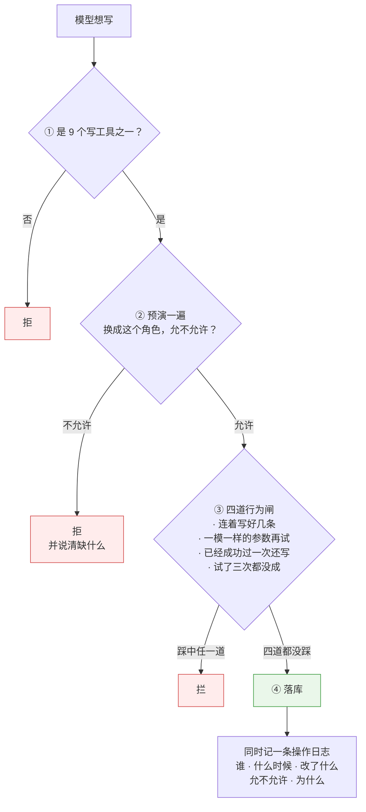
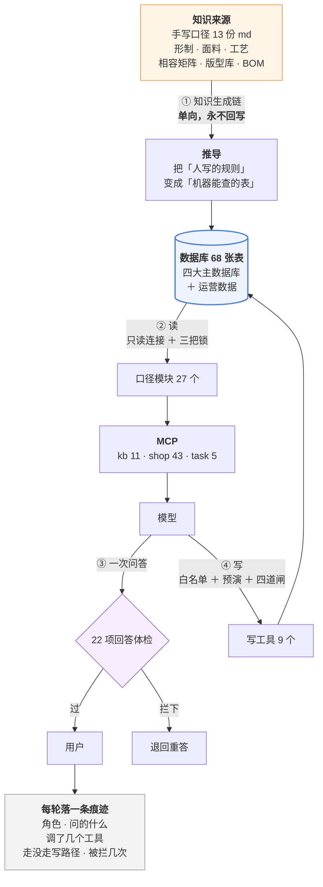

# 澜绣云裳 Agent · 产品说明

> 版本:V1.0 · 2026-09-18
> **文档里所有数字都是当天从库和源码里现取的**,不是手抄的。
> 手抄的数会漂,而漂了的文档和没有文档是一回事 —— 这份文档自己也守这条。

---

## 1. 一句话

**澜绣云裳 Agent 是一个汉服定制业务的运维助手:店里的人用大白话问,它去查真实的库、按写好的口径算,给出带出处的答复;需要动数据的时候,它走一条比读严得多的通道。**

它不是聊天机器人。区别在三件事上:

| | 聊天机器人 | 这个 Agent |
|---|---|---|
| 数字从哪来 | 模型脑子里 | **必须调工具从库里查**,查不到就说查不到 |
| 口径谁定 | 模型当场编 | **写死在口径模块里**,工具只取数不定规矩 |
| 能不能改数据 | 不能,或者随便改 | 能,但要过写工具白名单 + 预演 + 四道闸 |

---

## 2. 谁在用

库里 **38 个在职员工**,六种角色。**每种角色看到的工具和收到的规矩都不一样** —— 不是同一个助手换个称呼。

| 角色 | 人数 | 典型问题 |
|---|---|---|
| 工匠 | 21 | 我手上有哪些活?哪件要拖了? |
| 顾问 | 9 | 这位客户该跟进吗?这套配置能做吗、多少钱、多久? |
| 店长 | 3 | 这个月店里怎么样?这单该派给谁? |
| 版师 | 2 | 这个版型的裁片用料占比是多少?这个客户要不要改版? |
| 总部运营 | 2 | 哪些客户在流失?这个活动效果如何? |
| 财务 | 1 | 这笔退款卡在哪?这单为什么对不上? |

**为什么要分角色:** 让模型去调一个它没有的工具,它会开始编。所以提示词是**按调用方实际挂了哪些工具装配**的 —— 挂了什么工具,才发对应的规矩。

---

## 3. 它能做什么,明确不做什么

### 能做

- **查**:工艺能不能做、面料配不配、版型有哪些码、这单到哪一步了、这个客户属于哪一档
- **算**:报价、工期倒推、尺码推荐、成长身高预测、RFM 分档、产能排期、裁片用料
- **判**:该不该跟进、该不该改版、售后该谁担责、这单能不能下、库存该不该补
- **写**(受控):派单、改派、结单、审批、调整会员等级

### 明确不做

- **不做自动触达。** 发短信、发微信、打电话是对外动作。Agent 只出清单和依据,**按不按是人的决定**。
- **不替业务定阈值。** 「压几天算流失」「补货点画在哪」这类线是业务的决定,不是算法的。工具只排序,不划线。
- **不在证据不足时硬判。** 售后判责查不到现场记录就说查不到,不猜。
- **不碰钱。** 不涉及支付、退款的实际执行,只查状态和定因。

---

## 4. 总体架构

### 4.1 一张图看全

**为什么口径要单独一层:**「可售天数怎么算」「哪种情况算流失」这类规矩如果写在工具里,同一个概念会在三个工具里长出三个版本,而它们**看起来都对**。现在口径只有一处,工具只负责取数。

### 4.2 MCP / Skill / Hook 分别管什么

这三样常被混着说,其实职责完全不同。**记住这张表,后面每个服务的说明都按它来读:**

| | 是什么 | 什么时候起作用 | 数量 |
|---|---|---|---|
| **MCP 工具** | 模型**能查什么、能改什么** | 模型自己决定要不要调 | 59 个(读 50 / 写 9) |
| **Skill** | 一套**固定动作**:先查哪几样、按哪几段输出 | 模型判断「这件事属于那一类」时自动触发 | 3 个 |
| **Hook** | **每一轮都跑的守卫**,模型管不着也关不掉 | 每轮开头、每次调工具前后、交付之前 | 4 个 |

一句话区分:
- **工具**回答「我能拿到什么」
- **Skill** 回答「这类事该怎么做才不漏」
- **Hook** 回答「不管你怎么做,这几条必须成立」

⚠️ **Hook 不属于任何一个服务** —— 它对所有服务一视同仁。所以下面服务清单里,Hook 那一栏写的是「哪几条对这个服务特别关键」,不是「只有这个服务才有」。

### 4.3 MCP:三个服务,59 个工具

**为什么分三个而不是一个:** 给一个角色多余的工具,代价不是浪费,是**它会去用**。工匠不需要看到客户资产,顾问不需要看到工单调度。分服务之后,挂哪几个是一次配置,不是每次提醒模型「别用那个」。

✍️ 标记的是**写工具**(共 9 个),要过白名单 + 预演 + 四道闸,见 4.6。

#### `kb` · 知识库(11 个)—— 回答「能不能做、怎么做、多少钱、多久」

| 工具 | 干什么 |
|---|---|
| `kb_lookup` | 按关键词查工艺知识库。也可按分类(形制/材质/工艺/配饰)或来源等级(public/scal |
| `kb_detail` | 按编码取一条知识的完整内容(含出处链接)。编码形如 KF01 / MT01 / XZ01 / |
| `kb_combo` | 查某工艺能否用于某面料。工艺名和面料名直接写中文即可(如「妆花」「云锦」),不必也不要猜编码 |
| `kb_read` | 读知识库原文 —— 表里查不到、只在正文里的那些话:怎么洗怎么存、为什么这么做、客户问「为什 |
| `kb_tables` | 取全部决策表(6 张共 30 行:客户原话对照、选料决策、配饰形制搭配、配色易错、工期档位、 |
| `kb_coverage` | 查相容矩阵的完成度(共多少格、已定义多少、未定义多少)。 |
| `kb_pattern` | 查版型库:某个形制有哪些版型、每个版型分几个裁片、能出哪些尺码、改版难度多高。客户问「这个能 |
| `kb_size` | 查某版型的成衣尺码表(各部位厘米数)。返回的是成衣尺寸不是人体尺寸,和客户量体值之间差一个放 |
| `kb_fit` | 拿客户的量体记录比对版型尺码表,给出推荐尺码和档位(标准码 / 调号 / 全定制 / 需补量 |
| `kb_lead` | 算工期:给定版型 + 尺码 + 面料 + 工艺,返回最快到最慢的天数区间、每一段花多久、关键 |
| `kb_bom` | 算料算钱:给定版型 + 尺码 + 面料 + 所选工艺,返回完整物料清单(每项的净用量、损耗、 |

#### `shop` · 门店业务(43 个)

**任务与派工**

| 工具 | 干什么 |
|---|---|
| `my_tasks` | 看我自己的任务。顾问只看得到派给自己的,店长看本店全部 —— 这是数据隔离,不是界面上少显示 |
| `task_types` | 九种任务类型的数据规范:每种挂哪张单据(客户号/订单号/维保单号/售后单号/不挂)、谁能派、 |
| `get_task` | 看一条任务的详情。看不到别人的 —— 知道单号也看不到:顾问只能看派给自己的,店长能看本店的 |
| `dispatch_pool` | 待分配池:客户已经约了时间、但系统没能自动派单的任务。每条都带 agent 的人选建议和依据 |
| `team_tasks` | 本店每个顾问手上各有什么活 —— 店长看团队用这个。按人分组,带每个人的在办件数、最近到期时 |
| ✍️ `assign_task` | 派一条任务(真的写进去,立即生效)。只有店长及以上能派,只能派给本店在职顾问。type 见  |
| ✍️ `dispatch_task` | 把待分配池里的单分出去(真的写进去)。不给 assignee 就采纳 dispatch_po |
| ✍️ `reassign_task` | 改派:把一条已经派出去的任务转给另一个人(真的写进去)。和 dispatch_task 的区 |
| ✍️ `finish_task` | 把任务标记完成(真的写进去)。日程总结必填。只能完成派给自己的 —— 别人代点等于台账上写了 |
| ✍️ `assign_batch` | 一次排一批任务(排班用,真的写进去)。items 是列表,每条 {type, assigne |
| ✍️ `dispatch_batch` | 一次把待分配池里的几条单分出去(真的写进去)。items 是 [{task_id, assi |

**排班与复盘**

| 工具 | 干什么 |
|---|---|
| `week_grid` | 排班用的格子:一周里每个顾问哪天什么时段已经占了、哪几天完全没人排班、待分配还有几条。排班之 |
| `monthly_review` | 月度复盘:这个月做完了多少、几条逾期、逾期都在谁身上、改派几次和理由、agent 的派单建议 |
| `appt_funnel` | 预约到店转化漏斗:约了多少 → 我们确认了多少 → 真到店多少 → 量体多少 → 下单多少; |

**会员与审批**

| 工具 | 干什么 |
|---|---|
| `member_level` | 这个客户是哪一档会员、凭什么、离下一档还差多少。 门槛按 level_cfg,是滚动 12  |
| `points_ledger` | 积分流水和对账。 ⚠️ 余额是「同一个事实两个来源」:既能从 balance 字段读,也能从 |
| `approval_queue` | 审批队列:等级调整 / 积分调整 / 客户转移,谁申请的、什么理由、批了没有。这三种的共同点 |
| ✍️ `apply_adjust` | 提一张审批单(等级调整 / 积分调整 / 客户转移)—— ⚠️ 只是申请,不生效。这三件事都 |
| ✍️ `decide_approval` | 批一张审批单:同意或驳回。「待审批 → 已通过/已驳回」这一步只有总部运营能走(角色判定在状 |
| `get_lifecycle` | 查会员生命周期判定:某个客户属于八档中的哪一档(潜在/新客/活跃/高价值/忠诚/休眠/潜在流 |
| `get_member_priority` | 回答「同一档里先联系谁」。给一个生命周期档位(如「潜在流失」),按 RFM 三维打分并排出优 |

**客户与订单**

| 工具 | 干什么 |
|---|---|
| `get_order` | 查订单。给 order_id 返回单条全链路(双口径状态、金额勾稽、时间线、订单行、关联售后 |
| `can_order` | 下单之前先问一句:这单能下吗? 定制订单要有这个着装人下单前的量体,而且不能超期 —— 超期 |
| `get_wearer` | 查着装人档案 —— 衣服穿在谁身上,和「谁付钱」是两回事。身份绑在账户上(账户以手机号为主标 |
| `recovery_queue` | 未成交挽回清单 —— 下了单没付钱的、约了没来的,各压着多少钱、压了多久、该按什么顺序跟。不 |
| `activity_roi` | 活动投入产出:花了多少、带来多少成交、投入产出比、单均获客成本。不给 code 就是全部活动 |
| `channel_compare` | 多渠道表现对比 —— 四个下单渠道(微信小程序/官网/门店 Pad/客服代下单)各自的单量、 |

**库存与产能**

| 工具 | 干什么 |
|---|---|
| `get_stock` | 查现货。四种问法,给其中一个参数即可:sku=某个具体规格;spu=某个商品的全部规格;ma |
| `stock_alert` | 库存预警 —— 哪些 SKU 要断了、哪些看着有货其实一件都发不出(在手有货但全被订单占用) |
| `get_capacity` | 查工坊产能排期。不传 craft 就是全工坊负载概览(每个工种几人、在制多少、手上的活要消化 |
| `get_workorder` | 查在制工单:这件活在谁手上、做到哪一步、会不会拖。可按工单号、师傅(工号或姓名)、状态、订单 |
| `my_workorders` | 我手上的工单。工匠看自己的,工坊管事看本坊,总部运营看全部 —— 范围跟身份走。带在制上限和 |

**版师相关**

| 工具 | 干什么 |
|---|---|
| `pattern_queue` | 版师的排队看板 —— 「今天该我核什么」。不用传任何参数。把版师手上的活一次列全:裁片用料占 |
| `grading_audit` | 推档自检 —— 把「要核 1237 个数」压成「要核 12 条档差」。尺码表全部是推出来的( |
| `piece_ratios` | 裁片用料占比 —— 版师核对用。不传 pattern 给全部版型的核对进度;传 patter |
| ✍️ `set_piece_ratio` | 改一片的用料占比,并标成「版师核过」。改完这一片就锁住,不会再被估算覆盖;同版型其余没核过的 |

**定制与售后**

| 工具 | 干什么 |
|---|---|
| `fitting_queue` | 白坯试衣看板 —— 哪些定制单该做白坯试衣、试了没有、客户签没签字。白坯试衣是重工订单唯一的 |
| `get_aftersale` | 查售后记录(退货/换货/退款/维修),可按订单号、客户或状态筛。退款类会带上退款轨迹。这个工 |
| `get_maintain` | 查售后维修工单的现场。客户说「衣服起球了 / 开线了 / 尺寸不对」时用。返回这件是什么(形 |
| `get_review_queue` | 看待核实队列:哪些工艺×面料组合被顾问问到了、却没有任何依据,按被问次数排序。 背景:相容矩 |

**推算与校验**

| 工具 | 干什么 |
|---|---|
| `plan_for_event` | 场景倒推 —— 客户说「明年六月毕业礼要穿」时用这个。它把四个互相咬着的约束一次算完:①选码 |
| `forecast_growth` | 推算某个着装人到未来某天的身高,并给留成长量建议。主要用于小孩 —— 定制工期 30–150 |
| `check_write` | 问「这件事业务允不允许做」时用它。它会拿真正的校验器跑一遍,返回能不能做、错误码和理由。不写 |

#### `task` · 任务与财务排查(5 个)

| 工具 | 干什么 |
|---|---|
| `list_tasks` | 列出待处理的人工任务。task_type 可选:财务人工任务、客户合并确认 |
| `get_deposit` | 读取押金单:金额、当前状态、幂等号、关联预约号 |
| `get_refund_trace` | 读取退款尝试轨迹,含每次重试的返回码、请求金额和幂等号 |
| `get_payment_flow` | 读取支付流水,direction=in 为收款,out 为退款,含渠道流水号与最终状态 |
| `get_customer` | 读取客户档案(手机号与地址已脱敏) |

### 4.4 Skill:三个

Skill 管的是「一套固定动作」—— 一句话说不清、又必须每次都照做的那种。

| Skill | 什么时候自动触发 | 它强制做什么 |
|---|---|---|
| **`quote`** 定制报价单 | 用户提到报价、出个价、做份方案、这套多少钱、能不能便宜点 —— **哪怕没说「报价单」三个字** | 先把**可行性 / 尺码 / 用料 / 工期**四样全查一遍,再按固定八段出单:方案 · 可行性 · 尺码 · 用料 · 工期 · 价格 · 风险 · 下一步。附齐免责声明 |
| **`growth-plan`** 童装成长方案 | 问题涉及孩子将来的尺寸:明年还能不能穿、某个日子该做多大、要不要留放量 | 按固定六段出:预测区间 · 依据 · 留成长量 · 复量周期 · 风险 · 下一步。**必须给区间不给点估计** |
| **`roster`** 一周排班 | 要一次安排多天或多人:排班、值班、这周谁值哪天、把待分配的都排进去 | 先看现有占用和冲突 → 排一张整周的表 → **念给店长听让他改** → 才写入 |

**为什么要做成 Skill 而不是写进提示词:** 这三件事都有「**漏一步就废**」的特点 ——
报价漏查工期就是空口报价,成长方案给点估计等于没给,排班不先看冲突就是排了也用不了。
写在提示词里是一句「记得先查」,做成 Skill 是**一套必须走完的步骤**。

### 4.5 Hook:四个,不分服务,每一轮都跑

Hook 是这套系统里**模型关不掉的那一层**。

| Hook | 什么时候跑 | 干什么 | 为什么非要它不可 |
|---|---|---|---|
| **开场注入** `UserPromptSubmit` | 每轮用户提问时 | 把**今天几号**和**最近三条工作日记**塞进去 | 模型不知道今天几号,**工期倒推会算错,而且错得很自然,没人看得出来**。日记每轮都注 —— 原本想只在「重要动作」时注,判据当场就漏(「排下周的班」不含「排班」) |
| **调用前记账** `PreToolUse` | 每次调工具之前 | 影子埋点(**只记不改**)+ 给放行的写操作记一笔**结构化**的:哪个工具、什么参数、成没成 | 只记工具名的话,分不出「改正参数重试」和「又要做一件新的」——**这两件该放和该拦是相反的** |
| **调用后回填** `PostToolUse` | 每次调工具之后 | 回填这次写**成没成** | 不回填的话,**一次校验失败就把这一轮的写额度用光了** —— 而改正一个校验错误是完全正当的 |
| **交付前体检** `Stop` | 模型准备交付答案时 | 跑 22 项回答体检,没过就**打回重答**(只打回一次,不无限循环) | 这是最后一道 —— 前面都过了、话也说得很像,**站不住的那一句就靠它拦** |

### 4.6 闸:三层,各管一件事

**① 读的闸 —— 三把锁**

| 锁 | 挡什么 |
|---|---|
| 工具层的数据库连接**开成只读** | 任何写操作当场报错,而不是「碰巧没人写」 |
| 任何提到 `truth` 的 SQL **一律拒绝执行** | 评测答案不许经工具层暴露 —— 不看语句形状,运行时拦 |
| 密码哈希与盐**连读都不许读** | 拿到手就能离线爆破,所以和答案表同等对待 |

**② 写的闸 —— 比读多三道**

**③ 答的闸 —— 22 项回答体检**(由 `Stop` Hook 执行)

抓的是「话说得很像但站不住」的那类:

- 给了数字却一个工具都没调 —— 数字没有出处
- 把成本当售价报出去
- 整单工期只说了一条链路,没算并行
- 没查规则就说「你这个发现对」,顺着对方的前提往下推
- 该说「这一格没录入」的地方,推断了一个值

---

## 5. 支持哪些服务

上一章是「有哪些零件」,这一章是「零件怎么组成一件事」。

**每个服务都按同一个格式写:解决什么问题 → 流程走几步 → 用到哪些工具 / Skill / Hook。**

### 5.0 服务总览

| # | 服务 | 主要给谁用 | 一句话 | Skill |
|---|---|---|---|---|
| 1 | **知识问答与可行性** | 顾问 · 店长 | 这个工艺能不能用在这个面料上、为什么 | — |
| 2 | **报价与方案** | 顾问 | 一套配置下来多少钱、多久、有什么风险 | `quote` |
| 3 | **量体与尺码** | 顾问 · 版师 | 这个客户穿哪个码、要不要改版 | — |
| 4 | **童装成长方案** | 顾问 | 孩子明年还能不能穿、该留多少放量 | `growth-plan` |
| 5 | **下单前置校验** | 顾问 | 这单现在能不能下、缺什么 | — |
| 6 | **排班与派工** | 店长 | 这周谁值哪天、待分配的怎么分 | `roster` |
| 7 | **工坊产能与工单** | 工匠 · 店长 | 我手上有什么活、哪件要拖、加急能不能接 | — |
| 8 | **客户运营** | 顾问 · 总部运营 | 谁在流失、先联系谁、会员该不该升档 | — |
| 9 | **售后与判责** | 顾问 · 店长 | 这件该谁担责、怎么处理 | — |
| 10 | **版师核对** | 版师 | 今天该我核什么、这个数对不对 | — |
| 11 | **经营复盘** | 店长 · 总部运营 | 这个月怎么样、渠道/活动/库存有没有问题 | — |

---

### 5.1 知识问答与可行性

**解决什么:** 顾问面对客户时最常被问的那一类 —— 「这个能不能做」「为什么不能」「有没有替代」。以前要翻文档、问版师,现在直接问。

**流程**

1. 顾问问「妆花能用在香云纱上吗」
2. 模型调 `kb_combo` 查相容矩阵 → 得到「可 / 不可 / 未定义」和依据
3. 不可 → 调 `kb_lookup` 找替代工艺;未定义 → 如实说「这一格没录入」,并进 `get_review_queue` 待核实队列
4. 要讲原理 → 调 `kb_read` 读知识库原文(表里没有、只在正文里的那些话)

**用到什么**

| | |
|---|---|
| **架构** | **单点读**。模型 → `kb` 服务 → 口径 `knowledge/kb.py`、`derive_combo.py` → `craft` / `craft_combo` 表。**全程只读**,只过读的三把锁 |
| **MCP** | `kb_combo` · `kb_lookup` · `kb_detail` · `kb_read` · `kb_tables` · `kb_coverage` · `get_review_queue` |
| **Skill** | 无 —— 这是单点问答,没有「必须走完的几步」 |
| **Hook** | 交付前体检里的「**该说没录入的地方不许推断一个值**」对这个服务最关键 |

---

### 5.2 报价与方案 `quote`

**解决什么:** 客户问「这套做下来多少钱、多久」。**口头报价最容易出事**:漏算工艺加价、漏算损耗、只算一条工期链路。

**流程**(Skill 强制走完,少一步不出单)

1. **先查,再写** —— 四样必须全查:
   - `kb_combo` 可行性(能不能做)
   - `kb_fit` 尺码(该穿哪个码、要不要改版)
   - `kb_bom` 用料与钱(净用量 · 损耗 · 实际用量 · 单价)
   - `kb_lead` 工期(**最快到最慢的区间**,关键路径在哪)
2. 按**固定八段**出单:方案 · 可行性 · 尺码 · 用料 · 工期 · 价格 · 风险 · 下一步
3. 附齐免责声明

**用到什么**

| | |
|---|---|
| **架构** | **多步编排**(Skill 串起 4 个工具)。模型 → `kb` 服务 → 口径 `fitting.py` / `leadtime.py` / BOM 推导 → `pattern` / `material` / `pattern_bom`。**只读不写** |
| **MCP** | `kb_combo` · `kb_fit` · `kb_bom` · `kb_lead` · `kb_size` · `kb_pattern` |
| **Skill** | **`quote`** —— 用户说「报个价」「这套多少钱」「能不能便宜点」就触发,不必说「报价单」 |
| **Hook** | 交付前体检的「**报了总价但没算过料**」「**把成本当售价**」两条,专门守这个服务 |

---

### 5.3 量体与尺码

**解决什么:** 成衣尺码表是**成衣尺寸**,客户量的是**人体净尺寸**,中间差一个放松量。**直接相减一定判错。**

**流程**

1. `kb_size` 取版型的成衣尺码表
2. `kb_fit` 拿客户量体记录比对 → 给出**推荐尺码**和**档位**
3. 档位三档:标准码(直接下) / 调号(改几个数) / 全定制(出专属版)
4. 量体记录过期 → 拦下,要求复量(**超期的记录不是参考值,是无效值**)

**用到什么**

| | |
|---|---|
| **架构** | **读 + 口径计算**。`kb` 服务 → `knowledge/fitting.py`(放松量表来自 `10-版型库.md`)→ `size_spec` / `measure_rec` |
| **MCP** | `kb_size` · `kb_fit` · `kb_pattern` · `get_wearer` |
| **Skill** | 无 |
| **Hook** | — |

---

### 5.4 童装成长方案 `growth-plan`

**解决什么:** 定制工期 30–60 天,而孩子在长。**做的时候合身,穿的时候小了。**

**流程**(Skill 强制六段)

1. `forecast_growth` 推算到目标日期的身高 —— **给区间,不给点估计**
2. 说清依据(百分位曲线 / 突增窗口)
3. 给留成长量建议(裙长 / 衣长折边能放多少)
4. 给复量周期
5. 风险
6. 下一步

**用到什么**

| | |
|---|---|
| **架构** | **读 + 口径计算**。`shop` 服务 → `knowledge/growth.py`(百分位曲线 + 突增窗口)→ `wearer` / `measure_rec` |
| **MCP** | `forecast_growth` · `get_wearer` · `kb_size` · `plan_for_event` |
| **Skill** | **`growth-plan`** —— 只要问题涉及孩子将来的尺寸就触发 |
| **Hook** | 交付前体检的「**吞掉区间只报点估计**」这一条,就是为它设的 |

---

### 5.5 下单前置校验

**解决什么:** 定制单下下去之后再发现缺量体、量体过期、着装人未成年没监护人同意 —— **返工成本极高**。

**流程**

1. `can_order` 一次问全:这单能下吗?
2. 三档结果:可以 / 不可以(缺什么说清楚) / 判不了(数据不全)
3. 「判不了」**不等于「可以」** —— 它单独成一档,不许糊成放行

**用到什么**

| | |
|---|---|
| **架构** | **读 + 预演**(`check_write` 拿真校验器跑一遍但**不写**)。`shop` 服务 → `knowledge/order_gate.py` → `ordr` / `measure_rec` / `wearer` |
| **MCP** | `can_order` · `get_wearer` · `kb_fit` · `check_write` |
| **Skill** | 无 |
| **Hook** | — |

---

### 5.6 排班与派工 `roster`

**解决什么:** 排一周的班不是排七次班 —— **一个人一天只能有一个身位**,冲突要一次看全。

**流程**(Skill 强制四步)

1. **先看现在什么样**:`week_grid` 取一周格子(谁哪天什么时段占了、哪天完全没人)+ `dispatch_pool` 待分配池
2. **排**:出一张整周的表
3. **念给店长听,让他改** —— 不直接写
4. **写**:`assign_batch` / `dispatch_batch` 一次落库

**用到什么**

| | |
|---|---|
| **架构** | **读 + 批量写**。`shop` 服务 → `backend/tasks.py` → `schedule` 表。**这是写路径**:过写工具白名单 + 预演 + 四道行为闸,批量走 `*_batch` 一次落库 |
| **MCP** | `week_grid` · `dispatch_pool` · `team_tasks` · `my_tasks` · `task_types` · ✍️`assign_batch` · ✍️`dispatch_batch` · ✍️`assign_task` · ✍️`dispatch_task` · ✍️`reassign_task` · ✍️`finish_task` |
| **Skill** | **`roster`** —— 要一次安排多天或多人就触发 |
| **Hook** | **写的闸对这个服务最要紧**:排班是批量写,`PreToolUse` 的「连着写好几条」会拦 —— 所以 Skill 要求走 `assign_batch` 一次写,而不是连发十条单写 |

---

### 5.7 工坊产能与工单

**解决什么:** 「这活什么时候能排上」「能不能加急」。**加急这件事不是钱能解决的** —— 织造一人一机,加人无效。

**流程**

1. `get_capacity` 看工坊负载(每个工种几人、在制多少、消化要多久)
2. `get_workorder` / `my_workorders` 看具体工单在谁手上、会不会拖
3. 加急请求 → 若该工种**一人一机**,直接说「加不了人,加钱也没用」,不给模糊承诺

**用到什么**

| | |
|---|---|
| **架构** | **单点读**。`shop` 服务 → `knowledge/capacity.py`(一人一机的约束在这里)+ `leadtime.py` → `workorder` / `staff` |
| **MCP** | `get_capacity` · `get_workorder` · `my_workorders` · `kb_lead` |
| **Skill** | 无 |
| **Hook** | 交付前体检的「**整单工期只说了一条链路,没算并行**」 |

---

### 5.8 客户运营

**解决什么:** 谁在流失、同一档里先联系谁、会员该不该升档。**这些判断以前靠顾问的印象。**

**流程**

1. `get_lifecycle` 判档(八档:潜在/新客/活跃/高价值/忠诚/休眠/潜在流失/流失)
2. `get_member_priority` 在同一档里按 RFM 三维排序 —— **只排序,不划线**
3. `recovery_queue` 未成交挽回:下了单没付钱的、约了没来的,各压着多少钱
4. 会员等级 / 积分调整 → `apply_adjust` **只是申请**,`decide_approval` 才生效(且只有总部运营能批)

**用到什么**

| | |
|---|---|
| **架构** | **读 + 两段式受控写**。`shop` 服务 → `knowledge/lifecycle.py`(判档唯一源头)+ `rfm.py`(同档排序)+ `recovery.py` → `customer` / `ordr`。**申请和生效是两步**,分属不同角色 |
| **MCP** | `get_lifecycle` · `get_member_priority` · `recovery_queue` · `member_level` · `points_ledger` · `approval_queue` · ✍️`apply_adjust` · ✍️`decide_approval` |
| **Skill** | 无 |
| **Hook** | 交付前体检的「**排序不是预测,不许承诺挽回率**」 |

---

### 5.9 售后与判责

**解决什么:** 「衣服起球了 / 开线了 / 尺寸不对」—— 该谁担责、怎么处理。**判据藏在现场记录里,不在客户的描述里。**

**流程**

1. `get_maintain` 查**现场**(这件是什么工艺面料、维修记录怎么写的)
2. `kb_tables` 取**判定表**(公司定的标准,不是模型对「什么算公平」的理解)
3. 出结论:责任方 + 处理方式 + 依据
4. **证据不足就说证据不足** —— 不硬判

**用到什么**

| | |
|---|---|
| **架构** | **只读**。`shop` 服务 → `knowledge/liability.py`(判定表推自 `09-养护与售后.md` 第五节)→ `maintain` / `aftersale` |
| **MCP** | `get_maintain` · `get_aftersale` · `kb_tables` · `get_order` |
| **Skill** | 无 |
| **Hook** | 交付前体检的「**没查现场就下判责结论**」 |

---

### 5.10 版师核对

**解决什么:** 尺码表全是推出来的,**1237 个数没人核得动**。把它压成「核 12 条档差」。

**流程**

1. `pattern_queue` —— 今天该我核什么(裁片 / 推档 / 待核实,一次列全)
2. `grading_audit` —— 推档自检:1237 个数 → 12 条档差
3. `piece_ratios` —— 裁片用料占比的核对进度
4. ✍️`set_piece_ratio` 改一片并标成「版师核过」—— **改完这一片就锁住,不再被估算覆盖**

**用到什么**

| | |
|---|---|
| **架构** | **读 + 单点写(必须带理由)**。`shop` 服务 → `knowledge/grading.py` + `piece_ratio.py` → `pattern_piece` / `size_spec`。写完那一片**锁住**,不再被估算覆盖 |
| **MCP** | `pattern_queue` · `grading_audit` · `piece_ratios` · ✍️`set_piece_ratio` · `kb_pattern` |
| **Skill** | 无 |
| **Hook** | 写的闸:`set_piece_ratio` 要求写理由,**而理由必须是版师给的** —— 助手替他编一条就是假记录 |

---

### 5.11 经营复盘

**解决什么:** 这个月做得怎么样、问题出在哪一环。

**流程**

1. `monthly_review` 月度复盘:做完多少、几条逾期、逾期在谁身上、改派几次和理由
2. `appt_funnel` 预约到店漏斗:约了 → 确认 → 到店 → 量体 → 下单,**每一环掉多少**
3. `activity_roi` 活动投入产出 · `channel_compare` 渠道对比 · `stock_alert` 库存预警
4. **只给数和排序,不替业务划线**

**用到什么**

| | |
|---|---|
| **架构** | **只读聚合**。`shop` 服务 → `knowledge/review.py` + `appt_funnel.py` + `activity.py` + `channel.py` + `stockalert.py` → 跨多表。**不写任何东西** |
| **MCP** | `monthly_review` · `appt_funnel` · `activity_roi` · `channel_compare` · `stock_alert` · `get_stock` · `fitting_queue` |
| **Skill** | 无 |
| **Hook** | 开场注入的「今天几号」对这个服务最关键 —— **月度口径算错了看不出来** |

---

## 6. 数据信息流转

### 6.1 全景

### 6.2 知识生成链:单向,永不回写

**人写规则 → 机器推表 → 表进库。反过来一步都不许走。**

| 手写的 | 推出来的 | 规模 |
|---|---|---|
| `01-形制.md` | 形制字典 | — |
| `06-相容矩阵.md` 的规则 | 工艺×面料相容矩阵 | **2025 格** |
| `10-版型库.md` 的基码与档差 | 全部尺码 | 86 版型 / 391 裁片 / **1237 条尺码** |
| `11-物料与BOM.md` 的参数 | 用料清单 | 135 物料 / 341 版型用料 / 69 工艺用料 |

**为什么不许回写:** 回写一次,库里就多了一个「没人写过、也没人推过」的数,而它和推出来的数长得一模一样。以后再也说不清哪个是依据、哪个是结果。
门禁里有一条专门对账:**知识库写的和库里存的必须一致**,不一致就红。

### 6.3 四大主数据库

对标成衣定制行业的做法,主数据分四块:

| 库 | 回答什么 | 规模(2026-09-18 实测) | 手写还是推的 |
|---|---|---|---|
| **款式库** | 长什么样 | 商品 296 / SKU 805 / 类目 53 | 由版型 × 相容矩阵生成 |
| **工艺库** | 能不能做 | 工艺条目 168 / 相容矩阵 2025 格 | 知识手写,矩阵推 |
| **版型库** | 怎么裁 | 版型 86 / 裁片 391 / 尺码 1237 | 基码手写,推档推 |
| **BOM 库** | 多少钱、多久备齐 | 物料 135 / 版型用料 341 / 工艺用料 69 | 参数手写,清单算 |

运营侧数据:客户 106 / 着装人 127 / 订单 3903 / 量体记录 1979 / 工单 53 / 日程 90 / 售后 26。

### 6.4 一次问答的完整流转

以顾问问「**C10001 这套唐制齐胸襦裙,加妆花工艺能做吗?多少钱?什么时候能交?**」为例:

| 步 | 发生什么 | 关键约束 |
|---|---|---|
| 1 | **登录与会话归属** | 续聊只认这一份归属表:别人的会话一律拒 —— 里面有你看不到的数据 |
| 2 | **按角色装配提示词** | 顾问角色挂的工具决定收到哪 16–26 条规矩 |
| 3 | **模型决定调哪些工具** | 它拿到的是工具说明书,不是数据库 |
| 4 | **工具经 MCP 打到只读连接** | 三把锁在这一层生效 |
| 5 | **口径模块算** | 相容矩阵判能不能做;BOM 算料;工期按并行链路倒推,不是简单相加 |
| 6 | **模型组织答复** | 每个数字都要带出处 |
| 7 | **22 项回答体检** | 报了价没算过料?整单工期只算了一条链?当场拦 |
| 8 | **落痕迹** | 这一轮问了什么、调了几个工具、有没有走写路径、被拦了几次 |

**用户感觉得到的差别:** 它会说「**缂丝加不了急 —— 一台织机一个人,加人无效,加钱也没用**」,而不是「我们会尽力安排」。因为工期是算出来的,不是客气话。

### 6.5 每一轮留下什么

每轮对话记一条结构化记录,字段包括:

`角色` · `问的什么` · `像不像复合请求` · `走没走写路径` · `用没用批量` · `单条写了几次` · `被拦几次` · `拦的理由` · `触发了哪个技能` · `调了几个工具`

**为什么记这些:** 「效果不好」是一句没法改进的话。有了这些字段,才能问出「是工具没挂上,还是规矩没发到,还是模型没调」——**三种原因要改的地方完全不同**。

---

## 7. 怎么知道它是对的

三层,各管一件事:

| 层 | 规模 | 管什么 | 花不花钱 |
|---|---|---|---|
| **门禁** | **100 步** | 数据勾稽、规则推导、边界审计、页面跑得起来 | 不花钱,每次改动都跑 |
| **判分器对照** | 10 套评测集 | 判分器自己判得对不对(喂人造答案,不调模型) | 不花钱 |
| **模型评测** | 10 套评测集 | 模型真的答得对不对 | 花钱,手动跑 |

两条贯穿始终的纪律:

- **判分器先写,模型后跑。** 判分器错了,你会拿到一张假的满分成绩单 —— 而假的满分和真的满分长得一模一样。
- **咬合测试:每一项检查都要被故意改坏过,确认它真的会红。** 目前 **100 个检查脚本,100 个都有真跑过的咬合记录**。没红过的检查等于没有,而「验过的」和「没验过的」在代码里长得一样。

---

## 8. 边界与已知代价

写出来,免得有人自己撞上:

| 边界 | 代价 |
|---|---|
| **不接自动触达** | 清单出来了还要人去执行,效率上限在人 |
| **不替业务划线** | 补货点、流失天数这类阈值一天不定,对应的告警就一天做不成 |
| **口径写死在代码里** | 改口径要改代码,业务不能自助调 —— 换来的是同一个概念不会长出三个版本 |
| **只读连接 + 写工具白名单** | 加一个新的写能力要动三处(工具、预演、闸),慢;换来的是模型碰不到没授权的写口 |
| **演示数据** | 能安全挂单的客户只有 27 个、季节性只覆盖 3 月、部分流水与库存对不上 —— 这三处会让相关功能的演示效果打折 |

---

## 9. 一句话总结

**这个 Agent 的价值不在「会说话」,在于它说的每一句都能指回一个数据源、一条口径、一次工具调用。**

而这件事的成本,全花在四个地方:**把规矩从模型脑子里挪到代码里、把工具按角色分开、给写操作装闸、给每一项检查做咬合。**
