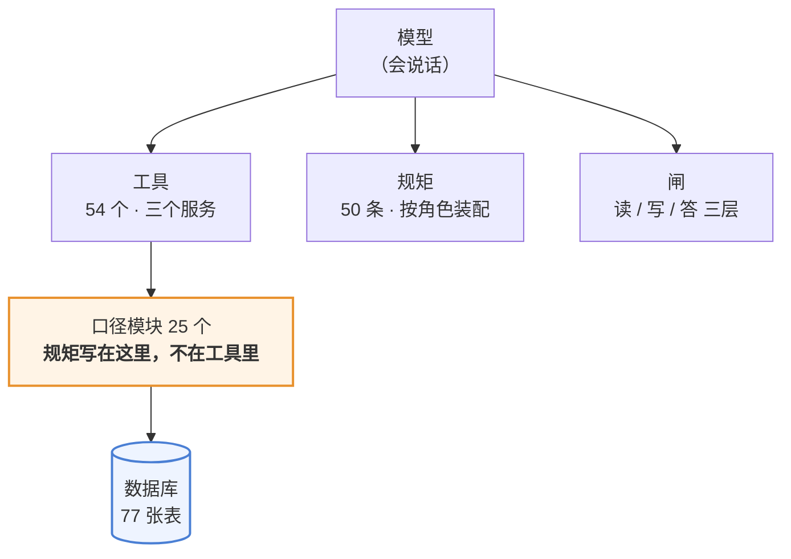
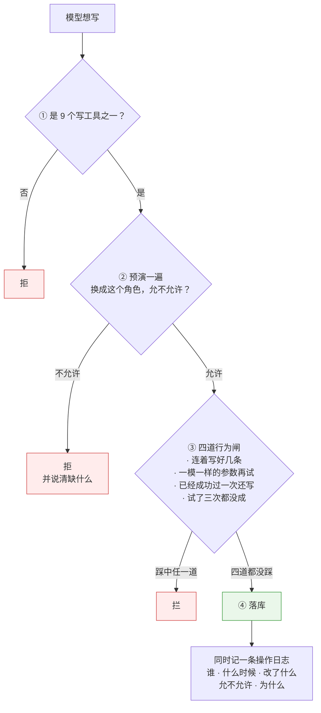
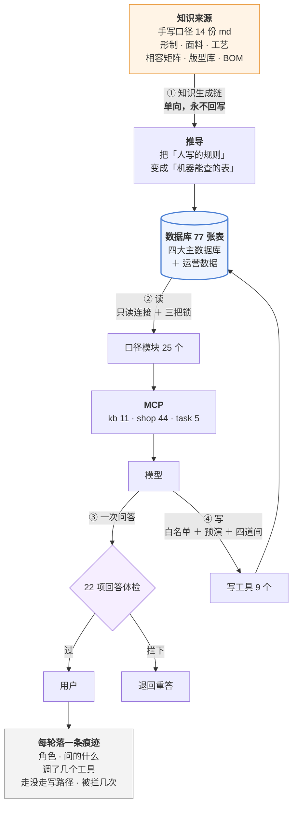

# 澜绣云裳 Agent · 产品说明

> 版本:V1.0 · 2026-09-18
> **文档里所有数字都是当天从库和源码里现取的**,不是手抄的。
> 手抄的数会漂,而漂了的文档和没有文档是一回事 —— 这份文档自己也守这条。

---

## 1. 一句话

**澜绣云裳 Agent 是一个汉服定制业务的运维助手:店里的人用大白话问,它去查真实的库、按写好的口径算,给出带出处的答复;需要动数据的时候,它走一条比读严得多的通道。**

它不是聊天机器人。区别在三件事上:

| | 聊天机器人 | 这个 Agent |
|---|---|---|
| 数字从哪来 | 模型脑子里 | **必须调工具从库里查**,查不到就说查不到 |
| 口径谁定 | 模型当场编 | **写死在口径模块里**,工具只取数不定规矩 |
| 能不能改数据 | 不能,或者随便改 | 能,但要过写工具白名单 + 预演 + 四道闸 |

---

## 2. 谁在用

库里 **38 个在职员工**,六种角色。**每种角色看到的工具和收到的规矩都不一样** —— 不是同一个助手换个称呼。

| 角色 | 人数 | 典型问题 |
|---|---|---|
| 工匠 | 21 | 我手上有哪些活?哪件要拖了? |
| 顾问 | 9 | 这位客户该跟进吗?这套配置能做吗、多少钱、多久? |
| 店长 | 3 | 这个月店里怎么样?这单该派给谁? |
| 版师 | 2 | 这个版型的裁片用料占比是多少?这个客户要不要改版? |
| 总部运营 | 2 | 哪些客户在流失?这个活动效果如何? |
| 财务 | 1 | 这笔退款卡在哪?这单为什么对不上? |

**为什么要分角色:** 让模型去调一个它没有的工具,它会开始编。所以提示词是**按调用方实际挂了哪些工具装配**的 —— 挂了什么工具,才发对应的规矩。

---

## 3. 它能做什么,明确不做什么

### 能做

- **查**:工艺能不能做、面料配不配、版型有哪些码、这单到哪一步了、这个客户属于哪一档
- **算**:报价、工期倒推、尺码推荐、成长身高预测、RFM 分档、产能排期、裁片用料
- **判**:该不该跟进、该不该改版、售后该谁担责、这单能不能下、库存该不该补
- **写**(受控):派单、改派、结单、审批、调整会员等级

### 明确不做

- **不做自动触达。** 发短信、发微信、打电话是对外动作。Agent 只出清单和依据,**按不按是人的决定**。
- **不替业务定阈值。** 「压几天算流失」「补货点画在哪」这类线是业务的决定,不是算法的。工具只排序,不划线。
- **不在证据不足时硬判。** 售后判责查不到现场记录就说查不到,不猜。
- **不碰钱。** 不涉及支付、退款的实际执行,只查状态和定因。

---

## 4. 总体架构

### 4.1 一张图看全



**为什么口径要单独一层:**「可售天数怎么算」「哪种情况算流失」这类规矩如果写在工具里,同一个概念会在三个工具里长出三个版本,而它们**看起来都对**。现在口径只有一处,工具只负责取数。

### 4.2 MCP / Skill / Hook 分别管什么

这三样常被混着说,其实职责完全不同。**记住这张表,后面每个服务的说明都按它来读:**

| | 是什么 | 什么时候起作用 | 数量 |
|---|---|---|---|
| **MCP 工具** | 模型**能查什么、能改什么** | 模型自己决定要不要调 | 54 个(读 45 / 写 9) |
| **Skill** | 一套**固定动作**:先查哪几样、按哪几段输出 | 模型判断「这件事属于那一类」时自动触发 | 6 个 |
| **Hook** | **每一轮都跑的守卫**,模型管不着也关不掉 | 每轮开头、每次调工具前后、交付之前、压缩之前 | 5 个 |

一句话区分:
- **工具**回答「我能拿到什么」
- **Skill** 回答「这类事该怎么做才不漏」
- **Hook** 回答「不管你怎么做,这几条必须成立」

⚠️ **Hook 不属于任何一个服务** —— 它对所有服务一视同仁。所以下面服务清单里,Hook 那一栏写的是「哪几条对这个服务特别关键」,不是「只有这个服务才有」。

### 4.3 MCP:三个服务,54 个工具

**为什么分三个而不是一个:** 给一个角色多余的工具,代价不是浪费,是**它会去用**。工匠不需要看到客户资产,顾问不需要看到工单调度。分服务之后,挂哪几个是一次配置,不是每次提醒模型「别用那个」。

✍️ 标记的是**写工具**(共 9 个),要过白名单 + 预演 + 四道闸,见 4.6。

#### `kb` · 知识库(11 个)—— 回答「能不能做、怎么做、多少钱、多久」

| 工具 | 干什么 |
|---|---|
| `kb_lookup` | 按关键词查工艺知识库。也可按分类(形制/材质/工艺/配饰)或来源等级(public/scal |
| `kb_detail` | 按编码取一条知识的完整内容(含出处链接)。编码形如 KF01 / MT01 / XZ01 / |
| `kb_combo` | 查某工艺能否用于某面料。工艺名和面料名直接写中文即可(如「妆花」「云锦」),不必也不要猜编码 |
| `kb_read` | 读知识库原文 —— 表里查不到、只在正文里的那些话:怎么洗怎么存、为什么这么做、客户问「为什 |
| `kb_tables` | 取全部决策表(6 张共 30 行:客户原话对照、选料决策、配饰形制搭配、配色易错、工期档位、 |
| `kb_coverage` | 查相容矩阵的完成度(共多少格、已定义多少、未定义多少)。 |
| `kb_pattern` | 查版型库:某个形制有哪些版型、每个版型分几个裁片、能出哪些尺码、改版难度多高。客户问「这个能 |
| `kb_size` | 查某版型的成衣尺码表(各部位厘米数)。返回的是成衣尺寸不是人体尺寸,和客户量体值之间差一个放 |
| `kb_fit` | 拿客户的量体记录比对版型尺码表,给出推荐尺码和档位(标准码 / 调号 / 全定制 / 需补量 |
| `kb_lead` | 算工期:给定版型 + 尺码 + 面料 + 工艺,返回最快到最慢的天数区间、每一段花多久、关键 |
| `kb_bom` | 算料算钱:给定版型 + 尺码 + 面料 + 所选工艺,返回完整物料清单(每项的净用量、损耗、 |

#### `shop` · 门店业务(38 个)

**任务与派工**

| 工具 | 干什么 |
|---|---|
| `get_tasks` | 查任务 —— 四种问法一个口。 不给参数=我自己的活;给 task_id=某一条的详情;sc |
| `task_types` | 九种任务类型的数据规范:每种挂哪张单据(客户号/订单号/维保单号/售后单号/不挂)、谁能派、 |
| ✍️ `assign_task` | 派一条任务(真的写进去,立即生效)。只有店长及以上能派,只能派给本店在职顾问。type 见  |
| ✍️ `dispatch_task` | 把待分配池里的单分出去(真的写进去)。不给 assignee 就采纳 dispatch_po |
| ✍️ `reassign_task` | 改派:把一条已经派出去的任务转给另一个人(真的写进去)。和 dispatch_task 的区 |
| ✍️ `finish_task` | 把任务标记完成(真的写进去)。日程总结必填。只能完成派给自己的 —— 别人代点等于台账上写了 |
| ✍️ `assign_batch` | 一次排一批任务(排班用,真的写进去)。items 是列表,每条 {type, assigne |
| ✍️ `dispatch_batch` | 一次把待分配池里的几条单分出去(真的写进去)。items 是 [{task_id, assi |

**排班与复盘**

| 工具 | 干什么 |
|---|---|
| `week_grid` | 排班用的格子:一周里每个顾问哪天什么时段已经占了、哪几天完全没人排班、待分配还有几条。排班之 |
| `monthly_review` | 月度复盘:这个月做完了多少、几条逾期、逾期都在谁身上、改派几次和理由、agent 的派单建议 |
| `appt_funnel` | 预约到店转化漏斗:约了多少 → 我们确认了多少 → 真到店多少 → 量体多少 → 下单多少; |

**会员与审批**

| 工具 | 干什么 |
|---|---|
| `get_member` | 查会员分层 —— 等级和生命周期一次给全。 给 customer(客户号或姓名)返回这个人的 |
| `points_ledger` | 积分流水和对账。 ⚠️ 余额是「同一个事实两个来源」:既能从 balance 字段读,也能从 |
| `approval_queue` | 审批队列:等级调整 / 积分调整 / 客户转移,谁申请的、什么理由、批了没有。这三种的共同点 |
| ✍️ `apply_adjust` | 提一张审批单(等级调整 / 积分调整 / 客户转移)—— ⚠️ 只是申请,不生效。这三件事都 |
| ✍️ `decide_approval` | 批一张审批单:同意或驳回。「待审批 → 已通过/已驳回」这一步只有总部运营能走(角色判定在状 |

**客户与订单**

| 工具 | 干什么 |
|---|---|
| `get_scheme` | 查方案。方案是「一件事」的单位 —— 客户这次想做的这件衣服(形制/面料/工艺/颜色/配饰/ |
| `get_order` | 查订单。给 order_id 返回单条全链路(双口径状态、金额勾稽、时间线、订单行、关联售后 |
| `can_order` | 下单之前先问一句:这单能下吗? 定制订单要有这个着装人下单前的量体,而且不能超期 —— 超期 |
| `get_wearer` | 查着装人档案 —— 衣服穿在谁身上,和「谁付钱」是两回事。身份绑在账户上(账户以手机号为主标 |
| `recovery_queue` | 未成交挽回清单 —— 下了单没付钱的、约了没来的,各压着多少钱、压了多久、该按什么顺序跟。不 |
| `activity_roi` | 活动投入产出:花了多少、带来多少成交、投入产出比、单均获客成本。不给 code 就是全部活动 |
| `channel_compare` | 多渠道表现对比 —— 四个下单渠道(微信小程序/官网/门店 Pad/客服代下单)各自的单量、 |

**库存与产能**

| 工具 | 干什么 |
|---|---|
| `get_stock` | 查现货。四种问法,给其中一个参数即可:sku=某个具体规格;spu=某个商品的全部规格;ma |
| `stock_alert` | 库存预警 —— 哪些 SKU 要断了、哪些看着有货其实一件都发不出(在手有货但全被订单占用) |
| `get_capacity` | 查工坊产能排期。不传 craft 就是全工坊负载概览(每个工种几人、在制多少、手上的活要消化 |
| `get_workorder` | 查在制工单:这件活在谁手上、做到哪一步、会不会拖。可按工单号、师傅(工号或姓名)、状态、订单 |
| `my_workorders` | 我手上的工单。工匠看自己的,工坊管事看本坊,总部运营看全部 —— 范围跟身份走。带在制上限和 |

**版师相关**

| 工具 | 干什么 |
|---|---|
| `pattern_queue` | 版师的排队看板 —— 「今天该我核什么」。不用传任何参数。把版师手上的活一次列全:裁片用料占 |
| `grading_audit` | 推档自检 —— 把「要核 1237 个数」压成「要核 12 条档差」。尺码表全部是推出来的( |
| ✍️ `set_piece_ratio` | 改一片的用料占比,并标成「版师核过」。改完这一片就锁住,不会再被估算覆盖;同版型其余没核过的 |

**定制与售后**

| 工具 | 干什么 |
|---|---|
| `fitting_queue` | 白坯试衣看板 —— 哪些定制单该做白坯试衣、试了没有、客户签没签字。白坯试衣是重工订单唯一的 |
| `get_aftersale` | 查售后记录(退货/换货/退款/维修),可按订单号、客户或状态筛。退款类会带上退款轨迹。这个工 |
| `get_maintain` | 查售后维修工单的现场。客户说「衣服起球了 / 开线了 / 尺寸不对」时用。返回这件是什么(形 |
| `get_review_queue` | 看待核实队列:哪些工艺×面料组合被顾问问到了、却没有任何依据,按被问次数排序。 背景:相容矩 |

**推算与校验**

| 工具 | 干什么 |
|---|---|
| `plan_for_event` | 场景倒推 —— 客户说「明年六月毕业礼要穿」时用这个。它把四个互相咬着的约束一次算完:①选码 |
| `forecast_growth` | 推算某个着装人到未来某天的身高,并给留成长量建议。主要用于小孩 —— 定制工期 30–150 |
| `check_write` | 问「这件事业务允不允许做」时用它。它会拿真正的校验器跑一遍,返回能不能做、错误码和理由。不写 |

#### `task` · 任务与财务排查(5 个)

| 工具 | 干什么 |
|---|---|
| `list_tasks` | 列出待处理的人工任务。task_type 可选:财务人工任务、客户合并确认 |
| `get_deposit` | 读取押金单:金额、当前状态、幂等号、关联预约号 |
| `get_refund_trace` | 读取退款尝试轨迹,含每次重试的返回码、请求金额和幂等号 |
| `get_payment_flow` | 读取支付流水,direction=in 为收款,out 为退款,含渠道流水号与最终状态 |
| `get_customer` | 读取客户档案(手机号与地址已脱敏) |

### 4.4 Skill:六个

Skill 管的是「一套固定动作」—— 一句话说不清、又必须每次都照做的那种。

| Skill | 什么时候自动触发 | 它强制做什么 |
|---|---|---|
| **`quote`**<br>定制报价单 | 用户提到报价、出个价、做份方案、这套多少钱、能不能便宜点 —— **哪怕没说「报价单」三个字** | 先把**可行性 / 尺码 / 用料 / 工期**四样全查一遍,再按固定八段出单:方案 · 可行性 · 尺码 · 用料 · 工期 · 价格 · 风险 · 下一步。附齐免责声明 |
| **`growth-plan`**<br>童装成长方案 | 问题涉及孩子将来的尺寸:明年还能不能穿、某个日子该做多大、要不要留放量 | 按固定六段出:预测区间 · 依据 · 留成长量 · 复量周期 · 风险 · 下一步。**必须给区间不给点估计** |
| **`roster`**<br>一周排班 | 要一次安排多天或多人:排班、值班、这周谁值哪天、把待分配的都排进去 | 先看现有占用和冲突 → 排一张整周的表 → **念给店长听让他改** → 才写入 |
| **`deadline-rescue`**<br>工期赶不上时怎么救 | 算出来赶不上:客户定了日子来不及、问「加急行不行」「多花钱能不能快」 | 先查有没有**压不动的那一类**(织造类是物理上限,加人加钱都没用,当场说不行);否则四个办法按代价从小到大试,**每试一个重算一遍工期**;把做得到的方案连同代价一起交给客户选 |
| **`exchange`**<br>办换货 | 客户要把买的换成别的:换尺码、换颜色、换款 | 先判**定制品没有换货这个出口**;标品则:提审批 → 批了才让寄回 → 原件入库才发新的 → 差价走原渠道多退少补 → **从买的渠道出货,不许跨渠道调货** |
| **`pattern-draft`**<br>出打版图 | 要一张能裁布或发给版师的图:打版图、裁片图、M 码的图纸、这款的版怎么裁 | 先把商品落到版型、号型从库里现读(**童装是 110–150 不是 M**);出的是**现画的地址不是附件**(版型改版图就跟着改);**图上的橙色警告要原话带出去** —— 那是数据有问题不是图画错了 |

**为什么要做成 Skill 而不是写进提示词:** 这几件事都有「**漏一步就废**」的特点 ——
报价漏查工期就是空口报价,成长方案给点估计等于没给,排班不先看冲突就是排了也用不了,
换货先发新件再等寄回就是两件都在外面。
写在提示词里是一句「记得先查」,做成 Skill 是**一套必须走完的步骤**。

⚠️ **后两个是 2026-09-19 补的,补的理由和前三个不一样。**
前三个是「一件事漏一步就废」;后两个是**工具算完之后那一步没人管**:
`plan_for_event` 会说「赶不上」,但赶不上之后怎么办,原来一条规矩都没有,模型只能自己编 ——
而编出来的加急方案读起来完全合理,**错的和对的长得一模一样**,直到料已经裁了。

> 这也是这一轮真正想清楚的一件事:**「解冻」不等于删工具。**
> 那几个被说成「冻结流程」的工具,大多数每一步都有唯一正确答案(算身高、推尺码、算工期),
> **中间结果不需要经过模型** —— 它们是计算,该留在工具里。
> 真正缺的是它们**算完之后**那个需要判断的循环:试一个办法 → 重算 → 还是不行 → 换下一个。
> 那个循环没法提前枚举成一次调用,**它才是技能**。

### 4.5 Hook:五个,不分服务,每一轮都跑

Hook 是这套系统里**模型关不掉的那一层**。

| Hook | 什么时候跑 | 干什么 | 为什么非要它不可 |
|---|---|---|---|
| **开场注入**<br>`UserPromptSubmit` | 每轮用户提问时 | 把**今天几号**和**最近三条工作日记**塞进去 | 模型不知道今天几号,**工期倒推会算错,而且错得很自然,没人看得出来**。日记每轮都注 —— 原本想只在「重要动作」时注,判据当场就漏(「排下周的班」不含「排班」) |
| **调用前记账**<br>`PreToolUse` | 每次调工具之前 | 影子埋点(**只记不改**)+ 给放行的写操作记一笔**结构化**的:哪个工具、什么参数、成没成 | 只记工具名的话,分不出「改正参数重试」和「又要做一件新的」——**这两件该放和该拦是相反的** |
| **调用后回填**<br>`PostToolUse` | 每次调工具之后 | 回填这次写**成没成** | 不回填的话,**一次校验失败就把这一轮的写额度用光了** —— 而改正一个校验错误是完全正当的 |
| **交付前体检**<br>`Stop` | 模型准备交付答案时 | 跑 22 项回答体检,没过就**打回重答**(只打回一次,不无限循环) | 这是最后一道 —— 前面都过了、话也说得很像,**站不住的那一句就靠它拦** |
| **压缩前立旗**<br>`PreCompact` | 上下文满了、系统要压缩对话之前 | 立一个旗;下一轮把**按号取过的单据**(订单号/维保单号/着装人号/任务号)和一句提醒注回去 | **压缩是模型察觉不到的** —— 压完之后摘要读起来完整、自洽、没有窟窿,它不会自己想起来「我是不是丢了个单号」。而**没有编号却决定下一步的事实**(客户说过不要撞色、预算上限、哪天要穿)最容易在这一步没掉 |

⚠️ 第五个守卫的判据和「当前方案」那条**一字不差**:**按号取过的单条才算,列清单不算**。
列清单里挑一条是 hook 替模型挑,**而 hook 不出现在对话里,没人看得见它挑过**。

### 4.6 闸:三层,各管一件事

**① 读的闸 —— 三把锁**

| 锁 | 挡什么 |
|---|---|
| 工具层的数据库连接**开成只读** | 任何写操作当场报错,而不是「碰巧没人写」 |
| 任何提到 `truth` 的 SQL **一律拒绝执行** | 评测答案不许经工具层暴露 —— 不看语句形状,运行时拦 |
| 密码哈希与盐**连读都不许读** | 拿到手就能离线爆破,所以和答案表同等对待 |

**② 写的闸 —— 比读多三道**



**③ 答的闸 —— 22 项回答体检**(由 `Stop` Hook 执行)

抓的是「话说得很像但站不住」的那类:

- 给了数字却一个工具都没调 —— 数字没有出处
- 把成本当售价报出去
- 整单工期只说了一条链路,没算并行
- 没查规则就说「你这个发现对」,顺着对方的前提往下推
- 该说「这一格没录入」的地方,推断了一个值

---

## 5. 三条业务线

**这套东西服务的不是一条线。** 排成一条会看不懂 ——
**打版定款不跟单走,它在任何一单之前很久就发生了。**

| 业务线 | 跟着什么走 | 服务对象 | 什么时候动 |
|---|---|---|---|
| **一 · 导购线**(面客) | 跟着**客户**走 | 顾问 9 · 店长 3 · 工匠 21 | 客户有动作、单子往前走的时候 |
| **二 · 打版定款线**(主数据) | 跟着**版型**走 | 版师 2 | 上新款 / 新面料 / 顾问问到却没依据时 |
| **三 · 经营分析线** | 跟着**周期**走 | 店长 3 · 总部运营 2 | 每周 · 每月 · 库存告警 |

**两条线之间的关系,是这份文档里最要紧的一句:**

> **导购线每一次报价、每一次推码,消费的都是打版定款线的产出。**
> 线二不做,线一不会报错 —— **它会报一个看起来很正常的高价**。
> 现在 391 条裁片用料占比**版师核过的是 0 条**,所以分部位报价只能按可选料里
> 最贵的那种算,**客户一直被报高**,而报价单上一点异常都看不出来。

**读写分布一眼看:** 导购线前三步基本只读、订单那步是**预演不落库**、生产那步是**写路径密集区**;
打版定款线是**带理由的单点写**;经营分析线**纯只读**。

---

## 5A. 业务线一 · 导购(跟着客户走)

六个卡点,沿客户自己的时间线:**还没进门 → 在店里问 → 下单 → 等做好 → 出问题 → 之后还来不来**。

### 卡点 A · 获客与转化

| | |
|---|---|
| **场景** | 月底复盘、活动结束后、看板每天打开时 |
| **需求** | 钱花在哪个渠道有效、约进来的人掉在哪一环、约了没来的怎么捞回来 |
| **服务对象** | **总部运营**(2 人)· **店长**(3 人) |
| **目前做到哪** | ✅ 漏斗 / 活动 ROI / 挽回清单都能跑<br>⚠️ **渠道对比目前的结论是「这张表不能用来比渠道」** —— 演示数据里渠道是按序号轮着发的,而且渠道与活动 100% 共线。**数都算得对,但不能拿来下结论**<br>⚠️ 演示数据的季节性只覆盖 3 月,春节不在区间里 |

> **要回答的问题:** 这个月约进来多少、掉在哪一环、哪个渠道带来的、活动花的钱值不值。

| 步 | Agent 干了什么 | 用到什么 |
|---|---|---|
| 1 | **预约到店漏斗**:约了 → 我们确认了 → 真到店 → 量体 → 下单,**每一环掉多少人** | `appt_funnel` |
| 2 | **渠道对比**:四个下单渠道各自的单量、客单价、转化 | `channel_compare` |
| 3 | **活动投入产出**:花了多少、带来多少成交、单均获客成本 | `activity_roi` |
| 4 | **未成交挽回**:下了单没付钱的、约了没来的,各压着多少钱、压了多久、该按什么顺序跟 | `recovery_queue` |

**架构:** 纯只读聚合。`shop` 服务 → 口径 `appt_funnel.py` · `channel.py` · `activity.py` · `recovery.py` → 跨 `appointment` / `ordr` / `activity` 多表。

**这一步 Agent 明确不做的事**

- **不划线。** 「压几天算流失」「补货点画在哪」是业务的决定。工具**只排序,不划线**。
- **不做自动触达。** 名单出来了,发不发短信、打不打电话是人的决定。

**指标与机制**

| | |
|---|---|
| **质量指标** | 判分器对照 **32 条**(report_eval,复盘与漏斗)。判的是「口径对不对」——分母为零时**给不给数**、各月加起来等不等于全部,**都可机器判定** |
| **性能** | **单轮、1–2 个工具**。聚合在口径模块里算完再返回,不靠模型逐条加总 |
| **Agent Loop 哪体现** | **最短的 loop** —— 一轮问答、一次工具调用就结束,不需要多轮推进 |
| **Harness 哪体现** | SDK 管循环和上下文;我们只提供工具和口径。这个卡点**不往 state 里放东西** |

---

### 卡点 B · 定制咨询与报价

| | |
|---|---|
| **场景** | 客人在店里、或微信上问「这个能不能做、多少钱」的那几分钟 |
| **需求** | 别让顾问翻三本册子、等版师回话、口头报一个漏算损耗的价 |
| **服务对象** | **顾问**(9 人)—— 直接面客的那一环 |
| **目前做到哪** | ✅ 可行性 / 量体推码 / 报价 / 童装成长四件全通,判分器与模型评测都覆盖到<br>⚠️ 相容矩阵 2025 格里有 **293 格是「需评估」**(要打样才能定),问到这些格子只能如实说要打样<br>⚠️ 43 条「能对客户说」的知识**还溯不了源**,等补出处 |

> **例子:** 一位妈妈带着 9 岁女儿进店:「明年六月毕业典礼,想做一套唐制齐胸襦裙,香云纱的,能不能加妆花?」

| 步 | 顾问问什么 | Agent 干了什么 | 用到什么 |
|---|---|---|---|
| 1 | 妆花能用在香云纱上吗? | 查相容矩阵,给「可 / 不可 / **需评估**」和依据(2025 格里 293 格是需评估);不可就给替代工艺 | `kb_combo` `kb_lookup` `kb_read` `kb_detail` |
| 2 | 孩子明年六月多高?现在做会不会小? | 推算到目标日期的身高**区间**,给留成长量和复量周期 | **Skill `growth-plan`** · `forecast_growth` `plan_for_event` |
| 3 | 量完了,该穿哪个码? | 拿量体值比对成衣尺码表 —— **中间差一个放松量,直接相减一定判错**;给推荐码和三档判定(标准码 / 调号 / 全定制) | `kb_fit` `kb_size` `kb_pattern` |
| 4 | 这套多少钱、多久? | **Skill 强制先把可行性 / 尺码 / 用料 / 工期四样全查完**,再按固定八段出单 | **Skill `quote`** · `kb_bom` `kb_lead` |

**架构:** 全程只读。模型 → `kb` 服务 → 口径 `fitting.py`(放松量表来自 `10-版型库.md`)· `growth.py` · `leadtime.py` → `size_spec` / `pattern` / `material`。

**为什么这一段要用 Skill:** 这两件事都有「**漏一步就废**」的特点 ——
报价漏查工期就是空口报价,成长方案给点估计等于没给。
写在提示词里是一句「记得先查」,做成 Skill 是**一套必须走完的步骤**。

**Hook 守什么**

| 守什么 | 挡掉的具体错误 |
|---|---|
| 开场注入「今天几号」 | **工期倒推会算错,而且错得很自然** —— 模型不知道今天是几号 |
| 交付前体检 | 报了总价却没算过料 · 把成本当售价 · **吞掉区间只报一个点估计** · 该说「这一格要打样才能定」却推断了一个值 |

**指标与机制**

| | |
|---|---|
| **质量指标** | 判分器对照 **20 条**(chat_eval,知识问答)+ **23 条**(tool_eval,工具使用)+ **22 条**(growth_eval,成长推算)。**最吃紧的一条判据**:报了数字却一个工具都没调 —— 可机器判定 |
| **性能** | **多轮、4+ 个工具**。实测 800 轮记录里 `quote` 触发 **12 次**、`growth-plan` **5 次**;这是全系统 loop 最长的卡点 |
| **Agent Loop 哪体现** | **loop 最长的地方** —— Skill 强制模型连着调可行性 / 尺码 / 用料 / 工期四样,每一步的返回都要进下一步的判断 |
| **Harness 哪体现** | SDK 管多轮循环;**我们提供 Skill 作为「必须走完的步骤」** —— harness 不知道业务上哪一步不能漏,这一层只能我们给 |

---

### 卡点 C · 订单管理

| | |
|---|---|
| **场景** | 顾问点「下单」之前那一下,以及之后任何一次「这单到哪了」 |
| **需求** | 别把缺量体、量体过期、未成年没监护人同意的单放出去 —— 返工成本极高 |
| **服务对象** | **顾问**(9 人)· **店长**(3 人) |
| **目前做到哪** | ✅ 下单前置校验三档判定、全链路查单、金额勾稽都能用<br>⚠️ 演示数据里**有量体记录的客户只有 86 个**,能安全挂定制单的更少 —— 演示时要挑人 |

> **要回答的问题:** 这单现在能不能下?下了之后到哪一步了?金额对不对得上?

| 步 | Agent 干了什么 | 用到什么 |
|---|---|---|
| 1 | **下单前置校验**:量体在不在、过没过期、未成年着装人有没有监护人同意 | `can_order` |
| 2 | 结果分**三档**:可以 / 不可以(缺什么说清楚) / **判不了**(数据不全) | 同上 |
| 3 | **查单**:双口径状态、金额勾稽、时间线、订单行、关联售后 | `get_order` |
| 4 | 想改数据之前先问一句「业务允不允许」—— 拿真校验器跑一遍但**不写** | `check_write` |

**架构:** **读 + 预演,不落库。** `shop` 服务 → `knowledge/order_gate.py` → `ordr` / `measure_rec` / `wearer`。

⚠️ **「判不了」单独成一档,不许糊成「可以」。** 数据不全和条件不满足是两回事 ——
前者要去补数据,后者要去改配置,**而它们在一个「不通过」里长得一模一样**。

**指标与机制**

| | |
|---|---|
| **质量指标** | 判分器对照在 **ops_eval 90 条**里(下单前置那一支)。判的是**三档分得开没有**:可以 / 不可以 / **判不了** |
| **性能** | **单轮、1 个工具**。`can_order` 一次问全,不需要模型分几次查 |
| **Agent Loop 哪体现** | 短 loop。但它是**预演**:拿真校验器跑一遍**不落库** —— loop 里出现了一个「像写但不写」的动作 |
| **Harness 哪体现** | SDK 管循环;`check_write` 这层**是我们加的** —— harness 没有「先问业务允不允许」这种概念 |

---

### 卡点 D · 排产、派工与交付

| | |
|---|---|
| **场景** | 单下了之后到衣服交出去之间的全部时间 |
| **需求** | 排班不能排出冲突、活不能悄悄拖、加急要给得出真答案 |
| **服务对象** | **店长**(3 人)排班派工 · **工匠**(21 人)看自己的活 |
| **目前做到哪** | ✅ 排班 / 派工 / 改派 / 结单 / 工坊产能 / 工单进度都能用<br>⚠️ **白坯试衣这一环只做了一半** —— 看板能看,但那道闸**拦不住任何东西**:缺一个「推进订单进裁剪」的写口,没有它闸就没有可拦的动作;真值也还没有 |

> **例子:** 单下了。店长要把量体、方案确认、试衣排进这周;工匠要知道手上有什么活;客户追问「能不能加急」。

| 步 | 谁 | Agent 干了什么 | 用到什么 |
|---|---|---|---|
| 1 | 店长 | 先看这周谁哪天占了、哪天空着、待分配池还剩几条 | `week_grid` `dispatch_pool` `team_tasks` |
| 2 | 店长 | 排一张整周的表,**念给店长听让他改**,确认后才一次写进去 | **Skill `roster`** · ✍️`assign_batch` ✍️`dispatch_batch` |
| 3 | 工匠 | 我手上有什么活、哪件要拖 | `my_workorders` `get_workorder` `my_tasks` `get_task` |
| 4 | 顾问 | 客户问能不能加急 → 若该工种**一人一机**,直接说「加不了人,加钱也没用」 | `get_capacity` `kb_lead` |
| 5 | 店长 | 哪些定制单该做**白坯试衣**、试了没、客户签没签 | `fitting_queue` |
| 6 | 工匠 | 这条活做完了 | ✍️`finish_task`(**只能完成派给自己的**) |

**架构:** **唯一的写路径密集区。** 排班是批量写,派工 / 改派 / 结单是单条写。
`shop` 服务 → `backend/tasks.py` → `schedule` / `workorder` 表;
口径在 `capacity.py`(**一人一机的约束写在这里,不在工具里**)和 `leadtime.py`。

**Hook 守什么**

| 守什么 | 挡掉的具体错误 |
|---|---|
| **写的闸(四道)** | 连着写好几条 · 一模一样的参数再试 · 已经成功过一次还写 · 试了三次都没成(**不许反复猜**) |
| 调用前记账 / 调用后回填 | 记**结构化**的写操作,分得清「改正参数重试」和「又要做一件新的」——**这两件该放和该拦是相反的**;被拒的写不算用掉额度 |
| 交付前体检 | 整单工期只说了一条链路,**没算并行** |

> **Skill 和 Hook 在这里是咬合的:** 正因为有「连着写好几条」这道闸,
> `roster` 才必须走 `assign_batch` 一次写,而不是连发十条单写。
> **Hook 定下边界,Skill 教会怎么在边界内把事办完。**

**指标与机制**

| | |
|---|---|
| **质量指标** | 判分器对照 **90 条**(ops_eval,工坊与任务)+ **27 条**(role_eval,角色边界)。**实测拦下 30 次**(27 轮),其中 17 次是调了本系统没挂的工具 |
| **性能** | **多轮 + 批量写**。三代实测(同一天、同模型、6 条工单):V2 工作流 1.0 次模型调用 / 2.6 秒 / \$0.0012;V3 Harness 2.5 次 / 28.6 秒 / \$0.0298 |
| **Agent Loop 哪体现** | **loop 里唯一带写的一段**:预演 → 写 → **回填成没成**。回填这一步在 loop 里,不在工具里 —— 否则一次校验失败就把写额度用光了 |
| **Harness 哪体现** | SDK 管循环;**四道行为闸由我们在 PreToolUse/PostToolUse 里实现** —— 「连着写好几条」「同参数再试」这类判断要跨轮次看,**harness 只看单次调用** |

---

### 卡点 E · 售后管理

| | |
|---|---|
| **场景** | 交付之后客户说「起球了 / 开线了 / 尺寸不对」的时候 |
| **需求** | 判责要有依据,不能靠顾问的印象,也不能靠模型对「什么算公平」的理解 |
| **服务对象** | **顾问**(9 人)接单 · **店长**(3 人)拍板 |
| **目前做到哪** | ✅ 查现场 + 取判定表 + 出结论跑通,判分器对照覆盖<br>⚠️ **判定表只做到行业做法的一半** —— 剩下那一半要业务补,现在遇到表里没有的情况只能说「判不了」 |

> **例子:** 客户三个月后来说「裙子起球了」。

| 步 | Agent 干了什么 | 用到什么 |
|---|---|---|
| 1 | 查**现场**:这件是什么工艺面料、维修记录怎么写的 | `get_maintain` `get_aftersale` `get_order` |
| 2 | 取**判定表** —— 公司定的标准,**不是模型对「什么算公平」的理解** | `kb_tables` |
| 3 | 出结论:责任方 + 处理方式 + 依据 | 同上 |
| 4 | 证据不足 → **说证据不足,不硬判** | — |

**架构:** 只读。`shop` 服务 → `knowledge/liability.py`(判定表推自 `09-养护与售后.md` 第五节)→ `maintain` / `aftersale`。

**Hook 守什么:** 交付前体检的「**没查现场就下判责结论**」—— 客户的描述不是判据,现场记录才是。

**指标与机制**

| | |
|---|---|
| **质量指标** | 判分器对照 **14 条**(liability_eval)。核心判据:**没查现场就下判责结论** —— 查轨迹里有没有 `get_maintain`,可机器判定 |
| **性能** | **单轮、2–3 个工具**(现场 + 判定表 + 订单) |
| **Agent Loop 哪体现** | 短 loop,但**两个工具的顺序有意义**:先查现场再取判定表。顺序反了模型会拿通用标准套具体case |
| **Harness 哪体现** | SDK 管循环;判定表来自知识库(`09-养护与售后.md`),**不在模型脑子里** |

---

### 卡点 F · 客户留存与会员

| | |
|---|---|
| **场景** | 每周跟进排期、月度运营复盘、客户要求升档的时候 |
| **需求** | 把「凭印象跟客户」换成「有依据的顺序」;升档不能一个人说了算 |
| **服务对象** | **顾问**(9 人)执行 · **总部运营**(2 人)审批 |
| **目前做到哪** | ✅ 八档判定 / RFM 同档排序 / 挽回清单 / 两段式审批都能用<br>⚠️ **「压几天算流失」这类阈值一天不定,对应的自动告警就一天做不成** —— 这条线是业务的决定,不是算法的 |

> **要回答的问题:** 谁在流失、同一档里先联系谁、这个客户该不该升档。

| 步 | Agent 干了什么 | 用到什么 |
|---|---|---|
| 1 | **生命周期判档**:八档(潜在 / 新客 / 活跃 / 高价值 / 忠诚 / 休眠 / 潜在流失 / 流失) | `get_lifecycle` |
| 2 | **同一档里先联系谁** —— RFM 三维打分排序。**这不是第二套分档,只是排序** | `get_member_priority` |
| 3 | **会员等级**:现在哪一档、凭什么、离下一档还差多少 | `member_level` `points_ledger` |
| 4 | 升档 / 积分调整:**申请和生效是两步,分属两个角色** | ✍️`apply_adjust`(只是申请)→ ✍️`decide_approval`(才生效,**只有总部运营能批**) |

**架构:** 读为主 + **两段式受控写**。口径 `lifecycle.py`(**判档的唯一源头**)· `rfm.py` · `member.py`。

**Hook 守什么:** 交付前体检的「**排序不是预测,不许承诺挽回率**」。

**指标与机制**

| | |
|---|---|
| **质量指标** | 判分器对照 **31 条**(member_eval)。核心判据:**排序不是预测,不许承诺挽回率** —— 查答案里有没有出现百分比,可机器判定 |
| **性能** | **单轮、1–2 个工具**;审批类是两轮(申请一轮、批一轮,**分属两个角色**) |
| **Agent Loop 哪体现** | **loop 跨越了两个人**:申请和生效不在同一轮、也不在同一个人的会话里。这是全系统唯一一处「一件事跨两个 loop」 |
| **Harness 哪体现** | SDK 管各自的循环;**跨人的衔接靠数据库里那张审批单**,不靠上下文 —— 上下文不跨会话,而**会话归属是绑死到人的** |

---

---

## 5B. 业务线二 · 打版与定款(跟着版型走)

**这条线不跟任何一单走。** 触发它的是「上新款 / 进了新面料 / 顾问问到了却没依据」。
客户看不见它,**但导购线每一次报价都在消费它的产出**。

### 卡点 G · 定款

| | |
|---|---|
| **场景** | 上新季、进了一批新面料、或者某个形制想加变体的时候 |
| **需求** | 决定「这一季做哪些款、哪些面料工艺能配」—— 定歪了,后面全白做 |
| **服务对象** | **版师**(2 人)出方案 · **总部运营**(2 人)拍板 |
| **目前做到哪** | ✅ 形制字典 / 相容矩阵 2025 格 / 商品 296 · SKU 805(**由版型 × 相容矩阵生成**,不是手录)<br>⚠️ 2025 格里 **293 格是「需评估」** —— 要打样才能定,现在只能如实说「要打样」 |

| 步 | 干什么 | 谁能做 | 落在哪 |
|---|---|---|---|
| **G1** | **形制立项** —— 这一季做唐制齐胸襦裙,还是宋制褙子 | 版师提 · 总部运营拍板 | `craft`(cat=形制)· `xingzhi` |
| **G2** | **款式企划** —— 一个形制下出哪几个变体(标准 / 加长 / 阔褶 / 改良通勤) | **只有版师** | `pattern` 86 个版型 |
| **G3** | **面料与工艺选配** —— 哪些面料能配哪些工艺 | 版师定,**拿不准的标「需评估」等打样** | `craft_combo` 2025 格 |
| **G4** | **生成商品与 SKU** —— 版型 × 相容矩阵**自动生成**,不手录 | 机器 | `product` 296 / `sku` 805 |

⚠️ **G3 的「需评估」是一个真实档位,不是「还没填」。** 它表示「这个组合要打样才能定」——
把它当成「未定义」去补一个值,等于**编了一条没人验过的工艺结论**。

**指标与机制**

| | |
|---|---|
| **质量指标** | **没有专门的判分器对照** —— 这一环现在纯人工,agent 只提供查询。⚠️ 需求池 P5 正是在问「这一环要不要工具」,**答案可能就是不要** |
| **性能** | **单轮、1 个工具** |
| **Agent Loop 哪体现** | 几乎不体现 —— 这一环 agent 只是个查询入口,没有推进 |
| **Harness 哪体现** | 不体现。**写出来是为了说明:不是每个业务环节都该有 agent。** |

---

### 卡点 H · 打版与推档

| | |
|---|---|
| **场景** | 一个新版型立项之后,到它能被报价之前 |
| **需求** | 出一套能裁、能报价、能算工期的数 —— 而**这套数没人核得动** |
| **服务对象** | **版师**(2 人) |
| **目前做到哪** | ✅ 推档自检把「核 1237 个数」压成「核 12 条档差」<br>⚠️ **391 条裁片用料占比,版师核过的是 0 条**(全部停在「复核」:规则核过,数本身没人核过)<br>⚠️ 三张只有版师给得出来的表还没有 |

| 步 | 干什么 | 谁能做 | 落在哪 |
|---|---|---|---|
| **H1** | **基码打版** —— 出基础码(M / 均码)的各部位成衣尺寸 | **只有版师** | `size_spec` 基码 |
| **H2** | **推档** —— 按档差推出全部尺码(S/M/L/XL) | 机器推,版师核 | `size_spec` 1237 条 |
| **H3** | **推档自检** —— 把 1237 个数压成 **12 条档差**,只核这 12 条 | Agent(`grading_audit`) | — |
| **H4** | **裁片拆解** —— 这个版型分几片、每片叫什么 | **只有版师** | `pattern_piece` 391 条 |
| **H5** | **用料核定** —— 每片占整件用料的百分比 | **只有版师实测** | `pattern_piece.ratio` |
| **H6** | **占比对账** —— 每个版型各片之和必须 = 1,外层各部位之和 = 整件用料 | Agent(`piece_ratios`) | — |
| **H7** | **BOM 与工期参数** —— 物料、损耗率、工期档位 | 版师给参数,机器算清单 | `material` 135 / `pattern_bom` 341 / `craft_bom` 69 |

**Agent 在这一段的分工,一句话:**

> **机器负责「把要核的东西压到人核得动的量」和「核对勾稽关系」;
> 出数这件事本身只有版师能做。**
> `set_piece_ratio` 要求写理由,而**理由必须是版师给的** —— 助手替他编一条就是假记录,
> 而假记录和真记录在表里长得一模一样。

**架构:** 读 + **带理由的单点写**。`shop` 服务 → 口径 `grading.py` · `piece_ratio.py` →
`pattern_piece` / `size_spec`。**改完那一片就锁住,不再被估算覆盖。**

#### H8 · 打版图:把上面这些数画成一张能裁的纸 `2026-09-20`

版师核的是数,车间裁的是纸。原来「数」在库里、「纸」不存在 —— 顾问要一张图发给版师,
只能口述。现在 **86 个版型全部出得了图**,按号型现画:

| | |
|---|---|
| **入口** | 商品详情页多一块「打版图」,点号型就出;对话里问「这款 M 码的打版图」也能出(`pattern-draft` 技能) |
| **画什么** | 按 `pattern_piece` 登记的裁片清单画,每片印着**自己的公式**(如「宽=胸围/4+松量3」),版师能逐条驳 |
| **不画什么** | 库里没登记裁片的版型**报「画不了」,不猜** —— 配饰、面料部件没有版 |

**三条设计取舍,每条都在防一类事故:**

1. **图是现画的,不存盘。** 版型改版或号型改了尺寸,下次打开就是新的。
   存成文件的话,库里改了而图没改,**旧图和新图长得一模一样**,车间照着旧图裁布才发现。
2. **数据推不出合理值时,图照数据画 + 在图上打警告。**
   例:某款马面宽 32 配腰围 72,算下来每侧只剩 4 cm 打褶,做不出来 —— 图上打橙色框「请版师核」。
   偷偷改成合理值的话图很好看,而**库里的错数据没人发现**,下一次还照样错。
3. **图上画的纹样必须声明来源**,四档:已核 / 推导 / 占位 / 无纹样,**没有缺省**。
   146 个定制品里商品名真正点明纹样的只有 12 个,其余是按面料工艺推的 ——
   「业务确认过的缠枝」和「按云锦猜的缠枝」在图上长得一模一样,不分开就会被当成已核。

**验收**:`backend/draft_check.py` 七条进门禁(每个版型都出得了图 / 图上印的规格就是库里的数 /
童装号型按库里给 / 商品页指的是自己的版型 / 图上画的花按口径层来 / 每张图都声明了纹样来源 /
查不到的版型要明说查不到),六条咬合规格真跑过。

**指标与机制**

| | |
|---|---|
| **质量指标** | 判分器对照 **40 条**(pattern_eval)。核心判据:**报了米数必须说来源**、「米」出现在别处不算数 —— 可机器判定 |
| **性能** | **单轮、1–2 个工具**;写的时候一次一片 |
| **Agent Loop 哪体现** | 短 loop,但**写这一步要求带理由** —— loop 里多了一次「理由从哪来」的判断 |
| **Harness 哪体现** | SDK 管循环;**「理由必须是版师给的」这条 harness 管不了** —— 它分不出「人说的」和「模型编的」,这一层只能靠写口的参数约束 |

---

### 卡点 I · 回流:顾问问到了,而我们没有依据

这是**唯一一条从导购线流回打版定款线的通道**,也是这条线为什么不能只在上新季动。

| 步 | 干什么 | 谁 | 用到什么 |
|---|---|---|---|
| **I1** | 顾问问「妆花能配香云纱吗」,而这一格是「需评估」或压根没依据 | 顾问 | `kb_combo` |
| **I2** | 这次提问**自动进待核实队列**,按**被问次数**排序 | 机器 | `get_review_queue` |
| **I3** | 版师看队列 —— **先核被问得最多的那几条**,而不是从头核 | 版师 | `pattern_queue` · `kb_coverage` |
| **I4** | 核完写进知识库 md → 重新推导落库 | 版师 + 机器 | `06-相容矩阵.md` → `derive_combo.py` → `craft_combo` |

⚠️ **I4 的方向不能反。** 知识写进 md,推导成表;**表里的数永不回写进 md**。
回写一次,库里就多了一个「没人写过、也没人推过」的数,
**而它和推出来的数长得一模一样** —— 以后再也说不清哪个是依据、哪个是结果。

**指标与机制**

| | |
|---|---|
| **质量指标** | **没有专门的判分器对照**。现在靠 `kb_coverage` 看覆盖度变化 |
| **性能** | **单轮、1 个工具** |
| **Agent Loop 哪体现** | **这是唯一一条反向的 loop** —— 导购线的一次提问,变成打版线的一条待办 |
| **Harness 哪体现** | 不体现。**回流靠的是数据库里那张待核实表,不是上下文** —— 跨人、跨天、跨会话,上下文一个都留不住 |

---

## 5C. 业务线三 · 经营分析(跟着周期走)

**跟周期走,不跟单也不跟版型走。** 每周排期、每月复盘、库存告警触发。

### 卡点 J · 复盘与库存


| 步 | Agent 干了什么 | 用到什么 |
|---|---|---|
| 1 | **月度复盘**:做完多少、几条逾期、逾期在谁身上、改派几次和理由 | `monthly_review` |
| 2 | **库存预警**:哪些 SKU 要断了、哪些**看着有货其实一件都发不出** | `stock_alert` `get_stock` |

**架构:** 版师那半边是「读 + 带理由的单点写」,经营分析那半边是**纯只读聚合**。
口径 `grading.py` · `piece_ratio.py` · `review.py` · `stockalert.py`。

**Hook 守什么**

| 守什么 | 挡掉的具体错误 |
|---|---|
| 写的闸 | `set_piece_ratio` 要求写理由 —— **助手替版师编一条就是假记录** |
| 开场注入「今天几号」 | **月度口径算错了看不出来** —— 这是复盘最隐蔽的错 |

**指标与机制**

| | |
|---|---|
| **质量指标** | 判分器对照 **32 条**(report_eval)。核心判据:**分母为零的地方给一句话、不给 0** —— 可机器判定 |
| **性能** | **单轮、1–2 个工具**。聚合在口径模块算完 |
| **Agent Loop 哪体现** | 最短的 loop |
| **Harness 哪体现** | SDK 管循环;**「今天几号」由我们在 UserPromptSubmit 注入** —— harness 不会主动告诉模型今天是哪天,而月度口径算错了看不出来 |

---

---

## 5D. 三样东西在三条线上怎么分布

| 卡点 | 线 | 读工具 | 写工具 ✍️ | Skill | 写的闸 | 交付前体检 |
|---|:---:|:---:|:---:|---|:---:|:---:|
| A 获客与转化 | 导购 | ● | | | | ★ |
| B 定制咨询与报价 | 导购 | ● | | `quote` `growth-plan` | | **★ 最吃紧** |
| C 订单管理 | 导购 | ● | 预演不落库 | | | ★ |
| D 排产派工交付 | 导购 | ● | **●●●** | `roster` | **★ 最吃紧** | ★ |
| E 售后管理 | 导购 | ● | | | | ★ |
| F 留存与会员 | 导购 | ● | ●● | | ★ 两段审批 | ★ |
| G 定款 | 打版 | ● | | | | ★ |
| H 打版与推档 | 打版 | ● | ● | | ★ 必须写理由 | ★ |
| I 回流 | 打版 | ● | ● | | ★ | ★ |
| J 复盘与库存 | 经营 | ● | | | | ★ |

**三句话读法**

- **Skill 集中在「漏一步就废」的地方** —— 报价漏查工期就是空口报价,成长方案给点估计等于没给,排班不先看冲突就是排了也用不了。
- **写的闸集中在「会改数据」的地方**,而且三条线上的形态不同:导购线是**行为闸**(防连写、防反复猜),留存线是**两段式审批**(申请和生效分属两个角色),打版线是**必须写理由**(而理由必须是版师给的)。
- **交付前体检对每一个卡点都开着** —— 因为「话说得很像但站不住」这件事,哪一段都会发生。

---

## 5E. 两条线之间是怎么咬住的

```
  打版定款线(跟版型走)                导购线(跟客户走)
  ─────────────────────                ─────────────────
  G 定款 · 相容矩阵 2025 格   ──供料──▶  B 咨询:能不能做
  H 打版 · 尺码 1237 条       ──供料──▶  B 咨询:穿哪个码
  H 用料占比 391 条           ──供料──▶  B 报价:多少钱
  H BOM 与工期参数            ──供料──▶  B 报价:多久
                              ◀──回流──  I 顾问问到了却没依据
```

**这张图要说的只有一件事:线二不做,线一不会报错,它会报一个看起来很正常的错。**

现在 391 条用料占比**版师核过 0 条**,所以分部位报价只能按可选料里**最贵的那种**算。
报价单上一点异常都看不出来 —— **客户一直被报高,而系统全绿**。

---

## 5F. 压测与性能评估:测了什么,没测什么

**先说没测的。** 编一个数比不写更糟 —— **编出来的数和测出来的数在表里长得一模一样。**

### 已经测了的

| 测的什么 | 数 | 怎么测的 |
|---|---|---|
| **判分器对照用例** | **312 条**,覆盖 10 套评测集 | 喂人造答案给判分器,**不调模型、一分钱不花**。判分器错了比模型错更糟:它会给你一张假成绩单 |
| **每轮行为记录** | **800 轮** | 平均每轮调 **1.08** 个工具;调 0 个的 235 轮(多为澄清)、1 个 383 轮、2 个以上 151 轮 |
| **闸的实际拦截** | **30 次 / 27 轮** | 17 次是调了本系统没挂的工具;13 次是口径传错(整幅 vs 局部) |
| **技能触发** | `quote` 12 次 · `growth-plan` 5 次 | 从真实会话记录里数出来的,不是配置里写的 |
| **三代架构横向对比** | 同一天 · 同模型 · 同 6 条工单 · 跑两轮 | V1 纯 API 4.5 次调用 / 14.0s / \$0.0128;**V2 工作流 1.0 次 / 2.6s / \$0.0012**;V3 Harness 2.5 次 / 28.6s / \$0.0298 |
| **评测抖动** | 同代码同模型跑 5 次 | 极差 4 分;单题跑 20 次:某题 **15/20**,而五轮里它是 1/5 —— **差近四倍** |

### 明确**没有**测的

| 没测什么 | 为什么要写出来 |
|---|---|
| **单个卡点的响应时延** | 现在只有三代对比那一次的整体数,**没有按卡点拆过**。谁要是拿三代那个数当"报价要 28 秒",就读错了 |
| **并发压测** | 一次都没做过。演示规模是个位数用户,**没有并发场景,也就没有并发数据** |
| **上下文长度与成本的关系** | 没量过。每轮注入日记三条是**拍的**,不是算出来的 |
| **G / I 两个卡点的质量** | 没有判分器对照 —— 见上面那两张表里的 ⚠️ |

### 指标是怎么设计的:一条硬标准

> **指标必须可机器判定。**

全部 312 条对照用例判的都是「**取到的东西对不对**」——
调没调那个工具、报的数有没有出处、分母为零时给没给数、责任方是不是判定表里那一个。

**不判「回答得好不好」。** 理由:那要人来看,而人看会累、会漂、会因为今天心情不同给出不同的分;
更要紧的是,**它不能在门禁里跑** —— 一条进不了门禁的指标,迟早变成没人看的指标。

### 抖动:为什么单次结果不算数

同一份代码、同一个模型、同一批题,**跑五次的分数是 30 / 28 / 28 / 26 / 30**。

所以这个项目立了一条规矩:**同版波动的下限记在 `agent/evalrec.py` 里,
两次结果的差距没超过它,就不算结论。**

更贵的一课:某道题五轮里 1/5 通过(20%),单题跑 20 轮实测 **15/20(75%)** —— **差近四倍**。
**「量过一次」和「量准了」不是一回事。**

---

## 6. 数据信息流转

### 6.1 全景



### 6.2 知识生成链:单向,永不回写

**人写规则 → 机器推表 → 表进库。反过来一步都不许走。**

| 手写的 | 推出来的 | 规模 |
|---|---|---|
| `01-形制.md` | 形制字典 | — |
| `06-相容矩阵.md` 的规则 | 工艺×面料相容矩阵 | **2025 格** |
| `10-版型库.md` 的基码与档差 | 全部尺码 | 86 版型 / 391 裁片 / **1237 条尺码** |
| `11-物料与BOM.md` 的参数 | 用料清单 | 135 物料 / 341 版型用料 / 69 工艺用料 |

**为什么不许回写:** 回写一次,库里就多了一个「没人写过、也没人推过」的数,而它和推出来的数长得一模一样。以后再也说不清哪个是依据、哪个是结果。
门禁里有一条专门对账:**知识库写的和库里存的必须一致**,不一致就红。

### 6.3 四大主数据库

对标成衣定制行业的做法,主数据分四块:

| 库 | 回答什么 | 规模(2026-09-18 实测) | 手写还是推的 |
|---|---|---|---|
| **款式库** | 长什么样 | 商品 296 / SKU 805 / 类目 53 | 由版型 × 相容矩阵生成 |
| **工艺库** | 能不能做 | 工艺条目 168 / 相容矩阵 2025 格 | 知识手写,矩阵推 |
| **版型库** | 怎么裁 | 版型 86 / 裁片 391 / 尺码 1237 | 基码手写,推档推 |
| **BOM 库** | 多少钱、多久备齐 | 物料 135 / 版型用料 341 / 工艺用料 69 | 参数手写,清单算 |

运营侧数据:客户 106 / 着装人 127 / 订单 3903 / 量体记录 1979 / 工单 53 / 日程 90 / 售后 26。

### 6.4 一次问答的完整流转

以顾问问「**C10001 这套唐制齐胸襦裙,加妆花工艺能做吗?多少钱?什么时候能交?**」为例:

| 步 | 发生什么 | 关键约束 |
|---|---|---|
| 1 | **登录与会话归属** | 续聊只认这一份归属表:别人的会话一律拒 —— 里面有你看不到的数据 |
| 2 | **按角色装配提示词** | 顾问角色挂的工具决定收到哪 16–26 条规矩 |
| 3 | **模型决定调哪些工具** | 它拿到的是工具说明书,不是数据库 |
| 4 | **工具经 MCP 打到只读连接** | 三把锁在这一层生效 |
| 5 | **口径模块算** | 相容矩阵判能不能做;BOM 算料;工期按并行链路倒推,不是简单相加 |
| 6 | **模型组织答复** | 每个数字都要带出处 |
| 7 | **22 项回答体检** | 报了价没算过料?整单工期只算了一条链?当场拦 |
| 8 | **落痕迹** | 这一轮问了什么、调了几个工具、有没有走写路径、被拦了几次 |

**用户感觉得到的差别:** 它会说「**缂丝加不了急 —— 一台织机一个人,加人无效,加钱也没用**」,而不是「我们会尽力安排」。因为工期是算出来的,不是客气话。

### 6.5 每一轮留下什么

每轮对话记一条结构化记录,字段包括:

`角色` · `问的什么` · `像不像复合请求` · `走没走写路径` · `用没用批量` · `单条写了几次` · `被拦几次` · `拦的理由` · `触发了哪个技能` · `调了几个工具`

**为什么记这些:** 「效果不好」是一句没法改进的话。有了这些字段,才能问出「是工具没挂上,还是规矩没发到,还是模型没调」——**三种原因要改的地方完全不同**。

---

## 7. 怎么知道它是对的

三层,各管一件事:

| 层 | 规模 | 管什么 | 花不花钱 |
|---|---|---|---|
| **门禁** | **100 步** | 数据勾稽、规则推导、边界审计、页面跑得起来 | 不花钱,每次改动都跑 |
| **判分器对照** | 10 套评测集 | 判分器自己判得对不对(喂人造答案,不调模型) | 不花钱 |
| **模型评测** | 10 套评测集 | 模型真的答得对不对 | 花钱,手动跑 |

两条贯穿始终的纪律:

- **判分器先写,模型后跑。** 判分器错了,你会拿到一张假的满分成绩单 —— 而假的满分和真的满分长得一模一样。
- **咬合测试:每一项检查都要被故意改坏过,确认它真的会红。** 目前 **100 个检查脚本,100 个都有真跑过的咬合记录**。没红过的检查等于没有,而「验过的」和「没验过的」在代码里长得一样。

### 7.1 一条更底层的:**分数得先有意义** `2026-09-20`

上面三层都假设了一件事:**两次测量之间,被测的东西没变**。这个假设塌过一次。

同一份代码,重建两次数据库:订单总数 26587、客户 965、维保 374 —— **三个数完全一样**,
而(当时实测)**3512 张订单的状态、金额、归属人全都不同**。根子是造数据时挑客户用了数据库自带的随机排序,
它不受程序种子控制。

> (当时实测)「净差 12 张取消单」和「换掉了 3500 张单净差 12」,在总数上长得一模一样。

代价不是「数据有点抖」,是**门禁和评测失去意义**:CI 上一条判「哪几档维保率值得注意」的检查
间歇变红,而最紧的一档离阈值只有 0.9% —— 数据一抖就翻面。**判据对着一个会动的东西量,
红绿就不再有意义。**

现在两条守着:

| 守什么 | 怎么守 |
|---|---|
| **重建可复现** | 门禁扫三种会造成不可复现的写法(SQL 随机排序 / 造数据不设种子 / 拿机器的今天当基准);要扫哪几个脚本**从重建流水线现读**,新加一步自动被扫 |
| **历史分数有有效期** | 识图评测把喂进去的那批图的内容指纹记进结果,下次跑指纹对不上就明说「和上一轮不可比」 |

### 7.2 商品图:真图和示意图混在一起,必须分得开 `2026-09-20`

商品图原来全是**按商品属性现画的示意图**(颜色取自 SKU 的真实颜色、轮廓按形制画)。
现在支持换成真图,而**换是一批批换的** —— 所以这一层的规则是:

> **有真图就用真图,没有就现画示意图 —— 按「这一张有没有」判,不按「功能开没开」判。**

按开关判的话,开了之后没出图的商品会开天窗,而**页面不报错,只是空着**。

| | |
|---|---|
| **收图** | `tools/import_images.py <文件夹>` —— **先核名字再收**。名字对不上收进去是**静默失效**:文件在那儿、页面还是老样子,而「收错名字」和「还没出这张图」在页面上长得一模一样 |
| **覆盖率** | 按商品类型算该有几张:配饰 / 面料部件 3 张,服装 5 张。一律按 5 张算的话,绣片和袜子**永远显示缺两张** —— 那不是缺,是本来就不该有 |
| **纹样一致** | 图上画的花、打版图上画的花、页面文案说的花,读的是**同一份口径**(`knowledge/motif.py`)。原来三处各按款号算一个,而三处不会并排出现,没人发现 |

⚠️ **第一批(当时实测)**:12 款 106 张,文件名零错误;抽查衽向、马面褶位、素面不加花全对。
⚠️ **这是 AI 生成的效果图,不是实物照片** —— 上线前要么按实物拍摄替换,要么在页面上标注。

---

⚠️ 上一节第二条**不报错** —— 图本来就允许改,它只是把「历史分数到期了」说出来。
而这类问题比前面几类更难抓:**前面那些多看一眼能发现,这个每次看都自洽**,
只有把两次快照并排比才看得出来 —— 它把「不确定就再测一遍」这个兜底也吃掉了。

---

## 8. 边界与已知代价

写出来,免得有人自己撞上:

| 边界 | 代价 |
|---|---|
| **不接自动触达** | 清单出来了还要人去执行,效率上限在人 |
| **不替业务划线** | 补货点、流失天数这类阈值一天不定,对应的告警就一天做不成 |
| **口径写死在代码里** | 改口径要改代码,业务不能自助调 —— 换来的是同一个概念不会长出三个版本 |
| **只读连接 + 写工具白名单** | 加一个新的写能力要动三处(工具、预演、闸),慢;换来的是模型碰不到没授权的写口 |
| **演示数据** | 能安全挂单的客户只有 27 个、季节性只覆盖 3 月、部分流水与库存对不上 —— 这三处会让相关功能的演示效果打折 |

---

## 9. 一句话总结

**这个 Agent 的价值不在「会说话」,在于它说的每一句都能指回一个数据源、一条口径、一次工具调用。**

而这件事的成本,全花在四个地方:**把规矩从模型脑子里挪到代码里、把工具按角色分开、给写操作装闸、给每一项检查做咬合。**
