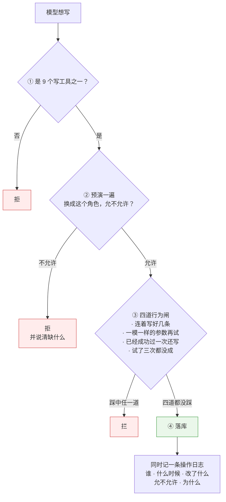
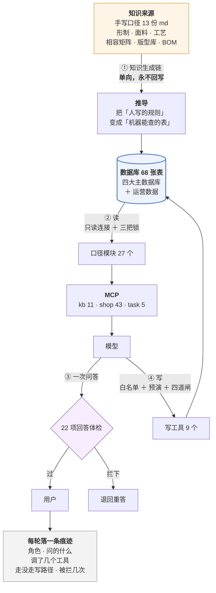

# 澜绣云裳 Agent · 产品说明

> 版本:V1.0 · 2026-09-18
> **文档里所有数字都是当天从库和源码里现取的**,不是手抄的。
> 手抄的数会漂,而漂了的文档和没有文档是一回事 —— 这份文档自己也守这条。

---

## 1. 一句话

**澜绣云裳 Agent 是一个汉服定制业务的运维助手:店里的人用大白话问,它去查真实的库、按写好的口径算,给出带出处的答复;需要动数据的时候,它走一条比读严得多的通道。**

它不是聊天机器人。区别在三件事上:

| | 聊天机器人 | 这个 Agent |
|---|---|---|
| 数字从哪来 | 模型脑子里 | **必须调工具从库里查**,查不到就说查不到 |
| 口径谁定 | 模型当场编 | **写死在口径模块里**,工具只取数不定规矩 |
| 能不能改数据 | 不能,或者随便改 | 能,但要过写工具白名单 + 预演 + 四道闸 |

---

## 2. 谁在用

库里 **38 个在职员工**,六种角色。**每种角色看到的工具和收到的规矩都不一样** —— 不是同一个助手换个称呼。

| 角色 | 人数 | 典型问题 |
|---|---|---|
| 工匠 | 21 | 我手上有哪些活?哪件要拖了? |
| 顾问 | 9 | 这位客户该跟进吗?这套配置能做吗、多少钱、多久? |
| 店长 | 3 | 这个月店里怎么样?这单该派给谁? |
| 版师 | 2 | 这个版型的裁片用料占比是多少?这个客户要不要改版? |
| 总部运营 | 2 | 哪些客户在流失?这个活动效果如何? |
| 财务 | 1 | 这笔退款卡在哪?这单为什么对不上? |

**为什么要分角色:** 让模型去调一个它没有的工具,它会开始编。所以提示词是**按调用方实际挂了哪些工具装配**的 —— 挂了什么工具,才发对应的规矩。

---

## 3. 它能做什么,明确不做什么

### 能做

- **查**:工艺能不能做、面料配不配、版型有哪些码、这单到哪一步了、这个客户属于哪一档
- **算**:报价、工期倒推、尺码推荐、成长身高预测、RFM 分档、产能排期、裁片用料
- **判**:该不该跟进、该不该改版、售后该谁担责、这单能不能下、库存该不该补
- **写**(受控):派单、改派、结单、审批、调整会员等级

### 明确不做

- **不做自动触达。** 发短信、发微信、打电话是对外动作。Agent 只出清单和依据,**按不按是人的决定**。
- **不替业务定阈值。** 「压几天算流失」「补货点画在哪」这类线是业务的决定,不是算法的。工具只排序,不划线。
- **不在证据不足时硬判。** 售后判责查不到现场记录就说查不到,不猜。
- **不碰钱。** 不涉及支付、退款的实际执行,只查状态和定因。

---

## 4. Agent 架构

### 4.1 四样东西,缺一不可

**为什么口径要单独一层:** 「可售天数怎么算」「哪种情况算流失」这类规矩如果写在工具里,同一个概念会在三个工具里长出三个版本,而它们**看起来都对**。现在口径只有一处,工具只负责取数。

### 4.2 工具:三个服务,59 个

| 服务 | 工具数 | 管什么 |
|---|---|---|
| `kb` | 11 | 知识库:工艺、面料、形制、版型、尺码、BOM、工期 |
| `shop` | 43 | 门店业务:客户、订单、工单、产能、库存、活动、售后、会员 |
| `task` | 5 | 任务与派工 |

**为什么分三个而不是一个:** 给一个角色多余的工具,代价不是浪费,是**它会去用**。工匠不需要看到客户资产,顾问不需要看到工单调度。分服务之后,挂哪几个是一次配置,不是每次提醒模型「别用那个」。

其中 **9 个是写工具**,单独成册(见 4.4)。

### 4.3 规矩:49 条,按角色装配

不是一份大提示词发给所有人。**同一套 49 条规矩,按调用方实际挂了哪些工具,装配成不同的子集:**

| 装配给谁 | 收到几条 |
|---|---|
| 全能助手 | 49 |
| 任务/派工 | 26 |
| 知识问答 | 16 |
| 工坊 | 12 |
| 版师 | 8 |
| 财务 | 6 |

规矩长什么样(举三条真的):

- 只说知识库里查到的。每一个关于工艺、面料、形制的具体结论,都必须先调工具查到。
- 给了具体数字就必须说出处;一个工具都没调却报了数字,直接判违规。
- 排序不是预测。给出跟进顺序可以,**不许承诺挽回率**。

### 4.4 闸:三层,各管一件事

**① 读的闸 —— 三把锁**

| 锁 | 挡什么 |
|---|---|
| 工具层的数据库连接**开成只读** | 任何写操作当场报错,而不是「碰巧没人写」 |
| 任何提到 `truth` 的 SQL **一律拒绝执行** | 评测答案不许经工具层暴露 —— 不看语句形状,运行时拦 |
| 密码哈希与盐**连读都不许读** | 拿到手就能离线爆破,所以和答案表同等对待 |

**② 写的闸 —— 比读多三道**

**③ 答的闸 —— 22 项回答体检**

答案发出去之前再过一遍,抓的是「话说得很像但站不住」的那类:

- 给了数字却一个工具都没调 —— 数字没有出处
- 把成本当售价报出去
- 整单工期只说了一条链路,没算并行
- 没查规则就说「你这个发现对」,顺着对方的前提往下推
- 该说「这一格没录入」的地方,推断了一个值

### 4.5 技能:3 个

技能是「一批固定动作」,不是一句话能说清的规矩:

| 技能 | 干什么 |
|---|---|
| `quote` | 出一张定制报价单(八段固定格式:方案 / 可行性 / 尺码 / 用料 / 工期 / 价格 / 风险 / 下一步) |
| `growth-plan` | 给孩子出成长方案(预测区间 + 复量周期 + 留量建议) |
| `roster` | 排班与产能视图 |

---

## 5. 数据信息流转

### 5.1 全景

### 5.2 知识生成链:单向,永不回写

**人写规则 → 机器推表 → 表进库。反过来一步都不许走。**

| 手写的 | 推出来的 | 规模 |
|---|---|---|
| `01-形制.md` | 形制字典 | — |
| `06-相容矩阵.md` 的规则 | 工艺×面料相容矩阵 | **2025 格** |
| `10-版型库.md` 的基码与档差 | 全部尺码 | 86 版型 / 391 裁片 / **1237 条尺码** |
| `11-物料与BOM.md` 的参数 | 用料清单 | 135 物料 / 341 版型用料 / 69 工艺用料 |

**为什么不许回写:** 回写一次,库里就多了一个「没人写过、也没人推过」的数,而它和推出来的数长得一模一样。以后再也说不清哪个是依据、哪个是结果。
门禁里有一条专门对账:**知识库写的和库里存的必须一致**,不一致就红。

### 5.3 四大主数据库

对标成衣定制行业的做法,主数据分四块:

| 库 | 回答什么 | 规模(2026-09-18 实测) | 手写还是推的 |
|---|---|---|---|
| **款式库** | 长什么样 | 商品 296 / SKU 805 / 类目 53 | 由版型 × 相容矩阵生成 |
| **工艺库** | 能不能做 | 工艺条目 168 / 相容矩阵 2025 格 | 知识手写,矩阵推 |
| **版型库** | 怎么裁 | 版型 86 / 裁片 391 / 尺码 1237 | 基码手写,推档推 |
| **BOM 库** | 多少钱、多久备齐 | 物料 135 / 版型用料 341 / 工艺用料 69 | 参数手写,清单算 |

运营侧数据:客户 106 / 着装人 127 / 订单 3903 / 量体记录 1979 / 工单 53 / 日程 90 / 售后 26。

### 5.4 一次问答的完整流转

以顾问问「**C10001 这套唐制齐胸襦裙,加妆花工艺能做吗?多少钱?什么时候能交?**」为例:

| 步 | 发生什么 | 关键约束 |
|---|---|---|
| 1 | **登录与会话归属** | 续聊只认这一份归属表:别人的会话一律拒 —— 里面有你看不到的数据 |
| 2 | **按角色装配提示词** | 顾问角色挂的工具决定收到哪 16–26 条规矩 |
| 3 | **模型决定调哪些工具** | 它拿到的是工具说明书,不是数据库 |
| 4 | **工具经 MCP 打到只读连接** | 三把锁在这一层生效 |
| 5 | **口径模块算** | 相容矩阵判能不能做;BOM 算料;工期按并行链路倒推,不是简单相加 |
| 6 | **模型组织答复** | 每个数字都要带出处 |
| 7 | **22 项回答体检** | 报了价没算过料?整单工期只算了一条链?当场拦 |
| 8 | **落痕迹** | 这一轮问了什么、调了几个工具、有没有走写路径、被拦了几次 |

**用户感觉得到的差别:** 它会说「**缂丝加不了急 —— 一台织机一个人,加人无效,加钱也没用**」,而不是「我们会尽力安排」。因为工期是算出来的,不是客气话。

### 5.5 每一轮留下什么

每轮对话记一条结构化记录,字段包括:

`角色` · `问的什么` · `像不像复合请求` · `走没走写路径` · `用没用批量` · `单条写了几次` · `被拦几次` · `拦的理由` · `触发了哪个技能` · `调了几个工具`

**为什么记这些:** 「效果不好」是一句没法改进的话。有了这些字段,才能问出「是工具没挂上,还是规矩没发到,还是模型没调」——**三种原因要改的地方完全不同**。

---

## 6. 怎么知道它是对的

三层,各管一件事:

| 层 | 规模 | 管什么 | 花不花钱 |
|---|---|---|---|
| **门禁** | **100 步** | 数据勾稽、规则推导、边界审计、页面跑得起来 | 不花钱,每次改动都跑 |
| **判分器对照** | 10 套评测集 | 判分器自己判得对不对(喂人造答案,不调模型) | 不花钱 |
| **模型评测** | 10 套评测集 | 模型真的答得对不对 | 花钱,手动跑 |

两条贯穿始终的纪律:

- **判分器先写,模型后跑。** 判分器错了,你会拿到一张假的满分成绩单 —— 而假的满分和真的满分长得一模一样。
- **咬合测试:每一项检查都要被故意改坏过,确认它真的会红。** 目前 **100 个检查脚本,100 个都有真跑过的咬合记录**。没红过的检查等于没有,而「验过的」和「没验过的」在代码里长得一样。

---

## 7. 边界与已知代价

写出来,免得有人自己撞上:

| 边界 | 代价 |
|---|---|
| **不接自动触达** | 清单出来了还要人去执行,效率上限在人 |
| **不替业务划线** | 补货点、流失天数这类阈值一天不定,对应的告警就一天做不成 |
| **口径写死在代码里** | 改口径要改代码,业务不能自助调 —— 换来的是同一个概念不会长出三个版本 |
| **只读连接 + 写工具白名单** | 加一个新的写能力要动三处(工具、预演、闸),慢;换来的是模型碰不到没授权的写口 |
| **演示数据** | 能安全挂单的客户只有 27 个、季节性只覆盖 3 月、部分流水与库存对不上 —— 这三处会让相关功能的演示效果打折 |

---

## 8. 一句话总结

**这个 Agent 的价值不在「会说话」,在于它说的每一句都能指回一个数据源、一条口径、一次工具调用。**

而这件事的成本,全花在四个地方:**把规矩从模型脑子里挪到代码里、把工具按角色分开、给写操作装闸、给每一项检查做咬合。**
