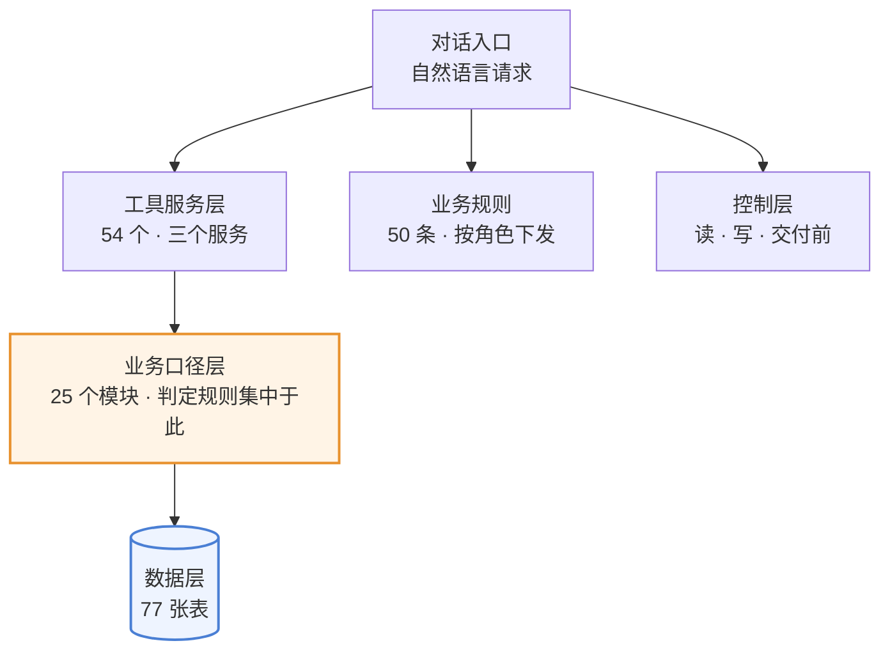
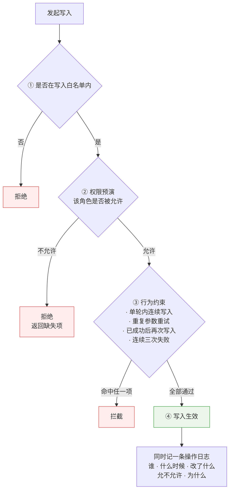
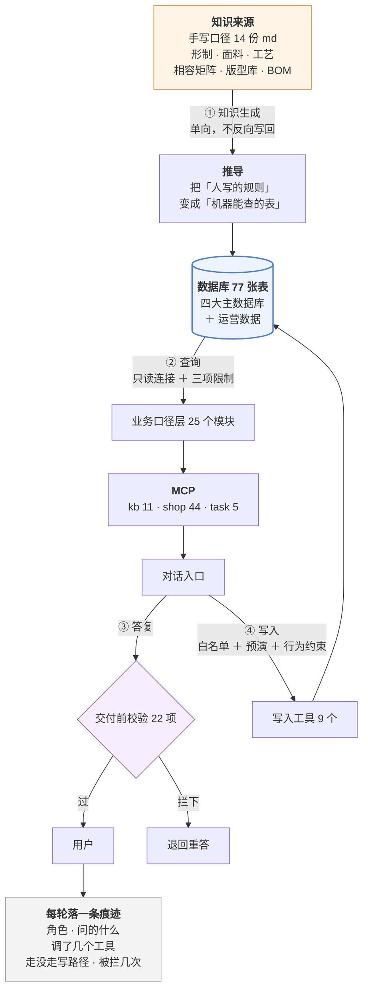
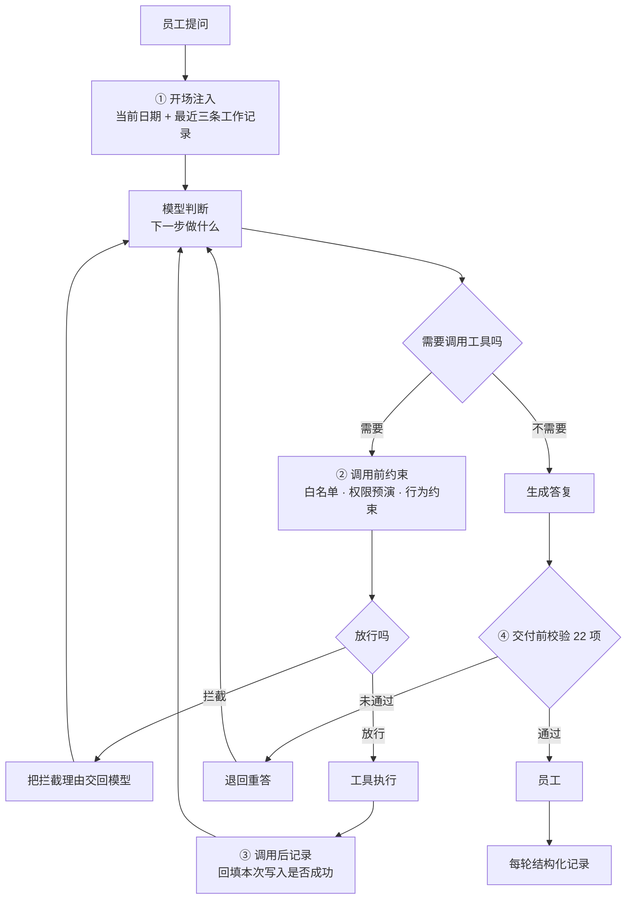

# 澜绣云裳门店智能助手产品需求文档_V1.0

PRODUCT REQUIREMENTS DOCUMENT

## 澜绣云裳门店智能助手产品需求文档

汉服定制业务｜门店顾问、工坊、版师与总部运营协同

| 项目 | 内容 |
|---|---|
| 文档版本 | V1.0 |
| 文档状态 | 内部产品需求基线 |
| 整理日期 | 2026 年 9 月 18 日 |
| 建设方式 | 主链路建设、只读能力先行、写能力受控开放、分角色推广 |
| 系统范围 | 门店智能助手（对话入口）+ 工具服务层 + 业务口径层 + 运营后台数据 |
| 一期重点 | 知识问答、定制报价、下单校验、排产派工、售后判责、客户运营 |
| 关联基线 | 《澜绣云裳小程序及门店 Pad 端产品需求文档 V1.5》 |

**项目范围** 门店智能助手面向店内员工，提供基于真实业务数据的问答、计算、判定与受控写入能力。助手不替代现有后台与 Pad，而是在其之上提供统一的自然语言入口：员工用日常说法提问，助手调用业务工具取数、按既定口径计算，并给出带出处的结论。

## 本期建设内容

- **业务主链路**：贯通知识问答、定制报价、量体推码、下单校验、排产派工、生产跟踪、售后判责、客户运营与经营分析。
- **工具服务层**：按资源与口径划分的 54 个业务工具，分三个服务挂载，按角色分配。
- **业务口径层**：25 个口径模块，承载全部业务判定规则，工具只取数不定规则。
- **受控写入**：9 个写入工具，经权限预演、行为约束与操作留痕后方可生效。
- **建设边界**：一期复用现有数据库与后台接口，不新建业务系统；不做对外触达；不替业务设定阈值。

---

## 文档导航与版本记录

### 阅读导航

| 阅读目的 | 建议章节 |
|---|---|
| 了解为什么建设 | 第 1 章：背景、原业务、调研、与通用助手的差异、痛点与目标 |
| 确认一期做什么、不做什么 | 第 2 章：系统范围与边界、关键产品决策 |
| 了解谁在用、怎么用 | 第 3 章：用户角色、业务线、端到端流程 |
| 查具体功能需求 | 第 4–10 章：按业务模块编排 |
| 查业务规则与状态 | 第 11 章：方案、订单、写入与可见性规则 |
| 查数据、权限与非功能要求 | 第 12 章 |
| 查排期与验收 | 第 13 章：阶段、里程碑、验收场景、上线门槛 |

### 版本记录

| 版本 | 日期 | 变更 |
|---|---|---|
| V1.0 | 2026-09-18 | 首版基线。确立三条业务线、60 个工具、9 个写入工具、口径单一来源与受控写入原则 |
| V1.1 | 2026-09-19 | 工具按「一个业务对象一个」合并同族重复：60 → 54（shop 44 → 38）；新增 `deadline-rescue`、`exchange` 两个技能（3 → 5）；新增 `PreCompact` 守卫（4 → 5）。合并的是工具**接口面**，实现与权限判定未改动 |
| — | 2026-09-19 | **对照实验结论（补记）**：工具合并前后经 11 条用例 × 2 轮对照，命中 11/11 → 11/11、首调即中 22/22 → 22/22、调用次数 1.00 → 1.00 次/条持平，token 120,532 → 119,706（**省 0.69%**）。**合并未带来可测收益，亦未引入新失败方式**（四项参数传递全部正确）。原定「同族工具易误选」的假设**未获数据支持** —— 合并前模型未出现任何一次选错。据此不再继续合并其余工具，转向按需加载，见需求池 §4.7 |

---

# 1. 项目背景与目标

## 1.1 项目背景

澜绣云裳为汉服定制业务，门店同时承担咨询、量体、方案确认、收款与售后。业务信息分布在商品、版型、工艺、物料、客户、订单、工单、日程等 77 张数据表中，员工日常需要跨多个后台页面查询与核对。

现有后台与 Pad 已覆盖数据录入与流程流转，但**查询与判断仍高度依赖员工个人经验**：能不能做、穿哪个码、多少钱、多久、该谁担责，均需人工翻阅资料或咨询版师。

## 1.2 原业务运转方式

| 环节 | 现状 |
|---|---|
| 工艺可行性 | 顾问翻工艺手册或电话询问版师，口头答复 |
| 报价 | 顾问按经验估价，或等待版师核算后回复客户 |
| 尺码推荐 | 顾问用量体值与尺码表人工比对 |
| 工期承诺 | 按经验给区间，无并行链路计算 |
| 排班派工 | 店长在日程页逐条安排，冲突靠人工发现 |
| 售后判责 | 顾问依据印象与既往案例判断 |
| 客户跟进 | 顾问凭印象决定先联系谁 |

## 1.3 需求调研与事实依据

| 事实 | 数据来源 |
|---|---|
| 在职员工 38 人，分 6 种角色（工匠 21、顾问 9、店长 3、版师 2、总部运营 2、财务 1） | `staff` 表 |
| 工艺 × 面料相容组合共 2025 格，其中 293 格需打样评估 | `craft_combo` 表 |
| 版型 86 个、裁片 391 条、尺码 1237 条，尺码由基码推档生成 | `pattern` / `pattern_piece` / `size_spec` 表 |
| 裁片用料占比 391 条中，经版师实测确认的为 0 条 | `pattern_piece.ratio_src` |
| 订单 3903 张，客户 106 位，量体记录 1979 条 | `ordr` / `customer` / `measure_rec` 表 |

## 1.4 通用 AI 助手无法直接满足的原因

| 差异点 | 通用助手 | 本产品要求 |
|---|---|---|
| 数据来源 | 依赖模型内部知识 | 结论必须来自业务工具实时取数，无出处不得输出 |
| 业务口径 | 由模型即时生成 | 口径固化在代码中，工具只取数不定规则 |
| 数据可见性 | 无角色概念 | 按角色分配工具，不同角色可见范围不同 |
| 写入能力 | 无或不受控 | 写入须经白名单、权限预演、行为约束与操作留痕 |
| 结论可核 | 不可追溯 | 每条结论可追溯到数据源、口径模块与工具调用 |

## 1.5 核心业务痛点

| 编号 | 痛点 | 业务影响 |
|---|---|---|
| P1 | 工艺可行性查询链路长 | 客户等待时间长，顾问依赖版师 |
| P2 | 报价口径不统一 | 漏算损耗与工艺加价，报价与结算不一致 |
| P3 | 尺码判断依赖经验 | 成衣尺寸与人体净尺寸混用，改版率上升 |
| P4 | 工期承诺不可核 | 只计单链路，未计并行与关键路径 |
| P5 | 排班冲突事后发现 | 任务重排，客户改期 |
| P6 | 售后判责缺统一依据 | 同类问题不同结论，客诉升级 |
| P7 | 客户跟进无优先级 | 高价值客户流失 |
| P8 | 主数据核对量过大 | 1237 条尺码无人可逐条核对 |

## 1.6 产品目标与验收口径

| 目标 | 验收口径 |
|---|---|
| 结论可追溯 | 涉及数字的答复必须先调用工具；未调用工具而给出数字，判定为不合格 |
| 口径统一 | 同一业务概念在系统内只有一处定义，工具与页面取同一口径 |
| 角色可见性正确 | 任一角色无法通过助手取得其权限外的数据 |
| 写入可控 | 写入操作必须可追溯到操作人、时间、变更内容与判定结果 |
| 质量可度量 | 各业务模块具备离线对照用例，判定结果可由程序判定 |

## 1.7 项目约束与原则

1. **只读能力先行，写入能力受控开放。** 一期写入工具限定 9 个。
2. **不做对外触达。** 助手输出名单与依据，是否联系客户由人决定。
3. **不替业务设定阈值。** 流失天数、补货点等由业务方确定后配置。
4. **证据不足不作判定。** 缺少现场记录或主数据时，应明确告知无法判定。
5. **工具按资源与口径划分，不按业务场景划分。** 业务场景由技能编排实现。

---

# 2. 系统范围与边界

## 2.1 系统协同架构

系统分六层。对话入口接收自然语言请求，守卫层在每一轮的固定位置介入，技能层编排多步业务流程，工具服务层按资源与口径暴露业务能力，业务口径层承载判定规则，数据层提供存储。

| 层 | 职责 | 规模 |
|---|---|---|
| 对话入口 | 接收自然语言请求，返回结论 | 1 个 |
| 守卫层 | 每轮注入上下文、约束工具调用、交付前校验、压缩前立旗 | 5 个守卫、22 项交付校验 |
| 技能层 | 固定动作编排（多步业务流程） | 6 个 |
| 工具服务层 | 按资源与口径暴露业务能力 | 3 个服务、54 个工具 |
| 业务口径层 | 承载业务判定规则 | 25 个模块 |
| 数据层 | 业务数据存储 | 77 张表 |

## 2.2 能力模块

工具按**资源与口径**划分，不按业务场景划分（见 2.4 决策 D2）。共 54 个，分三个服务挂载；其中 9 个为写入工具，在表中以 ✍️ 标识，须经 2.6 全部四道控制。

| 服务 | 工具数 | 覆盖范围 | 主要使用角色 |
|---|---|---|---|
| 知识库服务 `kb` | 11 | 工艺、面料、形制、版型、尺码、物料清单、工期 | 顾问、版师 |
| 门店业务服务 `shop` | 44 | 客户、订单、工单、产能、库存、活动、售后、会员、任务 | 全角色 |
| 任务服务 `task` | 5 | 人工任务与财务排查 | 财务、总部运营 |

### 2.2.1 知识库服务 `kb`(11 个)

| 工具 | 干什么 |
|---|---|
| `kb_lookup` | 按关键词查工艺知识库。也可按分类(形制/材质/工艺/配饰)或来源等级(public/scal |
| `kb_detail` | 按编码取一条知识的完整内容(含出处链接)。编码形如 KF01 / MT01 / XZ01 / |
| `kb_combo` | 查某工艺能否用于某面料。工艺名和面料名直接写中文即可(如「妆花」「云锦」),不必也不要猜编码 |
| `kb_read` | 读知识库原文 —— 表里查不到、只在正文里的那些话:怎么洗怎么存、为什么这么做、客户问「为什 |
| `kb_tables` | 取全部决策表(6 张共 30 行:客户原话对照、选料决策、配饰形制搭配、配色易错、工期档位、 |
| `kb_coverage` | 查相容矩阵的完成度(共多少格、已定义多少、未定义多少)。 |
| `kb_pattern` | 查版型库:某个形制有哪些版型、每个版型分几个裁片、能出哪些尺码、改版难度多高。客户问「这个能 |
| `kb_size` | 查某版型的成衣尺码表(各部位厘米数)。返回的是成衣尺寸不是人体尺寸,和客户量体值之间差一个放 |
| `kb_fit` | 拿客户的量体记录比对版型尺码表,给出推荐尺码和档位(标准码 / 调号 / 全定制 / 需补量 |
| `kb_lead` | 算工期:给定版型 + 尺码 + 面料 + 工艺,返回最快到最慢的天数区间、每一段花多久、关键 |
| `kb_bom` | 算料算钱:给定版型 + 尺码 + 面料 + 所选工艺,返回完整物料清单(每项的净用量、损耗、 |

### 2.2.2 门店业务服务 `shop`(38 个)

**任务与派工**

| 工具 | 说明 |
|---|---|
| `get_tasks` | 查任务 —— 四种问法一个口。 不给参数=我自己的活;给 task_id=某一条的详情;sc |
| `task_types` | 九种任务类型的数据规范:每种挂哪张单据(客户号/订单号/维保单号/售后单号/不挂)、谁能派、 |
| ✍️ `assign_task` | 派一条任务(真的写进去,立即生效)。只有店长及以上能派,只能派给本店在职顾问。type 见  |
| ✍️ `dispatch_task` | 把待分配池里的单分出去(真的写进去)。不给 assignee 就采纳 dispatch_po |
| ✍️ `reassign_task` | 改派:把一条已经派出去的任务转给另一个人(真的写进去)。和 dispatch_task 的区 |
| ✍️ `finish_task` | 把任务标记完成(真的写进去)。日程总结必填。只能完成派给自己的 —— 别人代点等于台账上写了 |
| ✍️ `assign_batch` | 一次排一批任务(排班用,真的写进去)。items 是列表,每条 {type, assigne |
| ✍️ `dispatch_batch` | 一次把待分配池里的几条单分出去(真的写进去)。items 是 [{task_id, assi |

**排班与复盘**

| 工具 | 说明 |
|---|---|
| `week_grid` | 排班用的格子:一周里每个顾问哪天什么时段已经占了、哪几天完全没人排班、待分配还有几条。排班之 |
| `monthly_review` | 月度复盘:这个月做完了多少、几条逾期、逾期都在谁身上、改派几次和理由、agent 的派单建议 |
| `appt_funnel` | 预约到店转化漏斗:约了多少 → 我们确认了多少 → 真到店多少 → 量体多少 → 下单多少; |

**会员与审批**

| 工具 | 说明 |
|---|---|
| `get_member` | 查会员分层 —— 等级和生命周期一次给全。 给 customer(客户号或姓名)返回这个人的 |
| `points_ledger` | 积分流水和对账。 ⚠️ 余额是「同一个事实两个来源」:既能从 balance 字段读,也能从 |
| `approval_queue` | 审批队列:等级调整 / 积分调整 / 客户转移,谁申请的、什么理由、批了没有。这三种的共同点 |
| ✍️ `apply_adjust` | 提一张审批单(等级调整 / 积分调整 / 客户转移)—— ⚠️ 只是申请,不生效。这三件事都 |
| ✍️ `decide_approval` | 批一张审批单:同意或驳回。「待审批 → 已通过/已驳回」这一步只有总部运营能走(角色判定在状 |

**客户与订单**

| 工具 | 说明 |
|---|---|
| `get_scheme` | 查方案。方案是「一件事」的单位 —— 客户这次想做的这件衣服(形制/面料/工艺/颜色/配饰/ |
| `get_order` | 查订单。给 order_id 返回单条全链路(双口径状态、金额勾稽、时间线、订单行、关联售后 |
| `can_order` | 下单之前先问一句:这单能下吗? 定制订单要有这个着装人下单前的量体,而且不能超期 —— 超期 |
| `get_wearer` | 查着装人档案 —— 衣服穿在谁身上,和「谁付钱」是两回事。身份绑在账户上(账户以手机号为主标 |
| `recovery_queue` | 未成交挽回清单 —— 下了单没付钱的、约了没来的,各压着多少钱、压了多久、该按什么顺序跟。不 |
| `activity_roi` | 活动投入产出:花了多少、带来多少成交、投入产出比、单均获客成本。不给 code 就是全部活动 |
| `channel_compare` | 多渠道表现对比 —— 四个下单渠道(微信小程序/官网/门店 Pad/客服代下单)各自的单量、 |

**库存与产能**

| 工具 | 说明 |
|---|---|
| `get_stock` | 查现货。四种问法,给其中一个参数即可:sku=某个具体规格;spu=某个商品的全部规格;ma |
| `stock_alert` | 库存预警 —— 哪些 SKU 要断了、哪些看着有货其实一件都发不出(在手有货但全被订单占用) |
| `get_capacity` | 查工坊产能排期。不传 craft 就是全工坊负载概览(每个工种几人、在制多少、手上的活要消化 |
| `get_workorder` | 查在制工单:这件活在谁手上、做到哪一步、会不会拖。可按工单号、师傅(工号或姓名)、状态、订单 |
| `my_workorders` | 我手上的工单。工匠看自己的,工坊管事看本坊,总部运营看全部 —— 范围跟身份走。带在制上限和 |

**版师相关**

| 工具 | 说明 |
|---|---|
| `pattern_queue` | 版师的排队看板 —— 「今天该我核什么」。不用传任何参数。把版师手上的活一次列全:裁片用料占 |
| `grading_audit` | 推档自检 —— 把「要核 1237 个数」压成「要核 12 条档差」。尺码表全部是推出来的( |
| ✍️ `set_piece_ratio` | 改一片的用料占比,并标成「版师核过」。改完这一片就锁住,不会再被估算覆盖;同版型其余没核过的 |

**定制与售后**

| 工具 | 说明 |
|---|---|
| `fitting_queue` | 白坯试衣看板 —— 哪些定制单该做白坯试衣、试了没有、客户签没签字。白坯试衣是重工订单唯一的 |
| `get_aftersale` | 查售后记录(退货/换货/退款/维修),可按订单号、客户或状态筛。退款类会带上退款轨迹。这个工 |
| `get_maintain` | 查售后维修工单的现场。客户说「衣服起球了 / 开线了 / 尺寸不对」时用。返回这件是什么(形 |
| `get_review_queue` | 看待核实队列:哪些工艺×面料组合被顾问问到了、却没有任何依据,按被问次数排序。 背景:相容矩 |

**推算与校验**

| 工具 | 说明 |
|---|---|
| `plan_for_event` | 场景倒推 —— 客户说「明年六月毕业礼要穿」时用这个。它把四个互相咬着的约束一次算完:①选码 |
| `forecast_growth` | 推算某个着装人到未来某天的身高,并给留成长量建议。主要用于小孩 —— 定制工期 30–150 |
| `check_write` | 问「这件事业务允不允许做」时用它。它会拿真正的校验器跑一遍,返回能不能做、错误码和理由。不写 |

### 2.2.3 任务服务 `task`(5 个)

| 工具 | 干什么 |
|---|---|
| `list_tasks` | 列出待处理的人工任务。task_type 可选:财务人工任务、客户合并确认 |
| `get_deposit` | 读取押金单:金额、当前状态、幂等号、关联预约号 |
| `get_refund_trace` | 读取退款尝试轨迹,含每次重试的返回码、请求金额和幂等号 |
| `get_payment_flow` | 读取支付流水,direction=in 为收款,out 为退款,含渠道流水号与最终状态 |
| `get_customer` | 读取客户档案(手机号与地址已脱敏) |

## 2.2.4 技能清单

技能用于编排**多步且不可省略**的业务流程。共 6 个。

| 技能 | 触发条件 | 强制流程 | 对应功能需求 |
|---|---|---|---|
| `quote` 定制报价单 | 员工提出报价、估价、方案、价格相关请求 | 出单前须完成可行性、尺码、用料、工期四项查询；按八段结构输出 | 5.2 |
| `growth-plan` 童装成长方案 | 请求涉及未成年着装人的未来尺寸 | 按六段结构输出；身高必须以区间给出 | 5.4 |
| `roster` 一周排班 | 需要一次安排多天或多人 | 读取占用与待分配池 → 生成整周表 → 提交确认 → 批量写入 | 7.1 |
| `deadline-rescue` 工期救援 | 工期推算结果为「赶不上」，或员工提出加急请求 | 先判定是否属织造类（物理上限，当场拒绝）；否则按代价升序试四种加急方式，**每次都重算工期**；输出可行方案及各自代价，由客户选择 | 5.3 |
| `exchange` 换货办理 | 客户要求将已购商品更换为其他商品 | 先判订单类型（定制品无换货出口）；标品走：提审批 → 寄回 → 入库 → 差价处理 → 按原渠道出货 | 6.2 |

## 2.2.5 守卫清单

守卫在每一轮的固定位置介入，不受模型控制。共 5 个。

| 守卫 | 介入时机 | 职责 |
|---|---|---|
| 开场注入 | 每轮请求进入时 | 注入当前日期与最近三条工作记录 |
| 调用前约束 | 每次工具调用前 | 校验工具是否在本角色挂载范围内；记录写入操作的工具名与参数 |
| 调用后记录 | 每次工具调用后 | 回填本次写入是否成功，被业务规则拒绝的不计入写入次数 |
| 交付前校验 | 输出答复前 | 执行 22 项校验，未通过则退回重答（单轮内仅退回一次） |
| 压缩前立旗 | 系统压缩对话上下文之前 | 立旗并记录本轮**按单据号取过**的订单号 / 维保单号 / 着装人号 / 任务号；压缩后的第一轮注回，并提示「无编号但决定下一步的事实可能已丢失」 |

**22 项交付前校验**覆盖：数字无出处、成本与售价混用、工期未计并行、未经查询即认可对方前提、应告知无记录处给出推断值等。

## 2.3 本文档范围

**包含**：门店智能助手的功能需求、业务规则、数据与权限要求、验收口径。

**不包含**：小程序与 Pad 端功能需求（见关联基线 V1.5）、后台页面改造需求、基础设施部署方案。

## 2.4 关键产品决策

| 编号 | 决策 | 理由 |
|---|---|---|
| D1 | 业务口径集中在口径层，工具不承载规则 | 同一概念在多处实现将产生多个版本，且难以发现 |
| D2 | 工具按资源与口径划分，不按业务场景划分 | 场景型工具会随业务增长持续增生，并造成同一业务有多个入口 |
| D3 | 工具按角色分配，不全量暴露 | 角色持有非必要工具时会实际调用，产生越权风险 |
| D4 | 写入须经权限预演 | 先以目标角色试算是否允许，再执行，避免部分写入 |
| D5 | 交付前统一校验 | 答复可能形式完整但缺乏依据，需在输出前拦截 |
| D6 | 助手不执行对外触达 | 对外动作不可逆，须由人确认 |

## 2.6 写入控制机制

写入操作须依次通过四道控制，任一未通过即终止。

| 控制 | 内容 |
|---|---|
| 白名单 | 仅 9 个工具可执行写入 |
| 权限预演 | 以目标角色试算该操作是否被业务规则允许，试算不产生数据变更 |
| 行为约束 | 单轮内连续写入、重复参数重试、已成功后再次写入、连续三次失败，均予拦截 |
| 操作留痕 | 记录操作人、时间、变更内容、判定结果与理由 |

---

# 3. 用户与核心旅程

## 3.1 用户角色

| 角色 | 人数 | 主要诉求 | 可见范围 |
|---|---|---|---|
| 工匠 | 21 | 我手上有哪些活、哪件将逾期 | 仅本人工单 |
| 顾问 | 8 | 能否制作、穿哪个码、多少钱、多久 | 本人负责的客户与订单 |
| 店长 | 3 | 排班派工、本店经营 | 本店全部 |
| 版师 | 2 | 主数据核对、改版判定 | 版型与主数据 |
| 总部运营 | 2 | 客户运营、活动与渠道分析、审批 | 全量 |
| 财务 | 1 | 退款定因与流水核对 | 财务相关 |

## 3.2 业务线划分

系统服务三条并行业务线，触发条件与节奏各不相同。

| 业务线 | 驱动对象 | 主要角色 | 触发时机 |
|---|---|---|---|
| 导购线 | 客户 | 顾问、店长、工匠 | 客户产生动作或订单推进时 |
| 打版定款线 | 版型 | 版师 | 上新款、引入新面料、查询无依据时 |
| 经营分析线 | 周期 | 店长、总部运营 | 每周、每月或库存告警 |

**线间关系**：导购线的报价、推码与工期计算，全部消费打版定款线的产出。打版定款线主数据未完成时，导购线仍可输出结论，但结论精度下降（如按最高价面料估算）。

## 3.3 数据流转地图

知识内容由人工维护，经推导生成数据表，单向流转，不反向写回。查询路径经工具服务层与业务口径层到达数据层；写入路径经 2.6 四道控制后回到数据层。每轮对话留存结构化记录。

| 环节 | 方向 | 说明 |
|---|---|---|
| ① 知识生成 | 知识内容 → 数据表 | 单向。相容矩阵、尺码、用料清单均由知识内容推导生成 |
| ② 查询 | 数据表 → 口径层 → 工具 → 模型 | 工具层数据库连接为只读 |
| ③ 答复 | 模型 → 交付前校验 → 员工 | 未通过校验的答复退回重答 |
| ④ 写入 | 模型 → 写入工具 → 数据表 | 经 2.6 四道控制 |

## 3.4 定制业务端到端流程

1. 顾问接待客户，确认诉求（形制、面料、工艺、用途、时间）
2. 助手查询工艺可行性，给出可制作或替代方案
3. 客户量体，助手比对尺码表给出推荐尺码与档位
4. 助手输出报价单（可行性、尺码、用料、工期、价格、风险）
5. 助手执行下单前置校验，通过后由顾问下单
6. 店长排产派工，助手输出周排班表并在确认后写入
7. 生产期间助手跟踪工单状态与逾期风险，提示白坯试衣节点
8. 交付后进入售后与客户运营环节

---

---

## 3.5 一轮对话的运行过程（Agent Loop）

第 4–10 章每条功能需求都标注了「Agent Loop 体现」。本节说明那个循环本身长什么样。

一轮对话不是「问一句答一句」，而是模型与工具之间的**多次往返**。系统在这个往返中有**四个固定介入点**，介入点不受模型控制——模型无法跳过、无法关闭、无法说服它们放行。

### 3.5.1 三条回边——循环的本体

图中有三条箭头指回「模型判断」，它们是这个系统区别于一次性问答的全部原因：

| 回边 | 从哪回来 | 模型收到什么 | 为什么必须回到模型而不是直接报错 |
|---|---|---|---|
| **工具结果** | 调用后记录 | 工具返回的数据 | 这是「轮」的定义。前一个工具的结果决定下一步查什么——报价要先查可行性才知道要不要查用料 |
| **拦截理由** | 调用前约束 | 被拦的原因文字 | 拦截不是终止。模型据此改正参数重试，或改口告诉员工这件事他无权做。**只说「拒绝」不说原因，等于随机失败** |
| **退回重答** | 交付前校验 | 未通过的具体条目 | 答复本身不合格（数字没出处、工期没计并行），退回让它重答，而不是把不合格的答复发给员工 |

### 3.5.2 循环在哪里停——三道终止条件

一个没有终止条件的循环会一直烧钱。本系统有三道，任一触发即停：

| 终止条件 | 取值 | 触发后 |
|---|---|---|
| 模型不再请求工具 | —— | 进入交付前校验，正常出口 |
| **退回重答只允许一次** | 1 次 | 第二次不再退回，直接交付并记录未通过项。**防止「校验退回→重答→又不过」的死循环** |
| 轮次上限 / 预算上限 | 12 轮 / 按供应商设定的金额 | 中止并明确告知是预算触顶，**不伪装成回答失败** |

> 第二条是这个系统栽过的地方换来的：校验器和模型可能在同一个点上反复对不上，而**两边都认为自己是对的**。允许无限退回的结果不是答案变好，是这一轮永远结束不了。

### 3.5.3 哪些是运行时框架给的，哪些是我们做的

这是「Harness 体现」那一行在回答的问题。分界线如下：

| | 由运行时框架托管 | 由本系统实现 |
|---|---|---|
| **循环调度** | ✅ 何时再调模型、何时收尾 | |
| **上下文管理** | ✅ 多轮消息的拼接与裁剪 | |
| **工具分发** | ✅ 把模型的调用请求路由到对应服务 | |
| **四个介入点** | | ✅ 图中带编号的四个方框 |
| **工具与业务口径** | | ✅ 54 个工具、25 个口径模块 |
| **业务上「哪一步不可省略」** | | ✅ 以技能实现——运行时框架不掌握业务语义 |
| **跨轮、跨人的状态** | | ✅ 以数据表实现——对话上下文不跨会话 |

> **最后两行是这个分界线的实质**。运行时框架能把循环转起来，但它不知道「报价前必须查可行性」，也不知道「提交审批的人和批准的人必须是两个人」。凡是需要业务语义才能判断的约束，框架都帮不上忙——这正是本系统存在的部分。

---

## 3.6 功能需求的统一读法

第 4–10 章每条功能需求，除需求描述、输入输出、业务规则外，统一给出四项：

| 项 | 含义 |
|---|---|
| **指标** | 这条需求用什么衡量、由谁判定。**全部指标要求可由程序判定** —— 判的是「取到的内容是否正确」（是否调用了对应工具、数字是否有出处、档位是否正确），不判「答复是否通顺」。不可由程序判定的指标无法进入自动化校验，长期将失效 |
| **性能** | 该功能的轮次与工具调用数。全系统实测平均 1.08 个工具/轮（800 轮记录）。**单功能响应时延与并发能力未测量**，见 12.3 |
| **Agent Loop 体现** | 该功能在 3.5 那个循环里的形态：单轮闭合、多轮推进、或跨轮跨人 |
| **Harness 体现** | 按 3.5.3 那条分界线，这一条里哪些归运行时框架、哪些归本系统 |

# 4. 功能需求—知识问答与可行性

## 4.1 工艺与面料相容性查询

| 项 | 内容 |
|---|---|
| **需求描述** | 员工以日常说法询问某工艺能否用于某面料，助手返回判定结果与依据 |
| **输入** | 工艺名称、面料名称（支持中文名，不要求编码） |
| **输出** | 判定结果（可 / 不可 / 需评估）、依据说明、不可时的替代方案 |
| **业务规则** | 判定结果取自相容矩阵；「需评估」表示需打样确认，不得推断为可或不可 |
| **异常处理** | 组合无记录时，明确告知无依据，并记入待核实队列 |
| **验收** | 离线对照用例 20 条（知识问答）全部通过 |
| **指标** | 离线对照用例 20 条（知识问答），程序判定判定结果与依据是否一致 |
| **性能** | 单轮，1–2 个工具 |
| **Agent Loop 体现** | 单轮闭合。模型一次判断即完成工具选择与作答；无依据时不进入下一轮推断 |
| **Harness 体现** | 循环调度由运行时框架托管；工具、口径与判定规则由本系统提供 |

## 4.2 知识原文查询

| 项 | 内容 |
|---|---|
| **需求描述** | 查询表格化数据之外的说明性内容（养护方式、工艺原理、客户常见问题答复口径） |
| **输出** | 知识库原文片段与出处标识 |
| **业务规则** | 仅返回知识库中存在的内容，不得补充生成 |
| **指标** | 并入 4.1 对照用例 |
| **性能** | 单轮，1 个工具 |
| **Agent Loop 体现** | 单轮闭合 |
| **Harness 体现** | 同上 |

## 4.3 决策表查询

| 项 | 内容 |
|---|---|
| **需求描述** | 查询 6 张业务决策表（客户原话对照、选料决策、配饰形制搭配、配色易错、工期档位、售后争议判定） |
| **输出** | 决策表全部行 |
| **业务规则** | 决策表为公司口径，判定必须以表为准 |
| **指标** | 并入 4.1 对照用例 |
| **性能** | 单轮，1 个工具 |
| **Agent Loop 体现** | 单轮闭合 |
| **Harness 体现** | 同上 |

---

# 5. 功能需求—定制报价与量体

## 5.1 推荐尺码与档位判定

| 项 | 内容 |
|---|---|
| **需求描述** | 依据客户量体记录与版型尺码表，给出推荐尺码与制作档位 |
| **输入** | 客户标识、版型 |
| **输出** | 推荐尺码、档位（标准码 / 调号 / 全定制）、判定理由 |
| **业务规则** | 尺码表为成衣尺寸，量体记录为人体净尺寸，比对须计入放松量；量体记录超期的，判定为无效并要求复量 |
| **验收** | 离线对照用例覆盖标准码、调号、全定制三档及边界情形 |
| **指标** | 对照用例覆盖标准码、调号、全定制三档及边界值，程序判定档位是否正确 |
| **性能** | 单轮，2 个工具 |
| **Agent Loop 体现** | 单轮闭合。工具返回推荐结果后直接作答，不由模型二次计算 |
| **Harness 体现** | 循环由运行时托管；放松量表与档位判定由本系统口径层提供 |

## 5.2 定制报价单

| 项 | 内容 |
|---|---|
| **需求描述** | 输出结构化报价单，覆盖可行性、尺码、用料、工期、价格与风险 |
| **触发** | 员工提出报价、估价、方案、价格相关请求时自动触发 |
| **前置要求** | 出单前必须完成四项查询：可行性、尺码、用料清单、工期 |
| **输出结构** | 方案 / 可行性 / 尺码 / 用料 / 工期 / 价格 / 风险 / 下一步，共八段 |
| **业务规则** | 报价须附免责声明；缺少任一前置查询结果时不得出单 |
| **验收** | 离线对照用例 23 条（工具使用）全部通过；出现「报价未计算用料」判定为不合格 |
| **指标** | 离线对照用例 23 条（工具使用），程序判定是否完成四项前置查询 |
| **性能** | **多轮，4 个以上工具**，由技能编排 |
| **Agent Loop 体现** | **多轮推进，本系统循环最长的功能**。前一步工具返回进入后一步判断；终止条件由技能约束（四项前置查询全部完成） |
| **Harness 体现** | 循环与上下文由运行时托管；**「不可省略的步骤」由本系统以技能实现** —— 运行时框架不掌握业务上哪一步不可省略 |

## 5.3 工期推算

| 项 | 内容 |
|---|---|
| **需求描述** | 给出从下单到交付的工期区间与关键路径 |
| **输出** | 最快与最慢天数、各阶段耗时、关键路径、可压缩环节 |
| **业务规则** | 工期按并行链路计算，不得简单相加；织造类工种为一人一机，不支持通过增加人力压缩工期 |
| **指标** | 并入 5.2 对照用例，另校验关键路径是否输出 |
| **性能** | 单轮，1 个工具 |
| **Agent Loop 体现** | 单轮闭合。工期区间与关键路径由口径层一次算出 |
| **Harness 体现** | 工期计算在口径层完成，不依赖模型逐步推算 |

## 5.4 童装成长方案

| 项 | 内容 |
|---|---|
| **需求描述** | 针对未成年着装人，推算目标交付日期的身高并给出留量建议 |
| **触发** | 涉及儿童未来尺寸的请求时自动触发 |
| **输出结构** | 预测区间 / 依据 / 留成长量 / 复量周期 / 风险 / 下一步，共六段 |
| **业务规则** | 身高预测必须以区间形式给出，不得给出单点估计 |
| **验收** | 离线对照用例 22 条（成长推算）全部通过 |
| **指标** | 离线对照用例 22 条（成长推算），程序判定是否以区间形式输出 |
| **性能** | 多轮，2–3 个工具，由技能编排 |
| **Agent Loop 体现** | 多轮推进。预测结果进入留量与复量周期的后续判断 |
| **Harness 体现** | 同 5.2 |

---

# 6. 功能需求—订单与下单校验

## 6.1 下单前置校验

| 项 | 内容 |
|---|---|
| **需求描述** | 在下单前一次性校验全部前置条件 |
| **校验项** | 着装人是否有有效量体记录；量体记录是否超期；未成年着装人是否具备监护人同意 |
| **输出** | 三档结果：可以下单 / 不可下单（列明缺失项）/ 无法判定（数据不全） |
| **业务规则** | 「无法判定」为独立档位，不得并入「可以下单」或「不可下单」 |
| **指标** | 并入订单类对照用例，程序判定三档是否正确区分 |
| **性能** | 单轮，1 个工具 |
| **Agent Loop 体现** | 单轮闭合 |
| **Harness 体现** | 校验规则在口径层；试算不产生数据变更 |

## 6.2 订单查询

| 项 | 内容 |
|---|---|
| **需求描述** | 查询订单全链路信息 |
| **输出** | 订单状态、金额勾稽、时间线、订单行明细、关联售后 |
| **业务规则** | 商品总额须与各订单行基本金额之和一致，不一致时应报出 |
| **指标** | 程序校验商品总额与订单行之和是否一致 |
| **性能** | 单轮，1 个工具 |
| **Agent Loop 体现** | 单轮闭合 |
| **Harness 体现** | 勾稽校验在口径层完成 |

## 6.3 写入前业务校验

| 项 | 内容 |
|---|---|
| **需求描述** | 在执行写入前，以目标角色试算该操作是否被业务规则允许 |
| **输出** | 是否允许、错误码、缺失项说明 |
| **业务规则** | 试算不产生任何数据变更 |
| **指标** | 程序判定试算结果与实际写入判定是否一致 |
| **性能** | 单轮，1 个工具 |
| **Agent Loop 体现** | 单轮闭合。循环内出现一次**不产生数据变更**的试算调用 |
| **Harness 体现** | 以真实校验器试算，非独立实现 |

---

# 7. 功能需求—排产、派工与交付

## 7.1 一周排班

| 项 | 内容 |
|---|---|
| **需求描述** | 生成一周排班表并在确认后批量写入 |
| **触发** | 需要一次安排多天或多人时自动触发 |
| **流程** | 读取现有占用与待分配池 → 生成整周排班表 → 提交店长确认 → 批量写入 |
| **业务规则** | 同一员工同一时段不得重复占用；须经确认后写入，不得直接落库 |
| **验收** | 排班写入须走批量接口，逐条写入将被行为约束拦截 |
| **指标** | 程序校验是否走批量接口、是否存在时段冲突 |
| **性能** | **多轮，3 个以上工具**，由技能编排；写入走批量接口 |
| **Agent Loop 体现** | **多轮推进，且循环内含人工确认节点**。确认前不进入写入步骤 |
| **Harness 体现** | 循环由运行时托管；**跨轮次的行为约束由本系统在调用前后实现** —— 运行时框架仅感知单次调用 |

## 7.2 任务派发与流转

| 项 | 内容 |
|---|---|
| **需求描述** | 派发、改派、完成任务 |
| **业务规则** | 仅店长及以上可派发；仅可派给本店在职员工；仅可完成派给本人的任务；完成时须填写总结 |
| **指标** | 离线对照用例 90 条（工坊与任务）+ 27 条（角色边界） |
| **性能** | 单轮，1 个工具；写入类含调用后回填 |
| **Agent Loop 体现** | 单轮闭合。写入类在循环内追加一次调用后回填 |
| **Harness 体现** | 写入结果回填在调用后守卫中完成，被拒写入不计入当轮次数 |

## 7.3 产能与工单查询

| 项 | 内容 |
|---|---|
| **需求描述** | 查询工坊负载、工单进度与逾期风险 |
| **输出** | 各工种在制量、消化周期、瓶颈工种、逾期工单 |
| **业务规则** | 加急请求须结合工种特性答复，一人一机工种明确告知不可加急 |
| **指标** | 并入 7.2 对照用例，另校验加急答复是否结合工种特性 |
| **性能** | 单轮，1–2 个工具 |
| **Agent Loop 体现** | 单轮闭合 |
| **Harness 体现** | 产能约束在口径层 |

## 7.4 白坯试衣看板

| 项 | 内容 |
|---|---|
| **需求描述** | 列出应做白坯试衣的定制订单及其试衣与签字状态 |
| **一期状态** | 看板功能已实现；试衣前置约束依赖「订单进入裁剪」写入口，该写入口一期未建设 |
| **指标** | 看板数据程序校验；前置约束待写入口建设后补充 |
| **性能** | 单轮，1 个工具 |
| **Agent Loop 体现** | 单轮闭合 |
| **Harness 体现** | — |

---

# 8. 功能需求—售后与判责

## 8.1 售后判责

| 项 | 内容 |
|---|---|
| **需求描述** | 依据现场记录与判定表，给出责任方与处理方式 |
| **输入** | 售后单号或订单号 |
| **输出** | 责任方、处理方式、判定依据 |
| **业务规则** | 必须先查询维修现场记录；判定必须以决策表为准；现场记录缺失时不得判定 |
| **验收** | 离线对照用例 14 条（售后判责）全部通过；出现「未查现场即判定」判定为不合格 |
| **指标** | 离线对照用例 14 条（售后判责），程序判定是否先查询现场记录 |
| **性能** | 单轮，2–3 个工具，调用顺序有约束 |
| **Agent Loop 体现** | 单轮闭合，但**工具调用顺序受约束**：须先取现场记录，再取判定表 |
| **Harness 体现** | 判定表取自知识库，不由模型生成 |

## 8.2 售后与维修查询

| 项 | 内容 |
|---|---|
| **需求描述** | 按订单、客户或状态查询售后与维修记录 |
| **输出** | 售后类型、状态、退款轨迹（退款类） |
| **指标** | 并入 8.1 对照用例 |
| **性能** | 单轮，1 个工具 |
| **Agent Loop 体现** | 单轮闭合 |
| **Harness 体现** | — |

---

# 9. 功能需求—客户运营与会员

## 9.1 客户生命周期判定

| 项 | 内容 |
|---|---|
| **需求描述** | 判定客户所处生命周期档位 |
| **输出** | 八档之一（潜在 / 新客 / 活跃 / 高价值 / 忠诚 / 休眠 / 潜在流失 / 流失）、命中的全部规则、取档理由 |
| **业务规则** | 同时命中多档时按既定优先级取档，并列出全部命中项 |
| **指标** | 离线对照用例 31 条（会员与审批），程序判定档位与命中规则 |
| **性能** | 单轮，1 个工具 |
| **Agent Loop 体现** | 单轮闭合 |
| **Harness 体现** | 判档规则在口径层，为唯一来源 |

## 9.2 同档优先级排序

| 项 | 内容 |
|---|---|
| **需求描述** | 在同一生命周期档位内给出联系优先级 |
| **输出** | 按 RFM 三维打分排序的客户列表与评分依据 |
| **业务规则** | 排序不构成挽回预测，不得给出挽回率等预测性数值 |
| **指标** | 并入 9.1 对照用例，另校验输出中是否出现预测性数值 |
| **性能** | 单轮，1 个工具 |
| **Agent Loop 体现** | 单轮闭合 |
| **Harness 体现** | 排序在口径层完成 |

## 9.3 未成交挽回

| 项 | 内容 |
|---|---|
| **需求描述** | 列出已下单未付款、已预约未到店的客户及其金额与停留时长 |
| **业务规则** | 「已取消」与「爽约」须分列，两者跟进方式不同 |
| **指标** | 程序校验已取消与爽约是否分列 |
| **性能** | 单轮，1 个工具 |
| **Agent Loop 体现** | 单轮闭合 |
| **Harness 体现** | — |

## 9.4 会员等级与审批

| 项 | 内容 |
|---|---|
| **需求描述** | 查询会员等级、积分流水；提交与审批等级调整、积分调整、客户转移 |
| **业务规则** | 提交与生效为两个独立操作，分属不同角色；仅总部运营可审批 |
| **验收** | 离线对照用例 31 条（会员与审批）全部通过 |
| **指标** | 并入 9.1 对照用例，程序校验提交与生效是否分属不同角色 |
| **性能** | **跨两轮、跨两名操作人**；衔接依赖审批单数据，不依赖对话上下文 |
| **Agent Loop 体现** | **跨轮、跨操作人**。提交与生效分属两次独立循环，之间以审批单数据衔接，不依赖对话上下文 |
| **Harness 体现** | 对话上下文不跨会话，**跨人衔接由本系统以数据表实现** |

---

# 10. 功能需求—主数据与经营分析

## 10.1 版师工作看板

| 项 | 内容 |
|---|---|
| **需求描述** | 列出版师当日待核事项（裁片、推档、待核实组合） |
| **输出** | 按类型分组的待核清单 |
| **指标** | 程序校验清单完整性 |
| **性能** | 单轮，1 个工具 |
| **Agent Loop 体现** | 单轮闭合 |
| **Harness 体现** | — |

## 10.2 推档自检

| 项 | 内容 |
|---|---|
| **需求描述** | 将全部尺码的核对工作压缩为档差核对 |
| **输出** | 档差清单与异常项 |
| **业务规则** | 1237 条尺码由基码与档差推导，核对档差即可覆盖全部尺码 |
| **指标** | 离线对照用例 40 条（版型与推档） |
| **性能** | 单轮，1 个工具 |
| **Agent Loop 体现** | 单轮闭合 |
| **Harness 体现** | 档差推导在口径层 |

## 10.3 裁片用料占比核定

| 项 | 内容 |
|---|---|
| **需求描述** | 版师逐条核定裁片用料占比并标记为已核 |
| **业务规则** | 核定须填写理由，且理由须由版师提供；已核条目锁定，不再被估算值覆盖 |
| **一期状态** | 391 条中已核 0 条；未完成前分部位报价按最高价面料估算 |
| **指标** | 程序校验理由字段非空、已核条目不被覆盖 |
| **性能** | 单轮，1 个工具（写入） |
| **Agent Loop 体现** | 单轮闭合。写入类含调用后回填 |
| **Harness 体现** | **理由须由版师提供，不得由系统生成** —— 运行时框架无法区分，故以写入参数约束实现 |

## 10.4 经营复盘

| 项 | 内容 |
|---|---|
| **需求描述** | 输出月度经营指标 |
| **输出** | 完成量、逾期量、逾期分布、改派次数与理由 |
| **业务规则** | 分母为零时给出说明，不得输出 0 或比率 |
| **指标** | 离线对照用例 32 条（复盘与漏斗），程序判定分母为零时是否给出说明 |
| **性能** | 单轮，1 个工具 |
| **Agent Loop 体现** | 单轮闭合 |
| **Harness 体现** | 当前日期由开场注入提供，不由模型推断 |

## 10.5 预约转化漏斗

| 项 | 内容 |
|---|---|
| **需求描述** | 输出预约到下单各环节人数与流失分布 |
| **业务规则** | 各环节人数须单调递减；流失分档之和须与环节差额一致 |
| **指标** | 并入 10.4 对照用例，程序校验单调性与分档之和 |
| **性能** | 单轮，1 个工具 |
| **Agent Loop 体现** | 单轮闭合 |
| **Harness 体现** | — |

## 10.6 库存预警

| 项 | 内容 |
|---|---|
| **需求描述** | 列出临近断货与实际不可发货的 SKU |
| **业务规则** | 仅排序不设阈值；「在手有货但不可发」须单独标识；无销售记录的 SKU 不得输出可售天数 |
| **指标** | 程序校验可售天数是否在无销售记录时输出 |
| **性能** | 单轮，1–2 个工具 |
| **Agent Loop 体现** | 单轮闭合 |
| **Harness 体现** | — |

## 10.7 渠道与活动分析

| 项 | 内容 |
|---|---|
| **需求描述** | 输出各下单渠道与各活动的投入产出 |
| **一期状态** | 计算逻辑已实现；当前数据环境下渠道与活动高度共线，结论不具备业务参考性，需接入真实渠道数据后启用 |
| **指标** | 计算逻辑已具备对照用例；数据可用性待业务确认 |
| **性能** | 单轮，1 个工具 |
| **Agent Loop 体现** | 单轮闭合 |
| **Harness 体现** | — |

---

# 11. 核心业务规则与状态

## 11.1 定制方案状态

| 状态 | 含义 | 可流转至 |
|---|---|---|
| 草稿 | 顾问正在配置 | 已保存、已失效 |
| 已保存 | 配置完成，可用于报价 | 已锁定、已失效 |
| 已锁定 | 准备转订单 | 已失效（转单后不再变更） |
| 已失效 | 客户放弃或过期 | — |

**规则**：同一客户可同时存在多条方案。方案与订单的关联关系一期新建（见第 13 章）。

## 11.2 订单状态

一期沿用后台既有状态：待付款、待审核、待生产、生产中、已生产、待发货、已发货、待完成、完成、取消。

**规则**：不得跳档流转；「待付款」表示库存锁定，「已退款」表示库存释放，两者在库存口径中不可合并处理。

## 11.3 预约状态

已预约、待确认、已到店、已完成、已取消、已过期、爽约。

**规则**：「已取消」与「爽约」须分列统计。

## 11.4 写入操作规则

| 序 | 规则 |
|---|---|
| 1 | 仅 9 个白名单工具可执行写入 |
| 2 | 写入前须以目标角色试算是否允许 |
| 3 | 单轮内连续写入、重复参数重试、已成功后再次写入、连续三次失败，均予拦截 |
| 4 | 写入结果须回填，被业务规则拒绝的写入不计入当轮写入次数 |
| 5 | 每次写入须留存操作人、时间、变更内容、判定结果与理由 |

## 11.5 数据可见性规则

| 角色 | 规则 |
|---|---|
| 工匠 | 仅本人工单 |
| 顾问 | 仅本人负责的客户与任务，知晓单号亦不可越权查看 |
| 店长 | 本店范围 |
| 总部运营 | 全量 |

**规则**：可见性由工具分配与查询条件共同保证；评测答案表与账户凭据字段在任何角色下均不可读取。

## 11.6 口径单一来源

业务判定规则集中在口径层，工具仅负责取数与调用。同一业务概念不得在多处实现。知识库内容与数据库表须保持一致，由知识内容单向推导至数据表，不得反向写回。

---

# 12. 数据、权限与非功能需求

## 12.1 埋点与分析

每轮对话须留存结构化记录，字段包括：角色、请求摘要、是否复合请求、是否走写入路径、是否使用批量接口、写入次数、拦截次数、拦截原因、触发技能、工具调用数。

**用途**：定位问题归属（工具未挂载 / 规则未下发 / 模型未调用），三类问题处置方式不同。

## 12.2 权限与隐私

| 项 | 要求 |
|---|---|
| 工具层数据库连接 | 只读连接，写操作直接报错 |
| 评测答案表 | 任何查询语句涉及该表一律拒绝执行 |
| 账户凭据字段 | 密码哈希与盐不可读取 |
| 客户手机号 | 列表与详情页脱敏展示 |
| 会话归属 | 会话绑定发起人，不可由他人续接 |

## 12.3 性能与可靠性

| 项 | 要求 | 当前状态 |
|---|---|---|
| 单轮工具调用数 | 常规问答 1–2 个，报价类 4 个以上 | 实测平均 1.08 个/轮（800 轮） |
| 交付前校验 | 22 项，输出前执行 | 已实现 |
| 质量对照 | 各模块具备离线对照用例，程序判定 | 共 312 条，覆盖 10 个模块 |
| 单模块响应时延 | 待定 | **未测量** |
| 并发能力 | 待定 | **未测量**，一期为个位数并发场景 |
| 结果稳定性 | 同版本重复运行存在波动 | 已量化，结论须跨多轮取值 |

---

# 13. 版本计划与验收

## 13.1 实施阶段

| 阶段 | 内容 | 状态 |
|---|---|---|
| 一期 A | 只读能力：知识问答、报价、量体、工期、查询类 | 已完成 |
| 一期 B | 受控写入：任务派发、排班、审批、主数据核定 | 已完成 |
| 一期 C | 方案对象贯通：方案查询工具、订单关联、报价结构化留存 | **未开始** |
| 二期 | 供应链、门店运营、内容营销业务线 | 未立项 |

## 13.2 痛点—需求—证据追踪

| 痛点 | 对应需求 | 验收证据 |
|---|---|---|
| P1 工艺可行性链路长 | 4.1 | 对照用例 20 条 |
| P2 报价口径不统一 | 5.2 / 5.3 | 对照用例 23 条 |
| P3 尺码依赖经验 | 5.1 | 对照用例覆盖三档与边界 |
| P4 工期不可核 | 5.3 | 并行链路与关键路径输出 |
| P5 排班冲突 | 7.1 | 批量写入与冲突校验 |
| P6 判责无依据 | 8.1 | 对照用例 14 条 |
| P7 跟进无优先级 | 9.1 / 9.2 | 对照用例 31 条 |
| P8 主数据核对量大 | 10.2 | 1237 条压缩为档差核对 |

## 13.3 里程碑

| 里程碑 | 判定标准 |
|---|---|
| M1 只读能力可用 | 全部查询与计算类需求通过对照用例 |
| M2 写入能力可用 | 写入规则五条全部生效，操作留痕完整 |
| M3 方案贯通 | 跨环节引用成功率达成既定目标 |
| M4 主数据完备 | 裁片用料占比 391 条全部经版师核定 |

## 13.4 核心验收场景

| 编号 | 场景 | 通过标准 |
|---|---|---|
| S1 | 顾问询问工艺可行性 | 返回判定与依据；无依据时明确告知并记入待核实 |
| S2 | 顾问要求报价 | 输出八段报价单，四项前置查询全部完成 |
| S3 | 顾问询问儿童未来尺寸 | 输出区间而非单点，含复量周期 |
| S4 | 顾问下单前校验 | 三档结果正确区分，缺失项列明 |
| S5 | 店长排一周班 | 输出整周表，确认后批量写入，无冲突 |
| S6 | 工匠查询本人工单 | 仅返回本人工单，无法查看他人 |
| S7 | 客户反馈起球 | 先查现场再判责，依据取自决策表 |
| S8 | 运营查询流失客户 | 输出档位与排序，不含预测性数值 |
| S9 | 版师核定裁片占比 | 须填写理由，核定后锁定 |
| S10 | 越权访问尝试 | 拒绝并说明原因 |

## 13.5 上线门槛

| 序 | 门槛 | 当前 |
|---|---|---|
| 1 | 全部离线对照用例通过 | 312 条全部通过 |
| 2 | 全量数据校验通过 | 100 项校验全部通过 |
| 3 | 越权访问校验通过 | 已通过 |
| 4 | 写入操作留痕完整 | 已通过 |
| 5 | 核心验收场景 S1–S10 全部通过 | 待逐条验收 |
| 6 | 裁片用料占比完成核定 | **未完成（0 / 391）** |
| 7 | 售后判定表补齐 | **未完成** |
| 8 | 业务阈值确定（流失天数、补货点） | **未确定** |
