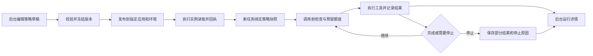

# 澜绣云裳 AI 管理后台：工具调用上限与防循环监控

版本：V1.0 · 整理日期：2026-10-04 · 状态：待实施、待验收的增量规格

交付对象：继续开发澜绣云裳项目的 Claude、产品负责人、研发与测试人员。

目标项目：`/Users/eureka/Desktop/澜绣云裳agent/`；管理后台位于其 `管理后台/` 目录。

本文承接已有 Workflow/Agent、工具筛选、调用链与 2026-10-03 审阅文档，补齐执行限制从后台配置到真实运行的连接。它不是要求重建一套后台，也不代表本文中的新增能力已经实现。

## 1. 要交付的结果

门店顾问让助手核对服装方案时，助手需要查询面料适配、物料成本、尺码、工期和库存。研发与运营需要提前规定它可以花多少时间、调用多少工具，并在查询重复、接口异常或额度不足时正确停止。顾问应拿到已核实结果与缺失项，不能收到一份未经完整核查却声称完成的正式报价。

输入是有权限的任务请求、任务类型、冻结的运行策略、工具返回及业务数据版本；输出是业务结果、实际生效策略、逐步执行记录、停止原因和必要的人工待办。配置由后台维护，限制由服务端执行，监控由系统持续记录，人工按异常介入。

本版本交付后必须能现场演示：

1. 在后台修改某个门店助手的工具调用上限，保存、验证、发布到指定环境。
2. 发起一条真实任务，在运行详情看到实际采用的策略版本和额度。
3. 到达上限后，服务端不再发起新的受限调用；页面显示准确的停止原因。
4. 已完成的核查可以保留，缺失项清楚显示，未满足正式报价条件时不能提交正式报价。
5. 正常的数据变化、分页和合法轮询不会被一概认定为循环。

以上是交付目标，尚未验证。配置数字、页面新增项和工期估算均为本次设计建议。

## 2. 当前有什么，哪些不能重复建设

### 2.1 证据范围

本次只读核对源码，基线 HEAD 为 `29d9bd2`，工作区存在其他未提交内容，因此提交号不能单独代表全部现场。文件哈希和完整测试输出保存在同目录 `evidence/source-baseline.json`、`evidence/existing-agent-tests.txt`。实施前重新核对文件，Claude 的后续改动可能使本文的行号或现状判断过期。

交付前的一次复核时 HEAD 已推进至 `fd3edc3`；`agentsite/sdk.py` 另有返回语句缩进调整，使返回不再依赖会话保存分支；`agentsite/guards.py::_unwrap` 新增了对工具结果直接为内容块列表的兼容。已核对这些差异，没有改变本文引用的轮数、费用、Hook 装配和配置入口，也不把这两项修正重复列为待修缺陷。差异与交付复核哈希另存 `evidence/delivery-source-check.json`，不把基线当作整个开发现场的冻结状态。

已运行现有 `test_agent_tools.py`：43 项检查通过。它使用脚本模型和模拟工具，证明有限的运行器与网关逻辑；没有验证真实 SDK、门店页面、数据库全链路、告警或本规格新增功能。新增验收用例当前执行数为 0。

### 2.2 现状与调整矩阵

下列路径均相对于目标项目根目录。行号供定位，复核以函数和当前源码为准。

| 对象 | 当前观察 | 实施要求 | 源码证据 |
|---|---|---|---|
| 门店 V3 助手 | `run` 默认 12 轮，传入 SDK 轮数及费用限制 | 保留，接入明确的任务策略与运行回执 | `agentsite/sdk.py:735,804,838` |
| V3 调参定义 | 有“最多来回几轮”，整数范围 1–24 | 保留实验用途，不把实验方案保存等同生产生效 | `agent/knobs.py:75,150,162` |
| 后台与 V3 的配置连接 | 后台方案存库，再由脚本导出候选文件，V3 选用后读取 | 将状态拆为已保存、已导出、已发布、实例已加载、运行已采用 | `管理后台/services/api/app/lanxiu_api.py:25`；`管理后台/tools/export_knob_plans.py` |
| 后台 Agent 配置页 | 有“权限与限制”，主要编辑 `limits` JSON，并展示限制落地说明 | 改为普通表单，保留受权限控制的高级查看；修正能力状态来源 | `管理后台/apps/web/app.js:1292,1416` |
| 后台 Agent 循环 | 有模型回合、工具请求计数及重复被拒动作停止 | 复用，补全计数口径、超时、预算与进度检测 | `管理后台/services/api/app/runtime/agent_loop.py:119,177,227` |
| 后台 Agent 的真实运行 | Worker 已连接上述循环，但真实模式显式报 `ENTRY_NOT_WIRED_LIVE`，目前接模拟适配器 | 明示能力边界；门店 V3 的首期交付不依赖此入口变成真实运行 | `管理后台/workers/worker.py:745,925,980` |
| V3 写入保护 | 有成功写入后的限制、相同参数尝试检查、失败尝试上限 | 保留业务规则，不扩成“所有同参数调用都禁止” | `agentsite/guards.py:1143,1205` |
| V3 Hook 装配 | 当前 `guard` 控制整组 `make_hooks` 是否挂载，其中包含工具前检查 | 拆开不可关闭的执行保护和可做实验的回答质量检查；必须验证关闭质量检查仍受预算及权限保护 | `agentsite/sdk.py:803`；`agentsite/guards.py:1462,1550` |
| 限制能力说明 | 契约表仍有统一的未落地标记，与部分运行逻辑不完全一致 | 用执行路径、版本、验证证据分别展示，不直接把全部标记改成已实现 | `管理后台/services/api/app/contract/dsl.py:590` |
| 运行与调用链 | 已有运行详情、事件、输入输出、步骤、Token、费用及权限处理 | 扩展现有页面和数据，不新增第二套独立日志平台 | `管理后台/apps/web/app.js:1153,2534`；`管理后台/services/api/app/runs_api.py` |
| 人工控制 | 已有暂停、继续、取消、核实外部状态的接口和按钮 | 逐执行路径验证是否被执行器消费；有按钮不等于能中断 V3 | `管理后台/services/api/app/runctl.py`；`管理后台/apps/web/app.js:1024` |

“后台 Agent 编排运行器”与“门店 V3 SDK 助手”是不同执行入口。接口、测试或页面的一边通过，不得被另一边借用为验收证据。

## 3. 范围、顺序与岗位

### 3.1 本期范围

- P0：门店 V3 的策略生效回执、不可关闭的执行保护、任务级计数、确定性重复识别、超时停止、真实运行记录与只读试点。
- P1：结构化进度检查、分类重试、站内异常提醒、运行中的安全停止与受控恢复、配置灰度及回滚。
- 独立后续项：后台 Agent 编排入口接真实模型和真实工具。可以复用本期策略契约，但不能通过改一个“真实”标签冒充接通。

本期不增加自主子 Agent、不替换模型、不改报价业务条件、不开放原本禁止的工具、不建立新的业务数据副本。既有工具筛选是否启用，继续依据其原有评测决定。

### 3.2 岗位与权限

| 岗位 | 可以做什么 | 不能自行做什么 |
|---|---|---|
| 门店顾问 | 发起任务、看有权查看的进度和业务结果、补充资料、停止自己的任务 | 调高系统硬上限、替其他门店读取原文、批准助手自己的写入 |
| AI 产品/运营 | 编辑任务策略草稿、运行测试、看脱敏诊断、处理普通异常 | 因为有编辑权限就默认拥有生产发布或客户原文权限 |
| 发布负责人 | 按项目授权发布、回滚，批准有范围的预算追加 | 把追加预算解释成新增工具权限或业务操作授权 |
| 研发/测试 | 核查执行证据、模拟故障、维护能力清单 | 用模拟通过代替真实联调，用模型自述代替网关记录 |

复用现有项目权限，不另建与现有账号脱节的管理员体系。发布与追加预算是否由同一角色承担，由现有权限表映射，不强制新增多级审批。

## 4. 从设置到执行的连接方式

以下是目标流程，不是现状图。



### 4.1 一个策略对象，两种运行适配

策略定义只维护一份可验证的契约。门店 V3 和后台 Agent Loop 分别实现适配层，报告自己支持哪些限制、采用何种计数方式、哪些信息不可观察。不要为了统一页面而谎称两种运行器内部完全相同。

优先扩展现有版本/发布对象并引用 `execution_policy_version_id`。如确需新增表，仅新增版本、实例回执与预算账本等缺少的对象，沿用现有项目外键、审计与 Trace。

### 4.2 保存、发布、加载、采用是四个状态

| 状态 | 必须有的事实 | 页面不能暗示什么 |
|---|---|---|
| 草稿已保存 | 后台持久化成功并有 revision | 不能表示门店已生效 |
| 版本已发布 | 发布记录指向不可变版本和目标环境 | 不能表示全部实例已加载 |
| 实例已加载 | 指定实例回执版本、哈希、能力清单与时间 | 不能表示历史任务改用了新版本 |
| 本次运行已采用 | Run 上记录实际策略快照与来源 | 不能借其他运行的回执证明本次生效 |

现有文件导出可作为过渡适配：原子生成带版本/哈希的配置文件，保留原候选文件中的 Prompt 改动和评测记录；必须另有目标应用的版本选择与实例回执。不得通过修改全局环境变量让并发请求偶然串用方案。

同一任务启动后固定策略快照。普通发布和回滚只影响后续新任务；运行中需要调整时，走有权限、有理由、有版本记录的控制操作，不静默替换整份 Prompt、工具或规则。

### 4.3 配置读取失败

允许使用上一次已验证的本地策略，但要展示回退版本、年龄、原因及有效期。没有有效策略或所需硬限制不受支持时，拒绝启动受影响任务；不能回退为“无限制”。配置服务不可用不等于额度可以清零。

## 5. 限制怎么定义：单位、作用域与默认值

### 5.1 作用域先于数字

- `session_id`：聊天会话标识；同一会话可能有多个不同业务任务。
- `task_id`：用户要完成的一件事，作为共享预算与业务进度的作用域。
- `run_id`：一次具体执行；重启、续跑可产生新运行段，但仍引用同一任务和预算账本。
- `plan_version`：该任务的计划版本；重排不创建新预算。

用户发起独立的新任务才能分配新任务预算。执行器不能为了继续原任务自行换 `task_id`。原任务重新核查同一笔写操作时，仍要连接原逻辑动作标识。

### 5.2 明确区分计数

| 字段（建议契约） | 计什么 | 用途 |
|---|---|---|
| `model_request_count` | 受控模型适配器的实际请求，含修复与降级请求 | 自建运行器模型请求预算 |
| `sdk_turn_count` | 所用 SDK 定义的交互回合 | V3 的 SDK 回合上限，不冒充逐次网络请求数 |
| `tool_request_count` | 模型提出的工具请求，含被拒绝、复用结果的请求 | 防止大量无效提议与重复索取结果 |
| `tool_attempt_count` | 实际进入工具适配器的执行尝试，含失败和重试 | 控制真实工具消耗 |
| `tool_retry_count` | 同一逻辑操作的追加执行尝试 | 区分“做了多少件事”和“试了多少次” |
| `provider_request_count` | 可观测的供应商底层请求数 | 有适配器记录才填写；不可见写未知 |

现有后台 `max_tool_attempts` 的计数在网关之前增加，可能包含被拒请求。迁移时保留 `counter_schema_version=legacy` 的旧含义；新版本同时保存请求数与实际执行数，不将历史同名字段悄悄改成新口径。

SDK 内部重试不能靠 `PreToolUse` 推算。开发时核对安装的 SDK/CLI 版本与适配器可见性；无法计数的调用要标明，并通过供应商请求超时、费用与任务期限形成额外约束，不能宣称所有网络调用都有精确次数上限。

### 5.3 首轮只读试点的建议值

这些是可替换的测试起点，不是行业标准，也不是当前生产配置。正式报价所需五项核查不能为满足额度而被省略。

| 后台字段 | 单位/建议初值 | 执行点与规则 |
|---|---|---|
| SDK 最大交互轮数 | V3 初始沿用 12 轮 | 绑定 SDK 参数；不因本规格自动改成 8 |
| 模型最大请求次数 | 后台 Loop 初始沿用 8 次 | 每次模型请求前检查；仅在该入口已接通时生效 |
| 工具请求上限 | 20 次/任务，建议 | 包含被拒、复用、Skill 等受控工具请求，分类展示 |
| 工具实际尝试上限 | 12 次/任务，建议 | 每次调用前原子预留；重试与并行共享 |
| 单工具调用超时 | 10 秒，按工具覆盖 | 到时取消本地等待；外部操作结果仍须核实 |
| 整体执行期限 | 60 秒，仅短只读核查试点 | 模型调用、工具调用和等待均不能越过剩余期限新启动 |
| 单操作最大重试次数 | 2 次，即最多 3 次尝试 | 只适用于允许重试的临时故障，并受任务总预算约束 |
| 无进展观察窗口 | 连续 3 个决策周期，建议 | 结构化进度无变化才触发；第 7 节规定例外 |
| 无进展后的重规划次数 | 最多 1 次，建议 | 仍占原任务额度；无合法替代路径则直接停止 |
| 并发工具数 | 首期 1 个 | 不开放现有未支持的并行；后续启用必须共享原子预算 |
| 费用上限 | 发布负责人填写币种和金额 | 必须有价格口径和版本；不能把未知价格视为零 |
| 人工等待期限 | 按人工处理场景单独填写 | 等人时释放执行资源，保留任务总期限和原预算 |

次数/秒数必须是正整数；重试允许 0；布尔值不能作为数字。字段不受支持时显示“此执行入口不支持”，不能让人填完仍显示保护已生效。时长、币种、作用域不同的限制不得直接取最小值合并。

同口径额度取项目硬上限、应用策略和本次合法覆盖中的更严格值。业务用户、模型、Skill 和检索资料都不能提升硬上限。改变金额预算不扩大业务写入权限。

## 6. 工程执行方式

### 6.1 统一的调用前后检查

每次请求依次经过：确认运行状态 → 确认权限与参数 → 判断重复/是否可复用 → 检查剩余预算与期限 → 原子预留 → 实际执行 → 登记结果和实际用量 → 更新进度 → 判断继续或停止。

工具请求数在受控入口接收请求时增加；实际执行数在准备进入适配器时预留。请求被权限拒绝不增加真实工具执行数，但仍消耗请求配额和对应模型消耗。重放同一个网络请求必须按 `request_id` 去重，不能重复增加请求计数。

并发扩展时，预算预留、状态检查、扣减使用同一事务或等效原子操作。两路看到还剩一次，最多只能有一路获得许可。额度为 0 时，在调用外部服务前拒绝，不能先执行再发现超限。

进程在调用结果返回前崩溃，不能立即把预留额度退回并重发。保留待核实状态，依靠执行记录/外部状态核对结算；不支持外部核实的写操作转人工处理。

### 6.2 V3 接法

- 在 `agentsite/sdk.py::run` 的配置装配之前解析任务身份和实际策略；创建/加载预算账本与策略快照。
- 传入 SDK 原生回合/费用参数，并在模型会话外层设置任务截止检查。SDK 自身的限制是额外保护，不替代跨续跑的任务账本。
- 将 `guards.make_hooks` 拆为执行保护与回答质量检查。额度、权限、工具名单、取消信号等必需检查始终存在；实验用的“关闭体检”只影响明确标注的质量评估部分。
- Hook 负责观察/阻止新工具请求；具体工具适配器或 MCP 服务入口执行实际尝试计数、超时与写操作保护，避免仅通过 Hook 推断底层重试。
- 硬上限触发后，除了拒绝调用，还必须让外层执行协调器结束循环。禁止只返回“不能调用”，却继续消耗模型回合争辩。
- 当前入口使用 `query()`。若所安装版本无法提供需要的主动中断控制，应评估迁到可中断的客户端形式，或采用受控的会话/子进程生命周期；先做一个超时测试证明可停止，再扩展。不得在文档里假定 `query()` 有不存在的中断方法。
- SDK/CLI、模型、工具版本及能力探测结果写入每次 Run。依赖文件只声明最低版本，不能据此推断机器实际安装版本。

### 6.3 后台 Loop 接法

复用 `runtime/agent_loop.py` 的轮数检查、工具网关、完成核验和结构化事件。把任务账本作为依赖注入，禁止在恢复时重新初始化成零。现有相同被拒动作识别继续保留。

复用 `runtime/tool_gateway.py` 的真实调用入口，增加超时、分类重试、预留与结算。不能在模型层、工具网关和 Worker 三层同时各重试三次，造成不可见的乘法放大。工具重试由网关负责；Worker 恢复执行必须读取检查点和既有逻辑动作。

当前 Worker 的真实模型分支未接通，保留明确错误。在真实工具协议、权限和调用结果关联都完成前，不将模拟适配器的结果标成真实。

### 6.4 时间与费用

单次请求可等待时长 = 单工具超时与任务剩余时长中的较小值。时间计算使用适合测量持续时间的时钟；持久化绝对截止时间用于跨进程恢复，防止重启获得新的完整 60 秒。

超时意味着停止等待/停止新调度，不代表外部操作被撤销。接口支持取消时请求取消，并核实回执；接口不支持时显示“本地已停止等待，外部结果待核实”。不能把仍在运行的线程换个名称后当作已经停止。

费用字段分为“供应商报告用量”“价格表估算”“账单确认”“未知部分”。请求前按已知上界或保守预留值判断，返回后结算差额。由于异步结算和在途请求，不承诺外部账单绝对零超支。估算不足或价格未知时按发布策略阻断昂贵任务，不能将费用默认为 0。

收尾优先用已经登记的事实生成固定状态说明，不必再请求模型。确需模型整理时提前预留收尾额度；硬截止后不得另开一轮无预算生成。

## 7. 怎样识别原地打转

### 7.1 重复调用与结果复用

只读调用指纹建议包含：工具及版本、规范化后的真实参数、项目/门店/权限范围、相关数据版本、候选方案版本。参数规范化只能统一确定等价的表示，不删除业务条件或改变列表顺序的语义。

| 情形 | 处理 |
|---|---|
| 同一条件、成功结果仍在有效期、权限仍有效 | 复用结果并记录来源调用；仍计工具请求数 |
| 局部刺绣改成整幅刺绣 | 候选版本变化，旧成本/工期结果失效，允许重新查询 |
| 库存版本变化，或需要核实刚发生的变更 | 允许刷新；无数据版本时采用工具规定的时效，不跨期限复用 |
| 分页参数或合法筛选条件改变 | 作为新的检索步骤，结合是否获得新信息判断进度 |
| 只修改跟业务无关的随机参数绕过重复检测 | 拒绝无契约参数，保留请求记录；不能由模型自行声明“这是新任务” |
| 写操作重复申请 | 由逻辑动作及幂等机制判断，不使用普通只读缓存策略 |

摘要不用于存储原始敏感参数。低熵的客户标识不宜只做公开哈希；根据部署条件使用带密钥摘要或受控加密存储，详情原文沿用既有专项权限。

### 7.2 结构化进度

先在报价核查场景实现明确的进度字段，再推广到其他任务模板。报价进度包含五项核查的状态/证据版本、未核实条件、当前候选、已排除候选、待用户决定事项。

真正进展包括：补齐必要证据、纠正一个错误参数、排除一个候选、确认任务不可行、形成明确的待确认事项。新增一句解释、调用次数增加、结果附上新时间戳，不算进展。失效旧结论也可以是进展，但必须记录触发它的新证据。

每个决策周期在本轮受控工具结果处理完后比较进度版本。连续窗口没有变化时，记录依据及相关调用 ID；若有可验证的新路径，允许一次受原预算约束的重规划，否则停止为 `no_progress`。不要让模型一句“我有进展”就清零计数。

查成本 → 查工期 → 再查成本 → 再查工期，只要业务证据和候选状态都未改变，同样会进入无进展检测。新候选必须有明确差异与依据，不能只换候选编号绕过计数。

### 7.3 合法等待与故障重试

可轮询工具必须在工具契约声明 `pollable`、轮询间隔、最长等待时间和预期结束状态。合法轮询走专用轮询预算，且仍受任务期限、工具尝试总数约束；不能因为没有新的业务证据就直接按普通无进展窗口误杀。

临时故障重试由错误码白名单决定。参数错误先修正参数，权限拒绝不自动重试，未知错误不猜成临时故障。建议退避起点为 1 秒、上限 8 秒并加随机扰动；实际间隔服从 `Retry-After` 和剩余期限，超过剩余期限直接停止。

写操作超时先核实外部状态，已成功则回填；未成功且具备可靠幂等条件才允许重试；结果未知则 `needs_verification`，不得用新动作编号规避保护。

## 8. 运行状态、人工控制与最终结果

运行状态继续沿用已有状态机，新增原因码要在服务端契约、API、前端和测试中同时登记。不要将停止原因塞进“成功/失败”的同一个字段。

| 事件 | 运行状态/停止原因建议 | 用户得到什么 | 后续动作 |
|---|---|---|---|
| 核查与完成判据通过 | `succeeded`，原因 `completed` | 已核实结论及证据 | 正常结束 |
| 次数或费用不足 | `incomplete`，细分额度原因 | 已完成事项、缺失项、消耗量 | 有权限的人追加额度或另行处理 |
| 无进展 | `incomplete / no_progress` | 重复的步骤及缺少什么 | 补资料、调整工具/规则后关联续跑 |
| 临时故障重试耗尽 | `incomplete / retry_exhausted` | 故障工具和最后一次错误分类 | 修复后从安全位置继续 |
| 总期限耗尽 | `expired / deadline_exceeded` | 部分结果和外部在途状态 | 原 Run 保持终态；按授权新建关联续跑段 |
| 写入结果未知 | Run 为未完成，动作状态 `needs_verification` | 待核实的目标及查询入口 | 查外部状态，不自动重做 |
| 用户取消 | 先 `cancel_requested`，执行器确认后 `cancelled` | 已做/未做/在途内容 | 不承诺撤销已发生动作 |
| 等待人工输入 | 已支持检查点时使用现有等待态；未支持则未完成 | 明确需要补的字段 | 不空转占用 Worker |

同时保存任务达标状态。`succeeded` 只表示对应执行契约通过，不能替代业务质量评测。正式报价必须满足原业务程序核验；五项核查缺一时不允许为了“尽快完成”跳过。

暂停/取消请求后，每次新模型调用和工具调用前检查信号。已发出的调用按取消能力处理。受控继续保留旧预算已用值和写入记录；终态 Run 不直接改回运行中，创建关联恢复段，仍引用原任务。

额度追加是“原总额增加到新总额”，不是“已用归零”。记录前值、增量、后值、理由、批准人、有效范围；不能超过项目硬上限。缺少恢复能力的入口禁用继续按钮，并解释原因。

## 9. 后台页面与按钮规划

### 9.1 导航与复用

保留现有“智能体 Agent”“运行记录/调用链”“用量与成本”“人工待办”。在应用或 Agent 详情增加“执行策略”，标明绑定的是“门店 V3”还是“后台编排 Agent”。一个列表可以聚合两种来源，但必须可筛选，不能混淆能力与费用口径。

### 9.2 执行策略列表

字段：策略名称、适用任务/门店/角色、目标执行入口、草稿版本、当前发布版本、实例回执覆盖数、最近一次实际采用时间、能力验证状态、更新时间/修改人。

顶部：名称搜索、环境/入口/状态筛选；右上“新建策略”。每行主要操作“查看/编辑”，更多菜单“复制为草稿、查看版本、停用”。生产停用必须说明回退版本，不能让新任务变成无限制。

空状态展示创建策略入口；接口失败保留筛选并提供重试；无权限只读；存在发布但没有实例回执时明确显示“尚未确认加载”。

### 9.3 执行策略详情

顶部显示名称、目标环境、策略版本、修改人；右上依次为“校验”“试运行”“发布”。发布前必须展示版本差异、目标范围、验证结果；不新增与现有发布体系重复的流程。底部固定区放“取消修改”“保存草稿”。

| 页签 | 输入/展示内容 | 关键交互 |
|---|---|---|
| 基本信息 | 名称、用途、任务模板、执行入口、环境与范围 | 切换入口重新检查支持能力，不悄悄抹掉原配置 |
| 次数与时间 | 第 5 节数字表单、单位、作用域、项目硬上限 | 越界/不支持字段原位报错；明确 2 次重试=总计 3 次 |
| 重复与重试 | 各工具结果有效期、可轮询配置、错误码白名单、无进展策略 | 新增例外必须选择工具及版本，不能填“所有都忽略” |
| 费用与停止 | 币种、额度、价格表、未知费用处理、部分结果策略 | 未核验价格不能显示“金额准确”；硬停止仍可生成确定性说明 |
| 验证与生效 | 每项限制的配置值、支持状态、执行点、最新测试、实例/Run 回执 | “查看该项测试”“查看采用此版本的运行” |
| 版本与审计 | 差异、发布/回滚/追加额度记录 | 老版本只读，可复制成新草稿 |

高级 JSON 只用于有权限人员查看或导入；导入与普通表单走同一服务端校验。字段旁的“已验证”必须带执行入口、运行器版本和测试时间，不允许维护一个全局静态绿勾。

### 9.4 运行列表

字段：开始时间、任务、来源应用/入口、执行状态、任务达标状态、当前阶段、工具请求/实际尝试/上限、耗时/期限、已知估算费用/预算、策略版本、停止原因、是否待核实、负责人。

筛选：运行中、未完成、超限、无进展、待核实、配置未采用、数据延迟，以及任务类型和时间段。每行主操作“查看详情”；只有当前身份、状态与入口支持时才显示“请求停止”。

调用 7/12 次是预算消耗，不显示为任务完成 58%。报价进度可显示“已核实 4/5 项”，它与预算条分别展示。列表里看不到客户原文不影响查看次数和状态。

### 9.5 运行详情

顶部：任务名、运行 ID、策略版本、执行入口、真实/模拟模式、数据更新时间。右上按状态显示“请求暂停/停止”；更多菜单放“查看脱敏诊断包”。

主体布局：

1. 左侧执行时间线：模型请求、工具请求、放行/拒绝、开始、返回、重试、复用、停止。每项可展开参数摘要、证据引用、耗时和原因。
2. 右侧预算与进度：已用/预留/剩余、截止时间、五项核查、缺失条件、在途动作。不能将预留成本与实际成本重复相加。
3. 底部页签：业务结果、停止依据、实际策略、输入输出、版本/环境、人工操作。原文沿用字段级权限。

额度耗尽后按能力显示“申请/追加额度并继续”；信息缺失显示“补充资料”；写入未知显示“核实外部状态”。没有对应能力不摆可点击的假按钮。操作进行中显示请求状态，等执行器回执后才更新为已停止/已恢复。

### 9.6 异常中心

优先扩展现有人工待办或健康页，集中显示：异常类别、严重程度、首次/最近时间、关联任务数、证据、负责人、处理状态。详情按钮为“认领”“查看运行”“记录处置”“关闭”。关闭异常不篡改原始失败记录。

同一任务/策略/原因的告警合并，保留发生次数。预警默认站内，外部飞书通知作为需配置目标及授权的后续能力；本次文档交付不会发送任何消息。

## 10. 监控、存储与接口

### 10.1 自动监控不依赖页面打开

运行器把关键事件写入持久化事件流/账本，后台通过已有事件接口或有间隔的轮询读取。不能将整个任务的所有事件放在一个直到结束才提交的长事务里，否则运行中看不到异常。实施时实测事件可见时间。

运行控制服务记录最后心跳；心跳失联先标“状态待核实”，停止向该任务发新调度。不能仅靠心跳超时判断外部写入失败。页面显示数据最后更新时间，断线时显示“数据更新中断”，不伪造任务进度。

本地执行账本仍可写、远端监控暂时不可用时，受控只读任务可继续并补报；持久化额度或写入意图无法可靠登记时不发起新的受保护调用。日志补报按事件 ID 去重。

### 10.2 最小数据对象（建议扩展）

| 对象 | 最少字段 | 约束 |
|---|---|---|
| 策略版本 | 项目/应用、版本号、哈希、作用域、限制、计数版本、支持要求 | 冻结后不可改；展示实际来源 |
| 实例回执 | 实例 ID、运行器/SDK 版本、策略哈希、加载时间、能力矩阵 | 同一实例定期更新；过期回执标陈旧 |
| 任务预算账本 | task_id、总额/已用/预留、期限、revision、追加记录 | 所有 Run 段共享；更新原子化 |
| Run 扩展 | session_id/task_id、父/前序 Run、策略快照、入口、实际工具版本、原因码 | 使用 existing Run/Trace 关联键，避免双份真相源 |
| 调用记录 | request/attempt/logical_action ID、工具版本、受控参数摘要、结果引用、计数增量 | 写入结果未知时不可伪造 failed/succeeded |
| 进度快照 | 任务模板、证据版本、候选/排除项、缺失项、progress_version | 只依据可核验变化更新 |
| 异常/人工操作 | 原因、依据事件、等级、负责人、处置、前后值 | 权限、审计、项目隔离 |

### 10.3 接口契约增量

实际路由先查现有契约再定名。下面是所需能力，不要求复制一个已有接口。

| 能力 | 复用/扩展点 | 输入与返回要点 |
|---|---|---|
| 编辑策略 | Agent 草稿/澜绣配置接口 | revision、目标入口、限制；返回字段错误及不支持项 |
| 冻结/发布 | 既有版本与发布接口 | 不可变版本、目标应用/环境、验证报告；返回发布 ID |
| 回报加载与采用 | 实例/运行上报入口 | 策略 hash、运行器版本、覆盖矩阵；服务端核验身份 |
| 查询运行 | `/execution-runs`、`/traces` 的对应视图 | 统一外部 ID 映射、实际快照、额度和新停止原因 |
| 实时事件 | 现有事件端点 | seq/cursor 续传；鉴权不塞长期凭证到 URL |
| 暂停/取消/核实/恢复 | `runctl.py` 已有能力 | 幂等键、revision、运行能力；返回“请求中”与最终回执 |
| 追加额度 | 扩展运行控制 | 原额度版本、追加值、理由、权限；保留已用值 |

任一客户端传入的 `project_id`、额度和动作标识都须经服务端身份与上下文核验。模型无法直接调用策略发布、额度追加或批准自己的接口。

### 10.4 指标和告警

| 指标 | 口径 | 如何使用 |
|---|---|---|
| 真实任务完成率 | 满足该任务业务判据数/同类有效任务数 | 按任务类型分组，别只看请求返回率 |
| 超限停止率 | 因具体额度停止数/同类启动任务数 | 与误杀、质量共同看，不以越低越好 |
| 无进展停止率 | 经规则停止数/同类任务数 | 人工抽查确实无进展的比例 |
| 正常任务误阻率 | 独立标注的正常任务中被错误拦下数/正常任务数 | 调阈值的重要约束 |
| 恢复成功率 | 满足恢复条件并最终完成数/发起恢复数 | 单列人工参与和写入待核实 |
| 时间/成本 | p50、p95、最大值；每任务及每成功任务 | 费用含失败消耗，未知项单列 |
| 观测完整率 | 具备策略回执、调用记录和终态记录的任务数/应记录任务数 | 分真实/模拟，不让缺日志任务消失 |

建议预警：额度使用到 80% 时只提示、不改变结果；硬上限则停止新调用。单次正常到限先记事件，多次同类失败或出现调用越界才升级告警。统计窗口、最小分母和异常阈值由试点基线决定；未取得基线不预设“故障率下降 50%”。

## 11. 实施阶段与交付检查

| 阶段 | Claude 要完成的工作 | 退出条件 |
|---|---|---|
| P0-A 查清入口 | 核对现场、列真实入口/版本/工具/计数能力，保留已有测试 | 能说明哪些上限在哪里执行，哪些看不到 |
| P0-B 接通 V3 策略 | 版本发布、实例加载、Run 采用回执；拆开硬保护和质量实验开关 | 一次真实只读任务能对上后台版本与实际策略 |
| P0-C 加执行保护 | 任务账本、次数、期限、重复识别、硬停止、部分结果 | 对抗任务到限不再发起调用，正常五项核查不误杀 |
| P1-A 补监控交互 | 表单、详情、运行中事件、异常聚合、恢复控制 | 页面关闭仍记录，断线续读，停止有回执 |
| P1-B 验证和试点 | 同题对照、峰值与故障演练、灰度、回滚 | 附录 C 的必需项通过，未通过项不隐藏 |
| 后续后台真运行 | 为后台 Loop 接真实工具协议，复用策略及账本 | 对该入口单独跑真实模型与工具验收 |

优先从门店 V3 的只读报价核查灰度，保持原有写入权限。暂停/取消/额度追加按钮随执行器能力发布，不能先放按钮后补执行。

先影子记录拟新增的无进展规则，比较正常查询是否会误拦；既有权限保护与硬上限持续生效。验证通过后只在指定测试范围执行新规则。回滚回到上一个已验证策略，不回退到无保护模式。

Claude 交付需包含：改动文件、策略到 Run 的证据、测试命令与报告、真实/模拟区分、后台页面截图、故障和回滚演练、未完成清单。产品负责人确认的是这些可检查结果，不是“已加入 Hook”等实现描述。

## 12. 成本与收益：本次增量的估算

### 12.1 估算边界

以下为 2026-10-04 的方案估算，依据是上述工作包拆分，没有实际排期、团队报价或收益基线。范围为 P0 与 P1，不含后台 Loop 的真实模型协议重建，不含原项目历史投入。币种为人民币；人日费率仅用于资源成本情景，不是供应商报价或税务口径。建设成本与上线后首月运营分列。

| 工作包 | 后端人日 | 前端人日 | 测试人日 | 产品人日 | 合计人日 |
|---|---|---|---|---|---|
| 入口与能力基线 | 1–1.5 | 0 | 0.5–1 | 0.5 | 2–3 |
| V3 策略与账本 | 4–6 | 2–3 | 0.5 | 0.5 | 7–10 |
| 防循环、超时与重试 | 4–6 | 0 | 2–3 | 0 | 6–9 |
| 监控、表单和异常交互 | 2–3 | 2–3 | 1–2 | 0 | 5–8 |
| 集成验收、灰度与回滚 | 1–1.5 | 0.5 | 2–3 | 0.5–1 | 4–6 |
| 合计 | 12–18 | 4.5–6.5 | 6–9.5 | 1.5–2 | 24–36 |

假设 1 名后端全时、1 名前端半时、1 名测试半时、产品按需投入，预计 5–7 个工作周，含依赖联调与一次修复缓冲；是角色工作量与依赖的估算，不是将总人日除以人数。前端和部分测试可在契约冻结后并行，真实入口联调是关键依赖。后续后台真实适配额外预留 4–7 人日，未计入上述合计。

### 12.2 建设与持续成本

假设综合资源成本为 1,500 元/人日，仅用于演算：24–36 人日对应 36,000–54,000 元。另对接口变更和非预期返工预留 10%，为 3,600–5,400 元；已列入验收阶段的常规修复不再次计提。**已知假设项小计为 39,600–59,400 元，不是完整项目总价。**

完整建设资源成本 = 上述小计 + AI 辅助建设费 + 新增评测费 + 必要基础设施/存储增量。后三项当前金额未知；有订阅的部分按实际分摊，不能把 SDK 估价当成现金账单。现有员工人日不必然形成新增工资现金支出。

持续运营需记录异常复核、规则维护、存储和上报成本。初期假设每月额外 2–4 人时维护，已在收益情景中扣除；试点后换成实测。存储预算公式为“日任务数 × 每任务平均事件数 × 每事件字节 × 保留天数”，另计索引、备份及压缩；各输入目前未测。

### 12.3 Token 与费用测算

本功能的计数、重复判断和硬停止不依赖新增模型调用。若后续增加模型辅助判断进度，其调用必须单独入账，并证明比确定性规则更合适。

以下全部是用量假设，不是当前项目日志统计；输入包含各轮系统提示、历史与工具定义的累加。缓存命中是总输入的子集，不能再次加到总输入上。

| 阶段 | 用量假设 | 汇总估算 |
|---|---|---|
| AI 辅助建设 | 80–160 次辅助调用；每次总输入 30,000–60,000、输出 2,000–5,000 Token | 总输入 240万–960万；输出 16万–80万 |
| 真实模型回归/试点测试 | 24 个业务任务 × 新旧两方案 × 各两轮 = 96 次任务；每任务总输入 50,000–120,000、输出 1,000–3,000 | 总输入 480万–1,152万；输出 9.6万–28.8万 |
| 运行期敏感性单位 | 每 1,000 次任务，沿用上行每任务假设 | 总输入 5,000万–1.2亿；输出 100万–300万 |

测试用量独立于建设辅助调用，不重复相加；运行期这一行是单位情景，不代表当前月业务量。正式费用按实际模型、价格版本、币种、缓存写入/读取档分别计算：`费用 = Σ(各计费档用量 × 对应单价 / 单价单位)`。价格未核验，因此本文不填模型单价和确定金额。超时与失败已包含在完整任务日志时，不再乘一次重试系数。

### 12.4 收益与试点判据

当前“原地打转事件/月”“每次人工排查时间”“额外调用费”均未测。预期收益是减少顾问等待与研发排查、保留可恢复结果、降低无效调用；不能由次数减少直接推导总收入或裁员收益。

净释放人时/月 = 受益事件数 × 每次减少的人工分钟 / 60 − 新增维护人时。下面是纯假设敏感性分析：

| 情景 | 受益事件/月 | 每次少花人工分钟 | 新增维护人时/月 | 净释放人时/月 |
|---|---|---|---|---|
| 保守 | 5 | 10 | 2 | -1.17 |
| 基准 | 20 | 15 | 3 | 2.00 |
| 乐观 | 50 | 20 | 4 | 12.67 |

出现负数说明小规模下维护可能抵消时间收益。现金净收益仅计实际减少的按量账单/采购等，内部时间价值另列，不重复货币化。ROI 和回收期当前不可确定；待取得建设现金支出、稳定月净现金收益后再算，月净收益不为正时不报告回收期。

试点先记录现状，再在同样任务、数据、模型和评分条件下比较；至少分别报告正常任务、超时、重复循环和数据变更场景的完成率、误阻率、人工时间、p95 延迟与每成功任务费用。

## 13. 开发前必须核实的事项

| 事项 | 影响 | 责任角色/决策时点 |
|---|---|---|
| 实际部署 SDK/CLI 版本及中断能力 | 决定能否停止模型循环、如何观测回合 | 研发，P0-A 前 |
| 门店请求如何映射到业务任务 | 决定续聊是否共享预算，避免每条消息重置 | 产品与研发，冻结数据契约前 |
| 供应商真实价格/订阅与缓存口径 | 决定金额限制是否有可信估算 | 发布负责人和研发，启用金额限制前 |
| 哪些工具有数据版本、可轮询、可查外部状态 | 决定重复复用与重试策略 | 工具维护人，逐工具启用前 |
| 真实调用的上报覆盖、事务提交时机 | 决定运行中是否可观察 | 后端与测试，P1-A 验收前 |
| 合法任务的调用/延迟分布 | 决定上限与无进展阈值，避免误杀 | AI 产品与测试，灰度前 |

缺少这些信息时保留不支持/未验证状态，继续完成不依赖它们的工作，不编造已上线结论。

## 14. 一手参考与版本说明

- 项目源码为本项目现状的一手材料；局部阅读范围和哈希见 `evidence/source-baseline.json`，不要用旧 README 的进度表覆盖当前调用分支。
- [Claude Agent SDK Python 参考](https://code.claude.com/docs/en/agent-sdk/python)，核对日期 2026-10-04：包含回合/估算费用参数，以及 `query()` 与客户端的控制能力区别。当前线上文档不等于本机已安装版本；实现必须验证实际版本。
- [Claude Agent SDK Hooks](https://code.claude.com/docs/en/agent-sdk/hooks)，核对日期 2026-10-04：用于调用前后观察与控制的接口参考。本文的任务账本、页面和无进展规则是项目设计建议，不是官方统一要求。
- 既有增量规格：目标项目 `管理后台/docs/规格/Workflow与Agent后台_产品与工程实施规格_给Claude.md`、`工具筛选与按需加载_架构及页面规划_给Claude.md`。复用其对象与权限；本文只增补执行额度与监控，不覆盖无关功能。

## 附录 A · 算法清单

### A-01 计算可用额度
- **用在哪**：服务端调用前检查，后台显示剩余额度。
- **解决什么问题**：并行、续跑和多层重试可能重复消费最后一份额度。
- **输入 → 输出**：策略快照、已用、预留、请求开销 → 允许/拒绝及新预留。
- **怎么算**：同口径剩余 = 总额 − 已用 − 未结算预留；原子检查并预留；结果返回后只结算一次。
- **为什么选它**：比提示词约束可强制，比事后扣减能防并行越界；代价是持久化与锁开销。
- **怎么验证的**：新算法未实现，按 C05–C09、C22、C30–C31 用独立调用计数器核对。
- **局限**：价格估算与外部账单可能滞后，不保证账单零超支；未知状态不能立即释放额度。
- **记于**：2026-10-04 · 最后改于：2026-10-04。

### A-02 判断是否可以复用查询结果
- **用在哪**：只读查询入口，顾问看到复用的有效证据。
- **解决什么问题**：同条件重复查询浪费时间，同时必须允许合理的数据刷新。
- **输入 → 输出**：工具版本、规范化实参、权限范围、数据/候选版本、有效期 → 复用或新执行。
- **怎么算**：等价字段生成受控摘要，匹配已有成功记录，再核对权限和时效；不满足就执行新查询。
- **为什么选它**：比“同名工具调用两次就拦”更准确；首期不引入语义相似度模型，减少误判和费用。
- **怎么验证的**：未实现；C10–C14、C35 对变更、分页、权限与合法重复逐例核对。
- **局限**：数据版本缺失时只能依靠适当时效；相似但不等价的问题不能随意复用。
- **记于**：2026-10-04 · 最后改于：2026-10-04。

### A-03 检查任务是否有进展
- **用在哪**：报价核查的决策周期结束处，后台显示停止依据。
- **解决什么问题**：在多个工具之间来回切换，单纯去重仍抓不到。
- **输入 → 输出**：本周期前后证据、候选、缺失项、等待状态 → 进展变化与继续/重排/停止。
- **怎么算**：合法结构化变化更新进度版本；连续窗口无变化，且非合法轮询，触发一次有预算的恢复或停止。
- **为什么选它**：比模型自评可追溯；比任意循环序列匹配更贴合业务。代价是需要任务模板定义进度。
- **怎么验证的**：未实现；C15–C18、C36 用人工定义的任务进展真值核对，实模两轮记录误阻。
- **局限**：不直接泛化到所有开放式研究任务；没有可靠进度规则时依靠硬预算，并标不支持自动无进展判断。
- **记于**：2026-10-04 · 最后改于：2026-10-04。

### A-04 分类重试与告警聚合
- **用在哪**：工具故障恢复和站内异常中心。
- **解决什么问题**：错误被重复尝试、同一事件产生大量告警。
- **输入 → 输出**：错误码、重试历史、剩余期限、动作状态 → 重试间隔/停止；事件键 → 聚合告警。
- **怎么算**：白名单临时故障使用有上限的指数退避和随机扰动；写入未知先核实；告警按任务/策略/原因键合并计数。
- **为什么选它**：比固定高速重试减少集中冲击；比逐事件提醒减轻人工负担。规则简单可检查。
- **怎么验证的**：未实现；C19–C21、C34、C38；退避用可控时钟验证范围和总期限。
- **局限**：故障分类和工具契约错误仍会导致误判；合并告警不能合并不同权限对象的原文。
- **记于**：2026-10-04 · 最后改于：2026-10-04。

### A-05 估算增量成本与人工收益
- **用在哪**：第 12 节，产品负责人评估投入。
- **解决什么问题**：避免把工具次数下降直接当成现金节约。
- **输入 → 输出**：人日、费率、用量、事件数、每次节省时间、新维护投入 → 资源小计、净人时。
- **怎么算**：人日乘费率，储备按限定基数计算；净人时按第 12.4 节公式；未知项单列不当作零。
- **为什么选它**：能替换假设重算；不依赖未经验证的统一提效比例。
- **怎么验证的**：文档交付时脚本复核表格算术；业务假设未验证，试点后以日志与人工记录替换。
- **局限**：估算不是报价；人力产能不等于现金或裁员收益。
- **记于**：2026-10-04 · 最后改于：2026-10-04。

## 附录 B · 难点与解法

### B-01 [协作] [部分解决] 两个 Agent 入口容易被当成一套已经接通的系统
- **问题**：后台有配置页和循环测试，门店也有真实 SDK 助手，但前者的测试不能证明后者采用后台策略。
- **当时以为**：无；本次按入口分别核对，没有将 43 项模拟逻辑检查当作真实联调。
- **尝试**：
  1. 查后台 Worker → 确认真运行分支明确报未接通。
  2. 查 V3 旋钮、导出脚本和 SDK 装配 → 确认存库、导出、选用是不同步骤。
  3. 比较重建运行器与复用 V3 两种方案 → 本规格优先复用 V3，后续单独接后台真实入口。
- **根因**：控制面配置、运行实例和不同执行器之间缺少统一可查的采用证据。
- **结果**：事实边界已写清，提出策略版本/实例/Run 回执；尚未实现连接。
- **证据**：第 2.2 节源码定位及 `evidence/source-baseline.json`。
- **未解决事项**：真实发布、加载回执、运行采用及停止演示，由研发在 P0-B 完成。
- **教训**：页面存在、循环代码存在、真实运行受控是三个不同结论。
- **来源**：2026-10-04 本地源码审阅与方案取舍。
- **记于**：2026-10-04 · **最后改于**：2026-10-04。

### B-02 [AI] [未解决] 重复查询既可能是循环，也可能是必要核实
- **问题**：直接按同名同参数拦截会误伤库存刷新、合法轮询和条件变化后的核查。
- **当时以为**：无；这是方案选择，没有伪造已经发生的线上故障。
- **尝试**：
  1. 比较固定次数拦截 → 易实现，但无法解释数据变化。
  2. 比较完全让模型判断 → 灵活，但新增费用且不能作为唯一停止依据。
  3. 选择参数/版本/时效复用与结构化进度结合 → 更可查，需要补工具和任务契约。
- **根因**：字符串重复不等于业务没有进展，单一判据覆盖不了全部任务。
- **结果**：形成第 7 节拟实施方案，没有产品实测结论。
- **证据**：当前循环仅针对已拒动作停止；新方案对应 A-02、A-03 与 C10–C18。
- **未解决事项**：逐工具定义时效与轮询、建立正常任务真值集并测误阻率。
- **教训**：先定义合理的再次调用，再决定什么应该停止。
- **来源**：用户关于“别让它原地打转”的需求与当前业务方案讨论。
- **记于**：2026-10-04 · **最后改于**：2026-10-04。

### B-03 [协作] [未解决] 关闭回答体检不能顺带关闭运行保护
- **问题**：当前 SDK 用同一个 `guard` 条件装配整组 Hook，其中包含工具前检查；新硬限制若放进去会受同一开关影响。
- **当时以为**：无；这是源码结构观察，未执行关闭开关后的攻击实验。
- **尝试**：
  1. 继续把所有规则放原 Hook 组 → 改动少，但实验开关边界不清。
  2. 分成始终启用的执行保护与可实验的质量检查 → 增加装配工作，但能独立验证。
- **根因**：运行约束和回答质量实验共用装配条件。
- **结果**：本规格选择拆分；当前未修改代码。
- **证据**：`agentsite/sdk.py:803`、`agentsite/guards.py::make_hooks`；新增 C04。
- **未解决事项**：实现拆分并验证所有入口的不可关闭约束，不能只改界面开关名称。
- **教训**：实验选项应有明确作用范围，不能扩大到运行权限和硬预算。
- **来源**：2026-10-04 本地源码观察。
- **记于**：2026-10-04 · **最后改于**：2026-10-04。

## 附录 C · 验收测试流程

### C.1 分层执行

| 层级 | 怎么跑与执行人 | 通过依据 | 证据与失败处理 |
|---|---|---|---|
| 现有逻辑回归 | 测试运行下面的现有命令，不请求真实模型 | 43 项检查的实际断言 | 已保存现有输出；失败先定位，不改标准凑绿 |
| 新增确定性控制 | 测试注入可控时钟、故障工具与独立计数器 | 次数、状态、账本、外部副作用逐条一致 | 保存用例 ID、源码/夹具哈希和原始输出；当前未跑 |
| 数据库/API 集成 | 在隔离测试库，经真实路由和 Worker 跑 | 版本、原子配额、权限、事件可见与恢复一致 | 不仅调用内部函数；当前未跑 |
| SDK 真实调用 | 授权测试环境，真实模型加受控测试工具 | 实际参数、停止行为、费用口径、结果关联可核对 | 缺凭据标跳过/未验证，不计通过；当前未跑 |
| 页面和业务验收 | 产品/测试按第 9 节逐页操作 | 显示与服务端一致，顾问能看懂下一步 | 截图、Run ID、事件与期望值配套；当前未跑 |

现有逻辑检查命令，执行目录为目标项目 `管理后台/`：

```bash
PYTHONDONTWRITEBYTECODE=1 PYTHONPATH=services/api/app .venv/bin/python tests/orchestration/test_agent_tools.py
```

### C.2 新增用例

下表全部为待实施验收设计，**最近结果均为“未跑”**。模拟故障在隔离工具内注入，不对真实客户重复写入。每条执行时登记具体版本、角色、前提、输入、调用轨迹、独立真值和实际结果。

| ID | 前提与步骤 | 必须看到的结果/判定方式 | 性质 | 最近结果 |
|---|---|---|---|---|
| C01 | 保存草稿，不发布，发起门店任务 | 仍用原发布版本；Run hash 与旧版一致 | 正向 | 未跑 |
| C02 | 发布到测试门店，其他门店同时请求 | 只有目标范围采用新版，实例回执与 Run 对得上 | 正向 | 未跑 |
| C03 | 填入未知字段、负数、布尔次数或不支持限制 | 服务端明确拒绝，不保存成假生效 | 负向 | 未跑 |
| C04 | 关闭回答质量体检，再触发越权和预算耗尽 | 权限和预算保护仍生效，实际适配器调用未越界 | 负向 | 未跑 |
| C05 | 工具实际尝试上限 2，提出 3 次参数不同且不可复用的有效调用 | 独立适配器计数为 2，第三次开始前被拒 | 边界 | 未跑 |
| C06 | 一轮同时提出 3 个不可复用的工具请求，上限 2 | 仍最多执行 2 个，不能按一轮算一次工具 | 边界 | 未跑 |
| C07 | 最后剩一次额度，在预算组件测试中让两个竞争执行者同时申请 | 原子许可仅发一份，无透支执行；不要求生产开启并行工具 | 并发 | 未跑 |
| C08 | 不断提不存在/无权限工具 | 请求预算终止空转；实际工具尝试数保持准确 | 负向 | 未跑 |
| C09 | 重规划、续聊、重启恢复同一业务任务 | 已用额度和期限不清零；保留任务关联 | 恢复 | 未跑 |
| C10 | 同参数只读查询，成功结果在有效期 | 复用并注明来源，实际外部查询不重复 | 正向 | 未跑 |
| C11 | 参数不变但库存版本更新 | 重新查询得到新版，不能复用过期值 | 正向 | 未跑 |
| C12 | 局部刺绣改成整幅，重查成本与工期 | 旧依赖失效，允许重查，费用/工期使用新证据 | 正向 | 未跑 |
| C13 | 翻页或新合法筛选条件产生新证据 | 不误判循环，进度更新有证据 | 正向 | 未跑 |
| C14 | 给同查询加无契约随机参数 | Schema 拒绝，不能绕过请求配额 | 负向 | 未跑 |
| C15 | 成本/工期交替查询，结果和候选不变 | 结构化无进展触发，依据可定位到调用 | 负向 | 未跑 |
| C16 | 只增加文字或时间戳、重命名候选编号 | 不算有效进展，不能清零窗口 | 负向 | 未跑 |
| C17 | 合法轮询任务由等待变完成 | 遵守间隔和总期限，不误用普通无进展窗口 | 正向 | 未跑 |
| C18 | 发现不可行候选并排除 | 被计为进展；不以“没找到可用方案”判空转 | 正向 | 未跑 |
| C19 | 临时故障两次后成功，允许重试 2 次 | 实际尝试 3 次，费用与次数全部入账 | 恢复 | 未跑 |
| C20 | 权限错误或永久参数错误 | 不进行原样自动重试，给出可执行下一步 | 负向 | 未跑 |
| C21 | 写接口已成功但响应丢失 | 先核实、只写一次，原逻辑动作 ID 保留 | 故障 | 未跑 |
| C22 | 工具超时后 Worker 重启 | 不释放未知预留后重复写；状态可核实 | 故障 | 未跑 |
| C23 | 工具卡住超过单次超时 | 停止本地等待，准确展示外部在途状态 | 故障 | 未跑 |
| C24 | 模型生成卡住超过总期限 | 外层执行可结束，不仅工具调用受限 | 故障 | 未跑 |
| C25 | 总额度耗尽且没有收尾模型额度 | 固定说明保留事实与缺失项，不再调模型 | 边界 | 未跑 |
| C26 | 用户请求取消时已有一个工具在途 | 不启动后续工具；先请求中，确认后终态 | 交互 | 未跑 |
| C27 | 暂停后恢复；终态后申请续跑 | 已用值不清零；终态保持历史，新段关联原任务 | 恢复 | 未跑 |
| C28 | 有权限追加预算、无权限用户也尝试 | 合法追加有前后值与审计；越权拒绝 | 权限 | 未跑 |
| C29 | 追加额度但尝试扩大工具/写权限 | 额度变化不产生新授权 | 权限 | 未跑 |
| C30 | 金额预留并发接近上限 | 新许可受余额约束，结算幂等，残余误差可解释 | 边界 | 未跑 |
| C31 | 价格未知或 SDK 估价与本地价表不同 | 不填零，不混成账单；按未知策略处理 | 边界 | 未跑 |
| C32 | 发布新版时旧任务仍在执行 | 旧任务策略快照不变，新任务采用新版 | 版本 | 未跑 |
| C33 | 配置服务离线、本地有效/无效两组情况 | 有效回退带版本；无有效策略拒启任务 | 故障 | 未跑 |
| C34 | 关闭后台页面，再运行并触发异常 | 事件继续持久化；重开可见；同类告警合并 | 监控 | 未跑 |
| C35 | 不同门店/角色请求相同工具参数 | 不跨权限复用数据；无权看原文仍可看授权指标 | 权限 | 未跑 |
| C36 | 正常完成五项报价核查 | 不误杀；证据齐全后才允许正式报价流程 | 正向 | 未跑 |
| C37 | 工期缺失却要求给出完整正式报价 | 返回缺失项，不将接口成功当报价完成 | 负向 | 未跑 |
| C38 | 事件重复补报、页面断线再连接 | 按事件 ID/seq 去重续读，不重复计费用和告警 | 恢复 | 未跑 |
| C39 | Run 未结束时读取事件 | 已发生事件可见；不等待大事务结束才一次显示 | 监控 | 未跑 |
| C40 | 运行账本不可写、远端上报单独故障两组 | 前者阻止新受保护动作；后者本地可靠记录后可补报 | 故障 | 未跑 |
| C41 | 后台编排入口选真实但未接适配器 | 明确未接通，不静默返回 mock 成功 | 负向 | 未跑 |
| C42 | 启用的新 SDK 或切换运行入口 | 重新核验能力，旧入口测试不冒充新入口验证 | 版本 | 未跑 |
| C43 | 稳态和业务峰值下各跑一组任务 | 总额不越界，记录完整，响应/误阻分项报告 | 负载 | 未跑 |
| C44 | 回滚策略后发新任务，同时保留旧 Run | 新任务用已验证旧版，历史结果可查，保护不断档 | 发布 | 未跑 |
| C45 | 同一请求网络重放两次 | 请求/预算不重复累计，逻辑动作不重复执行 | 幂等 | 未跑 |
| C46 | 第一次拒绝后补齐合法资料并发起新尝试 | 修正后的合法请求可执行，不被旧拒绝永久锁死 | 正向 | 未跑 |
| C47 | 未知状态的旧写操作换新 Run 再申请 | 仍连接原动作核实，不能换号重复写 | 负向 | 未跑 |
| C48 | 无进展规则触发后，模型声称“我有进展” | 没有结构化证据不复位；无法自主加额度 | 负向 | 未跑 |

### C.3 数据、真值与调整规则

确定性控制用合成数据：三套服装候选、五项核查的完成/缺失组合、两个数据版本、两个权限范围、可控时钟，以及成功/超时/拒绝/响应丢失工具。测试种子和数据构造脚本由实施者提交，写入测试每轮恢复初态。

真值来自独立的工具调用计数器、外部动作测试账本、预设版本与角色表、人工标注的业务完成条件。不得以运行器自己输出“没有超限”作为唯一判据。文档未生成这些新夹具，不得将本表数量算成已测数量。

真实模型质量对照建议 24 个代表性业务任务，覆盖正常、信息缺失、多轮修改、约束冲突、工具异常、权限不足、重复无进展七类；每题在旧/新方案各跑两轮，共 96 次任务。与本表的 48 个功能场景是不同集合，不能把数量相加当完成率分母。

修改样本、真值或判分规则需记录原因和版本。确认是标准错误才修改期望；不能为使结果变绿放宽关键限制。数据集变更后重跑两边基线，失败和中断报告不得覆盖完整报告。

### C.4 维度与门槛

| 维度 | 对应检查 | 本期建议门槛 |
|---|---|---|
| 需求理解 | 刺绣范围变化、缺失条件、预算/交期冲突 | 核心条件不得被忽略；逐题给证据 |
| 任务执行 | 选对工具、参数、预算、顺序 | 所有确定性越界用例必须拦住 |
| 最终结果 | 核查是否完整、正式报价是否真的具备条件 | 未核实不得伪装成已完成 |
| 异常处理 | 超时、续跑、待核实、停止 | 所有必需故障用例按预期状态退出 |
| 权限与安全 | 跨门店、越权追加、重复写、保护开关 | 测试集中严重违规 0 次；不是上线后永不发生的保证 |
| 效率与体验 | 正常任务误阻、延迟、费用、可见性 | 冻结的正常核心用例不误阻；其余指标先报分组实测，不承诺未经确认的收益 |

上线前必须报告分母、每类结果、两轮波动、剩余风险。已有 43 项逻辑检查可作回归基线，不能替代新增 48 项功能场景。UI、真实调用、负载缺任一关键证据时，对应能力保持未验证。

## 附录 D · Agent 能力边界与模型选型

### D.1 能做、不能做及谁负责

模型可以在现有授权工具内选择下一步、根据新证据建议换候选、解释已验证结果。模型不能增加自己的预算、删除失败记录、批准自己写入、跳过报价条件，或通过改任务编号获得新的配额。服务端策略、网关和业务程序执行这些边界；新增部分目前是设计，待 C04、C28–C29、C37、C47–C48 验证。

### D.2 模型与运行入口

本增量不做新模型选型。门店入口沿用现有运行时实际选中的模型并记录准确 ID、供应商和版本；后台 Loop 的真实模型尚未接通，不能列为可用于本次真实验收。模型价格未核验，费用只按第 12 节公式估算，不填猜测单价。

### D.3 模型优劣与两轮结果

本次没有进行模型优劣比较。43 项为脚本模型控制逻辑检查，不代表任一模型的准确率、速度或成本。新旧策略比较必须锁定同一模型、任务与评分条件，报告两轮结果；未取得数据前不选择“更强模型解决循环”。

### D.4 已知边界

| 情形 | 当前证据 | 拟处理 | 实测覆盖 |
|---|---|---|---|
| 后台真实工具协议未接通 | Worker 的明确错误分支 | 保留阻断，后续独立接入 | 无真实调用测试 |
| 普通查询循环不等于重复被拒动作 | 当前运行器只覆盖后一类停止 | 加进度与版本规则 | 新规则未测 |
| SDK 费用估计与供应商实际账单不同口径 | 项目存在两种计价字段，未核对当前账单 | 保留来源并按真实价格版本结算 | 当前账单未测 |
| 外部写入超时但可能成功 | 现有网关有待核实与幂等逻辑 | 保留核实，预算控制不能覆盖动作账本 | 现有模拟检查覆盖部分情形 |

### D.5 多模态

本期新增功能只治理执行与监控，不新增图片/PDF/语音/视频/表格解析能力，也不对模型多模态效果作结论。既有多模态任务如果接入本策略，其全部模型和解析工具消耗仍须纳入对应账本；长时转写任务必须使用自己的时间模板，不能套 60 秒报价核查初值。

### D.6 模型费用

建设、评测和运行的用量与公式见第 12.3 节，作为项目成本子项只计一次。当前没有此功能上线后的真实每任务费用。任务失败和正常结束都入账；成功任务数为零时“每成功任务费用”显示不可计算。

### D.7 强弱模型取舍

本问题首先由程序计数、状态记录和调用控制解决，没有同条件两轮证据支持更换模型。后续若模型频繁选错工具或无法利用反馈，再比较现有模型加清晰工具/任务说明与其他模型的质量、成本及延迟；换模型不能修复未接通的配置、缺失预算检查或错误的业务真值。
